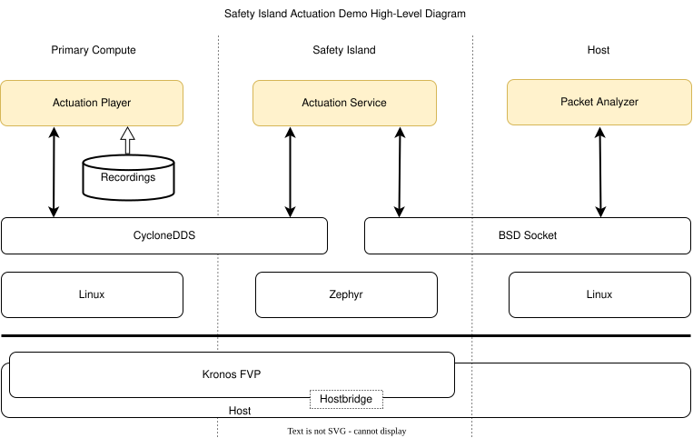

..
 # SPDX-FileCopyrightText: <text>Copyright 2023 Arm Limited and/or its
 # affiliates <open-source-office@arm.com></text>
 #
 # SPDX-License-Identifier: MIT

.. _design_applications_actuation:

############################
Safety Island Actuation Demo
############################

************
Introduction
************

The Actuation Service is a software application running on the Safety Island
Cluster 2 that receives inputs from the Primary Compute and generates control
commands that can be passed to an actuation system. A reference implementation
is provided by the `Safety Island Actuation Demo`_. The software running on the
Primary Compute is an Autoware pipeline and the Actuation Service takes the form
of a Zephyr application. The two communicate via DDS messages over a network
interface. This demo showcases the Pure Pursuit algorithm from Autoware.Auto
running as the Zephyr application.

Compared to the `Safety Island Actuation Demo`_, the Kronos version will have,
in the Primary Compute, a "Player" component instead of the Autoware pipeline
and, on the Host, a "Packet Analyzer" instead of a visualization software. This
is done in order to minimize the load for an FVP target.

************
Architecture
************

Components
==========

The Actuation Demo has 3 components:
    * Player
        Plays a recording of a driving scenario from the current Actuation Demo
    * Actuation Service
        Functionally the same as in the current Actuation Demo
    * Packet Analyzer
        Checks for correctness of the Actuation Service output

The communication between them is chained as described in the following
architecture diagram.

Diagram
=======

|

|

Interfaces
==========

Player <> Actuation Service
---------------------------

CycloneDDS (Using a specific upstream commit located at
:kronos-repo:`yocto/meta-kronos/recipes-demos/actuation/cyclonedds_0.10.3.inc`)
is used for the communication between Player and the Actuation Service.

Actuation Service <> Packet Analyzer
------------------------------------

BSD socket (TCP Protocol) is used in order to send the Control Commands from the
Actuation Service to the Packet Analyzer.

Validations
===========

Please refer to the Actuation Demo validations :ref:`validation_actuation_demo`
