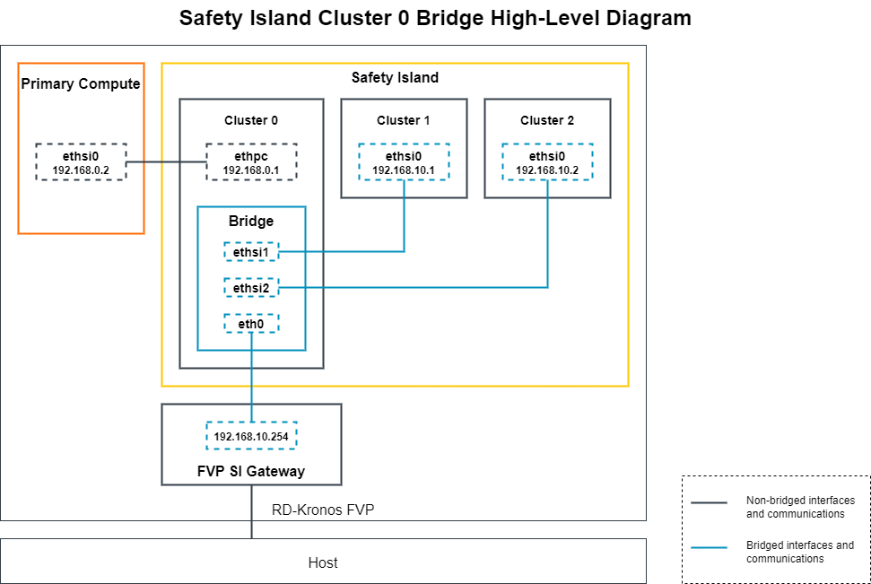

..
 # SPDX-FileCopyrightText: <text>Copyright 2023 Arm Limited and/or its
 # affiliates <open-source-office@arm.com></text>
 #
 # SPDX-License-Identifier: MIT

.. _design_applications_bridge:

##############################
Safety Island Cluster 0 Bridge
##############################

************
Introduction
************

The Safety Island Cluster 0 Bridge is a software application running on the
Safety Island Cluster 0 that acts as a network bridge connecting together the
network interfaces with the other Safety Island clusters and the network
interface with the Host. The code for the application can be found at
:kronos-repo:`components/safety_island/zephyr/src/apps/bridge`.

************
Architecture
************

Components
==========

The bridge is a Zephyr application making use of its `Ethernet Bridging API`_.

It is not VLAN-aware, as none of the traffic on the bridged networks (the
external network and all the inter-cluster networks) is VLAN-tagged.

The current Zephyr bridge functionality does not feature a learning process,
which means that incoming packets on a registered interface are sent to all
other registered interfaces at all times.

Diagram
=======

|

|

Interfaces
==========

The network interfaces added to the bridge forward all incoming packets to the
other registered interfaces without processing the packets. It means that those
interfaces can't respond to Internet Control Message Protocol (ICMP) *echo
requests* from other network nodes and can't be used for other purposes by the
application.

The network interface to the Primary Compute can respond to ICMP *echo requests*
but has no functional use.

Validation
==========

See :ref:`validation_zephyr_bridge`.
