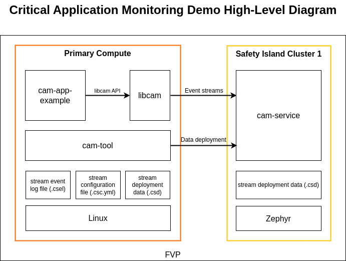

..
 # SPDX-FileCopyrightText: <text>Copyright 2023-2024 Arm Limited and/or its
 # affiliates <open-source-office@arm.com></text>
 #
 # SPDX-License-Identifier: MIT

.. _design_applications_cam:

####################################
Critical Application Monitoring Demo
####################################

************
Introduction
************

The Critical Application Monitoring (CAM) project implements a solution for
monitoring applications using a service running on a higher safety level system.
This approach aims to take advantage of running heavy workloads in high
performance cores whilst adding an extra layer of safety by monitoring such
applications via a higher safety subsystem. This project is integrated into the
Kronos Software Reference Stack to demonstrate the feasibility of monitoring
Primary Compute applications from the Safety Island.

*****************************************
Critical Application Monitoring on Kronos
*****************************************

High-Level Diagram
==================

The following diagram shows the architecture of the demo:

|

|

CAM consists of the following major components:

  * **Cam-app-example**: An example of an application using libcam for remote
    monitoring.

  * **Libcam**: Library used by critical applications to integrate the CAM
    project. It provides an API that enables applications to produce event
    streams to ``cam-service``.

  * **Cam-service**: The service responsible for monitoring all the event
    streams sent by multiple applications. In order to track the events,
    ``cam-service`` loads the stream data upon stream initialization.

  * **Stream data**: The data containing the expected event periods and state
    control data for each stream. The data must be deployed to ``cam-service``
    before a stream is initialized.

  * **Cam-tool**: The tool used to analyze, generate and deploy stream data.

The Primary Compute components are deployed on the baremetal Linux root
filesystem in the Baremetal Architecture build and on the DomU1 and DomU2 Linux
root filesystem in the Virtualization Architecture.

In the Kronos Reference Software Stack, ``cam-service`` is deployed on the
Safety Island Cluster 1 in order to provide applications on the Primary Compute
with a high safety level of monitoring services.

To support ``cam-service`` deployment on the Safety Island, there are the
following platform requirements:

  * Communication between the Safety Island and the Primary Compute for event
    streams.

  * Synchronized clocks on the Safety Island and the Primary Compute for
    temporal check.

  * Storage and a file system on the Safety Island for stream data deployment.

Communication Interfaces
========================

BSD sockets (over TCP) are used in order to send the event message from user
applications to ``cam-service`` via the :ref:`design_hipc` feature.

Time Synchronization
====================

Real-time clocks on the Primary Compute and the Safety Island are synchronized
via the :ref:`hipc_network_topology_gptp` protocol.

Zephyr File System
==================

Zephyr supports the FAT file system and can mount it to a RAM disk.
Refer to `Zephyr file system`_.

Due to the volatility of the RAM disk, on every system boot, the CAM stream data
needs to be deployed from the Primary Compute to the Safety Island Cluster 1 via
``cam-tool``.

Validation
==========

Refer to the CAM Demo validations :ref:`validation_cam_tests`.
