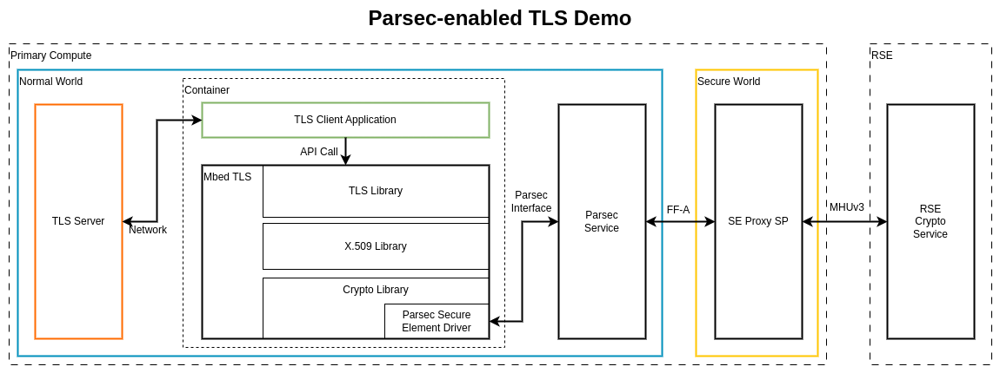
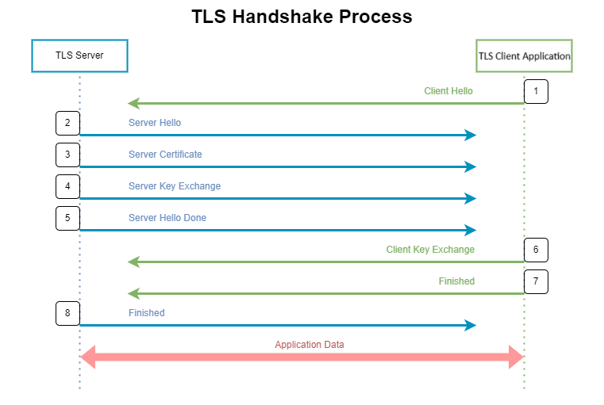

..
 # SPDX-FileCopyrightText: <text>Copyright 2023-2024 Arm Limited and/or its
 # affiliates <open-source-office@arm.com></text>
 #
 # SPDX-License-Identifier: MIT

.. _design_applications_parsec_enabled_tls:

#######################
Parsec-enabled TLS Demo
#######################

************
Introduction
************

The Parsec-enabled TLS demo illustrates a HTTPS session where a Transport Layer
Security (TLS) connection is established, and a simple webpage is transferred.

The TLS session consists of both symmetric and asymmetric cryptographic
operations. In this demo, the symmetric operations are executed by `Mbed TLS`_
in Linux userspace. The asymmetric operations are carried out by `Parsec`_. The
backend of the Parsec service is based on the RSS crypto runtime service.

************
Architecture
************

|

|

Components
==========

The following components are involved in the demo:

* TLS Server

    The TLS client application, running from inside a container, connects to
    the server at the ``4433`` port for the TLS connection. After the TLS
    connection is established, the server will send a simple ``Hello`` webpage
    when the client makes a request.

    The server application is provided by Mbed TLS. The source code can be
    found at ``program/ssl/ssl_server.c`` of `Mbed TLS repository`_.

* TLS Client

    The TLS client application connects to the server at the ``4433`` port for
    the TLS connection. It is deployed in a container environment. The client
    application calls the TLS API provided by Mbed TLS for the TLS connection.

    The source code of the client application is based on the example program
    ``program/ssl/ssl_client1.c`` of `Mbed TLS repository`_, with some
    modifications to handle a server IP address parameter and to work with
    Parsec. The code for modifications can be found at
    :kronos-repo:`yocto/meta-kronos/recipes-demos/parsec/files`.

* Mbed TLS

    `Mbed TLS`_ is a C library that implements cryptographic primitives, X.509
    certificate manipulation and the SSL/TLS and Datagram Transport Layer
    Security (DTLS) protocols.

    Mbed TLS provides 3 libraries:

        * TLS Library (libmbedcrypto)

        * X.509 Library (libmbedx509)

        * Crypto Library (libmbedcrypto)

    The relation of the 3 libraries is: libmbedtls depends on libmbedx509 and
    libmbedcrypto, and libmbedx509 depends on libmbedcrypto.

    In this demo, the client application code calls the API provided by the TLS
    Library of Mbed TLS to setup secure connection.

* Parsec Secure Element Driver

    The `Parsec Secure Element Driver`_ is an external driver for the Crypto
    Library of Mbed TLS. The driver implements a secure element by using the
    Parsec service. It delegates the crypto API calls to Parsec. The calls are
    further handled by the Secure Enclave Proxy Secure Partition (SE Proxy SP)
    in the Secure world of Primary Compute and finally handled by the RSS crypto
    service.

For more information of how the operations are handled by Parsec service, the SE
Proxy SP and the RSS, refer to :ref:`design_secure_services`.

TLS Handshake
=============

The following diagram illustrates the TLS handshake process that happens in the
demo.

|

|

To setup a TLS connection, the client and the server conduct the following main
handshake steps:

1. Client Hello
    The client initiates the handshake by sending a "hello" message to the
    server.

2. Server Hello
    In reply to the client hello message, the server sends a "hello" message to
    the client.

3. Server Certificate
    The server transfers its certificate to the client. The client authenticates
    the server certificate.

4. Server Key Exchange
    This message conveys cryptographic information to allow the client to
    communicate the premaster secret (a 48-byte random number).

5. Server Hello Done
    The server finishes sending messages to support the key exchange and the
    client can proceed with its phase of the key exchange.

6. Client Key Exchange
    The client generates its own premaster secret, encrypts it with the
    server's public key obtained from the server certificate, and sends the
    encrypted data to the server.

7. Client Finished
    The client finishes the handshake.

8. Server Finished
    The server finishes the handshake.

Once the handshake finishes successfully, the server and the client can exchange
data securely, because the data is encrypted with a symmetric algorithm.

Using RSS Crypto Service
------------------------

In the TLS handshake step ``3. Server Certificate`` and ``4. Server Key
Exchange``, the client performs asymmetric crypto operations to verify digital
signatures from the server side. The client invokes the Parsec Secure Element
Driver in Mbed TLS to handle the asymmetric operations. Finally the operations
are served by the RSS crypto runtime service. Specifically, the TLS client calls
following APIs from the RSS for the asymmetric crypto operations:

* ``psa_import_key``

    * The API imports a key in binary format. The TLS client application uses
      the API to import a public key.

* ``psa_verify_hash``

    * The API verifies the signature of a hash or short message using a public
      key. The TLS client uses this API to verify digital signatures of the TLS
      server assets with the public key imported by ``psa_import_key``.

* ``psa_destroy_key``

    * The API destroys a key. The TLS client application destroys the public
      key imported by ``psa_import_key``.

Validation
==========

See :ref:`validation_parsec_enabled_tls_demo`.
