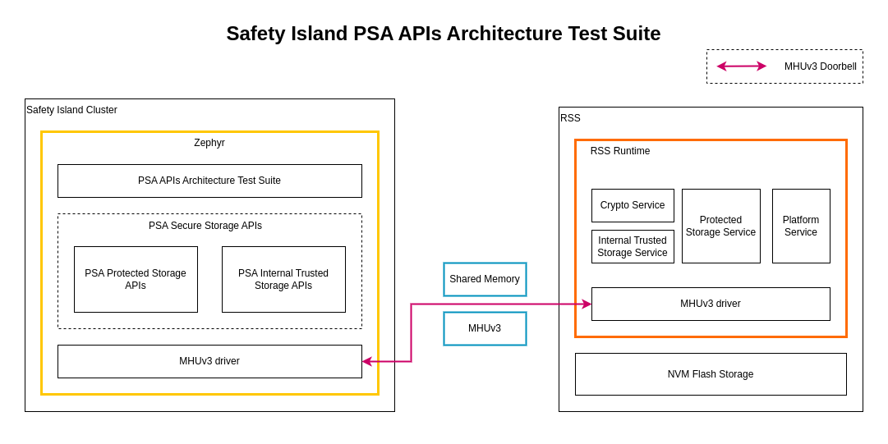

..
 # SPDX-FileCopyrightText: <text>Copyright 2023 Arm Limited and/or its
 # affiliates <open-source-office@arm.com></text>
 #
 # SPDX-License-Identifier: MIT

.. _design_applications_psa_arch_tests:

#########################################
Safety Island PSA Architecture Test Suite
#########################################

************
Introduction
************

The `PSA Arch Tests`_ test suite is one of a set of resources provided by Arm
that can help organizations develop products that meet the security requirements
of  PSA Certified on Arm-based platforms. The PSA Certified scheme provides
a framework and methodology that helps silicon manufacturers, system software
providers and OEMs to develop more secure products. Arm resources that support
PSA Certified range from threat models, standard architectures that simplify
development and increase portability, and open-source partnerships that provide
ready-to-use software.

The implementation of the PSA APIs Architecture Test Suite contains tests for
PSA APIs specifications. The tests are available as open source.

The architecture test suite abstracts platform-specific information from
the tests.

*******
Diagram
*******

|

|

***********************************************
PSA Secure Storage APIs Architecture Test Suite
***********************************************

The `PSA Secure Storage APIs Architecture Test Suite`_ runs on Safety Island
Cluster 2 as a Zephyr application. It uses the PSA Secure Storage APIs
interfaces provided by Trusted Firmware-M which communicates with the Secure
Storage Service provided by the Trusted Firmware-M running on RSS using an RSS
communication protocol.

The PSA Secure Storage API tests are linked into the Trusted Firmware-M PSA
Secure Storage APIs binaries and will automatically run. A log similar to the
following should be visible; it is normal for some tests to be skipped but
there should be no failed tests::

    ***** PSA Architecture Test Suite - Version 1.4 *****
    Running.. Storage Suite
    ******************************************
    TEST: 401 | DESCRIPTION: UID not found check | UT: STORAGE
    [Info] Executing tests from non-secure
    [Info] Executing ITS tests
    [Check 1] Call get API for UID 6 which is not set
    [Check 2] Call get_info API for UID 6 which is not set
    [Check 3] Call remove API for UID 6 which is not set
    [Check 4] Call get API for UID 6 which is removed
    [Check 5] Call get_info API for UID 6 which is removed
    [Check 6] Call remove API for UID 6 which is removed
    Set storage for UID 6
    [Check 7] Call get API for different UID 5
    [Check 8] Call get_info API for different UID 5
    [Check 9] Call remove API for different UID 5

    [Info] Executing PS tests
    [Check 1] Call get API for UID 6 which is not set
    [Check 2] Call get_info API for UID 6 which is not set
    [Check 3] Call remove API for UID 6 which is not set
    [Check 4] Call get API for UID 6 which is removed
    [Check 5] Call get_info API for UID 6 which is removed
    [Check 6] Call remove API for UID 6 which is removed
    Set storage for UID 6
    [Check 7] Call get API for different UID 5
    [Check 8] Call get_info API for different UID 5
    [Check 9] Call remove API for different UID 5

    TEST RESULT: PASSED

    ******************************************

    <further tests removed from log for brevity>

    ************ Storage Suite Report **********
    TOTAL TESTS     : 17
    TOTAL PASSED    : 11
    TOTAL SIM ERROR : 0
    TOTAL FAILED    : 0
    TOTAL SKIPPED   : 6
    ******************************************

There are some limitations behind running
``PSA Secure Storage APIs Architecture Test Suite`` on Safety Island Cluster 2
only. Please refer to the changelog :ref:`changelog_limitations` section.

PSA Secure Storage APIs
=======================

The PSA Secure Storage APIs are provided by the Trusted Firmware-M interfaces
instead of duplicating code in Kronos Reference Stack. They are linked into
Zephyr and use the provided ``psa_call()`` in order to communicate with the RSS
to use the Secure Storage Service provided by Trusted Firmware-M.

Please refer to `Trusted Firmware-M PSA Protected Storage Interfaces`_ and
`Trusted Firmware-M PSA Internal Trusted Storage Interfaces`_ for more
information.

**********
Validation
**********

See :ref:`validation_psa_arch_tests`.

******************
Downstream Changes
******************

Patch files can be found at
:kronos-repo:`yocto/meta-kronos/recipes-kernel/zephyr-kernel/files/psa-arch-tests`
to:

* Add PSA Arch Tests as a Zephyr module.
* Move a Secure Storage test to be the final one in the test suite as it causes
  Denial of Service to the Primary Compute.
