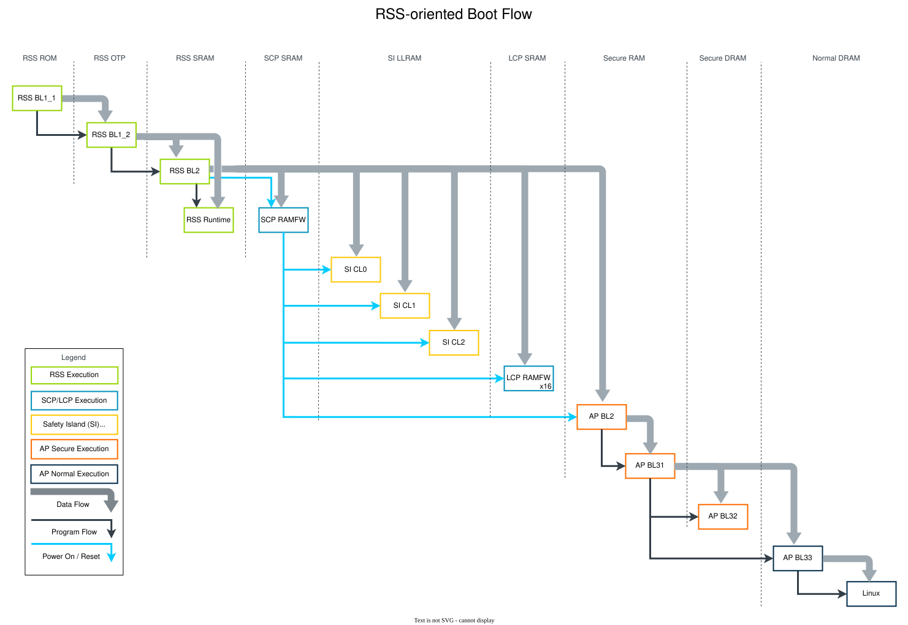

..
 # SPDX-FileCopyrightText: <text>Copyright 2023 Arm Limited and/or its
 # affiliates <open-source-office@arm.com></text>
 #
 # SPDX-License-Identifier: MIT

############
Boot Process
############

.. _design_boot_process_rss-oriented_boot_flow:

**********************
RSS-oriented Boot Flow
**********************

The :ref:`design_components_rss` is the root of the trust chain. It is the
first booting element when the system is powered up.

The RSS, implemented in Trusted Firmware-M (TF-M), has 3 boot stages. The
images for each stage are stored in different media:

* RSS BL1 (corresponds to TF-M BL11) is in ROM
* RSS BL2 (TF-M BL12) is in OTP
* RSS BL3 (TF-M BL2) is in NVM flash

The NVM flash contains not only RSS BL3, but also other images that are booted
by the RSS. The images currently included in the flash are:

* RSS BL3
* RSS Runtime
* SCP RAM Firmware (SCP RAMFW)
* LCP RAM Firmware (LCP RAMFW)
* Safety Island Cluster 0 (SI CL0)
* Safety Island Cluster 1 (SI CL1)
* Safety Island Cluster 2 (SI CL2)
* Application Processor BL2 (AP BL2)

:ref:`design_components_scp-firmware` has been extended to additionally
synchronize power control with the loading of images by the RSS.

The following diagram illustrates the boot flow that originates from the RSS.

|

|

Major steps of the boot flow:

1. RSS BL1 begins executing in place from ROM when the system is powered up. It:

   * Copies RSS BL2 from OTP to SRAM
   * Verifies RSS BL2 against the hash stored in OTP
   * Jumps to RSS BL2, if the hash verification has succeeded

2. RSS BL2:

   * Copies RSS BL3 image from flash into SRAM
   * Verifies RSS BL3 image using asymmetric cryptography
   * Jumps to RSS BL3, if the image was successfully verified

3. RSS BL3:

   * Copies SCP RAMFW from flash to SCP SRAM and verifies the image
   * Resets the SCP
   * Copies SI CL0 from flash to SI LLRAM and verifies the image
   * Notifies the SCP to power on the SI CL0
   * Copies SI CL1 from flash to SI LLRAM and verifies the image
   * Notifies the SCP to power on the SI CL1
   * Copies SI CL2 from flash to SI LLRAM and verifies the image
   * Notifies the SCP to power on the SI CL2
   * Copies LCP from flash to LCP SRAM and verifies the image
   * Release the LCP from reset
   * Copies AP BL2 from flash to AP SRAM and verifies the image
   * Notifies the SCP to power on the AP

.. _design_boot_process_primary_compute_boot_flow:

*************************
Primary Compute Boot Flow
*************************

The Primary Compute is the Application Processor in the Kronos Reference
Design. The purpose of its firmware is to provide an |Arm SystemReadyTM| IR
aligned interface to Linux. |Arm SystemReadyTM| IR compatible systems are
required to follow the `Device Tree specification`_, so the
:ref:`design_components_u-boot` bootloader is used in the non-secure world,
which provides the UEFI implementation and exposes the device tree to Linux.

:ref:`design_components_trusted-firmware-a` provides the initial, secure-world
firmware, which consists of BL2 and BL31. BL33 is provided by U-Boot.

The Primary Compute boot flow follows the following steps:

1. AP BL2:

   * Copies AP BL31 and BL33 from flash to SRAM and DRAM
   * Jumps to AP BL31

2. AP BL31 starts AP BL33
3. AP BL33 starts the Linux operating system

**********************
|Arm SystemReadyTM| IR
**********************

`Arm SystemReady`_ is a compliance certification program based on a set of
hardware and firmware standards that enable interoperability with generic
off-the-shelf operating systems and hypervisors. These standards include the
`Base System Architecture (BSA)`_ and `Base Boot Requirements (BBR)`_
specifications, and market-specific supplements.

In this way, the `Arm SystemReady program`_ provides a formal set of compute
platform definitions to cover a range of systems from the cloud to IoT and edge,
helping software 'just work' seamlessly across an ecosystem of Arm-based
hardware.

|Arm SystemReadyTM| is divided into a set of bands with a combination of specs
available to suit the different devices and markets. |Arm SystemReadyTM| IR is
one of these bands.

`Arm SystemReady IR`_ certified platforms implement a minimum set of hardware
and firmware features that an operating system can depend on to deploy the
operating system image. Hence, |Arm SystemReadyTM| IR ensures the deployment and
maintenance of standard firmware interfaces and targets both custom (Yocto,
OpenWRT, Buildroot) and pre-built (Debian, Fedora, SUSE) Linux distributions.

At a high level, the IR band requires that:

 * Firmware implements a subset of UEFI as defined in Embedded Base Boot
   Requirements (EBBR)
 * Firmware by default provides a device tree suitable for booting mainline
   Linux
 * Firmware can be updated using UEFI UpdateCapsule()
 * At least two Linux distros must be able to boot and install using the UEFI
   boot flow

Compliant systems must conform to the:

 * `Base System Architecture (BSA)`_ specification
 * `Embedded Base Boot Requirements (EBBR)`_
 * EBBR recipe of the Arm `Base Boot Requirements (BBR)`_ specification
 * `Device Tree specification`_

|Arm SystemReadyTM| IR Objective
================================

This Reference Stack aims to be aligned with |Arm SystemReadyTM| IR version 1.0,
but does not aim to be |Arm SystemReadyTM| IR certified, meaning that neither
formal compliance testing nor validation are performed.

.. _boot_process_systemready-status:

Current Status
==============

This Reference Stack has the testing capability to check for |Arm SystemReadyTM|
alignment. Please refer to :ref:`reproduce_run-time_integration_tests` to
see how to run the |Arm SystemReadyTM| IR `ACS`_ tests in this Reference Stack.

The |Arm SystemReadyTM| IR ACS tests of the Reference Stack use a set of
baseline files to detect any changes in regards to the current status of the
|Arm SystemReadyTM| IR alignment of the system. These files can be found under
:meta-arm-repo:`meta-arm-bsp/arm-systemready/acs/baseline/fvp-rd-kronos` and
describe the current status of the Reference Stack. A high-level summary of the
current non-alignments is described in
:ref:`boot_process_systemready-non_alignments`. Please refer to the baseline
files for more detailed information on each individual set of tests.

.. _boot_process_systemready-non_alignments:

Identified Non-Alignments
=========================

The Reference Stack is currently known to have the following non-alignments:

 * Reference stack

      1. Kronos software implementation does not currently support capsule
         updates, so the UpdateCapsule() method is currently being invoked with
         invalid parameters (CapsuleCount - 0).
      2. Kronos system does not have an EFI System Partition, which will lead to
         "Failed to persist EFI variables" and several SetVariable/GetVariable
         runtime services failure.
      3. U-Boot uses the 'removable storage' method to boot the EFI payload and
         the EFI boot manager is not configured/used.

 * U-Boot

      1. Known limitations of EFI implementation which are excluded in the
         `EBBR Specification - UEFI Runtime Services`_.
      2. Known limitations of EFI implementation which are noted as 'Explicit
         justification in a future revision of EBBR is pending' by
         `edk2-test-parser`_.
      3. The UpdateCapsule() method does not currently support certain
         invocations with invalid parameters.

 * Model - FVP

      1. Platform-specific limitations, which are noted as excluded in the
         `EBBR Specification - Required Platform Specific Elements`_.
      2. AES, SHA1 and SHA2 instructions are marked as unavailable in the FVP
         ID_AA64ISAR0_EL1.

 * Test environment

      1. No text input is available in the test environment for Simple Text
         Input Ex protocol.

 * BSA tests

      1. Tests are not compatible with certain devices in the RD-Kronos model.

|Arm SystemReadyTM| IR Tests
============================

Please refer to :ref:`validation_systemready_ir_tests` for more information on
the |Arm SystemReadyTM| IR test structure.
