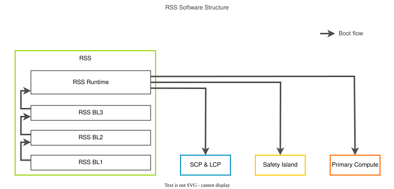
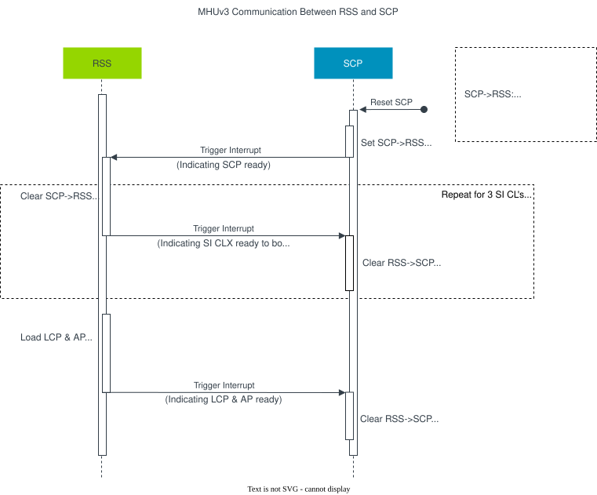
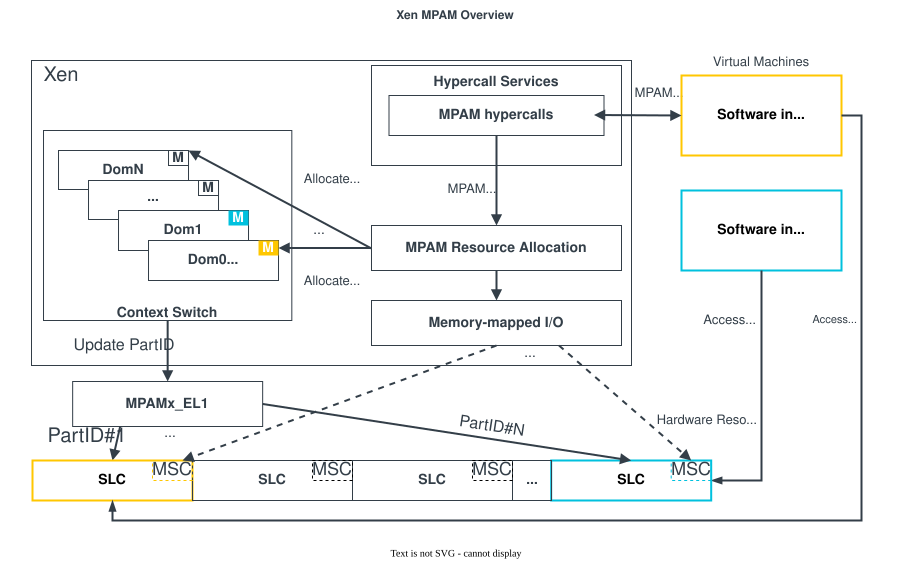

..
 # SPDX-FileCopyrightText: <text>Copyright 2023 Arm Limited and/or its
 # affiliates <open-source-office@arm.com></text>
 #
 # SPDX-License-Identifier: MIT

.. _design_components:

##########
Components
##########

The stack comprises of the following components:

.. list-table::
  :header-rows: 1

  * - Component
    - Version
    - Source
  * - Trusted Firmware-M (:ref:`design_components_rss`)
    - |Trusted Firmware-M version| (based on |Trusted Firmware-M base version|)
    - `Trusted Firmware-M repository`_
  * - :ref:`design_components_scp-firmware`
    - |SCP-firmware version| (based on |SCP-firmware base version|)
    - `SCP-firmware repository`_
  * - :ref:`design_components_trusted-firmware-a`
    - |Trusted Firmware-A version|
    - `Trusted Firmware-A repository`_
  * - :ref:`design_components_op-tee`
    - |OP-TEE version|
    - `OP-TEE repository`_
  * - :ref:`design_components_u-boot`
    - |U-Boot version|
    - `U-Boot repository`_
  * - :ref:`design_components_xen`
    - |Xen version|
    - `Xen repository`_
  * - :ref:`design_components_linux`
    - |Linux version|
    - `Linux repository`_
  * - :ref:`design_components_zephyr`
    - |Zephyr version|
    - `Zephyr repository`_

.. _design_components_rss:

***
RSS
***

The `Runtime Security Subsystem (RSS)`_ is a security subsystem fulfilling the
requirements of the `Arm Confidential Compute Architecture`_ (CCA). The RSS
additionally adds an isolated environment to provide platform security services
that are outside of the scope of the CCA Platform Security Domain.

The RSS serves as the Root of Trust for the system, offering critical platform
security services and holding and protecting the most sensitive assets in the
system.

In the current software stack, the RSS offers the secure boot service only,
further details of which can be found in the `Trusted Firmware-M Secure boot
documentation`_.

The RSS internally consists of 3 boot loaders and a runtime. The following
diagram illustrates the high-level software structure of the RSS and some
relevant external components.

|

|

Boot Loaders
============

RSS BL1
-------

The first stage bootloader (BL1) of the RSS is immutable code located in the RSS
ROM that executes in place on reset. Its purpose is to load and verify the
integrity of the second stage bootloader (BL2) image.

RSS BL2
-------

RSS BL2 is provisioned in the RSS OTP and executed from the RSS SRAM. Its
purpose is to load, decrypt and authenticate the BL3 image.

RSS BL3
-------

RSS BL3 is implemented through extensions to the existing MCUBoot bootloader in
Trusted Firmware-M (TF-M). It loads and authenticates the initial bootloaders
of the SCP, Safety Island (SI), LCP and Application Processor (AP).

After all the aforementioned PEs begin to boot, BL3 loads and authenticates the
RSS Runtime and starts it.

Runtime
=======

The RSS Runtime will provide services of PSA Crypto and Attestation in the form
of APIs in the future.

.. _design_components_rss_downstream_changes:

Downstream Changes
==================

Patches for the RSS are included at
:meta-arm-repo:`meta-arm-bsp/recipes-bsp/trusted-firmware-m/fvp-rd-kronos/` to:

 * Implement the RD-Kronos platform port, based on RD-Fremont.
 * Load and boot the SCP.
 * Load and boot the Safety Island.
 * Load and boot the LCP.
 * Load and boot the AP.

.. _design_components_scp-firmware:

************
SCP-firmware
************

The Power Control System Architecture (PCSA) [1]_ describes how systems can be
built to provide microcontrollers to abstract various power, or other system
management tasks, away from Application Processors (APs).

According to the PCSA, the System Control Processor (SCP), a dedicated
processor, is used to abstract power and system management tasks away from
application processors.

To support a scalable power control solution in systems with very high core
counts, a Local Power Controller (LCP) is introduced for each application core.
The LCP is managed by the SCP. The main functionality of the LCP are: Per-core
Dynamic Voltage Frequency Scaling (DVFS), Thermal management, Max Power
Mitigation Mechanism (MPMM), Power limit enforcement and Sensor Data Collection.

The `System Control Processor (SCP) Firmware`_ provides a software reference
implementation for the System Control Processor (SCP) and Local Power
Controller (LCP) components.

MHUv3 Communication
===================

There are MHUv3 devices between the |Cortex|-M core where the RSS runs and the
|Cortex|-M core where SCP-firmware runs. In the transport layer of MHUv3,
Doorbell signals are exchanged between the RSS and SCP-firmware.

For RD-Fremont platform, MHUv3 signals are sent:

* From SCP-firmware to the RSS to indicate that SCP-firmware has booted
  successfully
* From the RSS to SCP-firmware to indicate the LCP and AP is ready to boot

For RD-Kronos platform, the MHUv3 communication is extended for booting Safety
Island (SI). The RSS sends a Doorbell signal to SCP-firmware to notify that the
image of a Safety Island cluster has been loaded to LLRAM and the cluster is
ready to boot.

The following diagram illustrates the MHUv3 communication sequence between
the RSS and SCP-firmware.

|

|

.. _design_components_scp-firmware_downstream_changes:

Downstream Changes
==================

Patches for the SCP-firmware are included at
:meta-arm-repo:`meta-arm-bsp/recipes-bsp/scp-firmware/files/fvp-rd-kronos/` to:

 * Implement the RD-Kronos platform port, based on RD-Fremont.
 * Communicate with RSS via MHUv3 to conduct the boot flow.
 * Power on Safety Island.
 * Reset LCP.
 * Power on AP.

***************
Primary Compute
***************

.. _design_components_devicetree:

Device Tree
==================

The RD-Kronos FVP device tree contains the hardware description for the Primary Compute.
The CPUs, memory and devices are statically configured in the device tree. It is compiled
by the Trusted Firmware-A Yocto recipe, bundled in the Trusted Firmware-A flash image at
rest and used to configure U-Boot, Linux and Xen at runtime. It is located at
:meta-arm-repo:`meta-arm-bsp/recipes-bsp/trusted-firmware-a/files/fvp-rd-kronos/rdkronos.dts`.

.. _design_components_trusted-firmware-a:

Trusted Firmware-A
==================

Trusted Firmware-A is the initial bootloader on the Primary Compute.

For RD-Kronos, the initial TF-A boot stage is BL2, which runs from a known
address at EL3, using the ``BL2_AT_EL3`` compilation option. This option has
been extended for RD-Kronos to load the FW_CONFIG for dynamic configuration (a
role typically performed by BL1). BL2 is responsible for loading the subsequent
boot stages and their configuration files from the FIP flash image. This flash
image contains:

 * BL31
 * BL33 (:ref:`design_components_u-boot`)
 * The HW_CONFIG device tree
 * The TB_FW_CONFIG device tree

The device tree for the Primary Compute of the RD-Kronos FVP is compiled by
Trusted Firmware-A, bundled in the Primary Compute flash image (as the
HW_CONFIG) at rest and used to configure :ref:`design_components_u-boot`, Linux
and Xen at runtime. It is located at
:meta-arm-repo:`meta-arm-bsp/recipes-bsp/trusted-firmware-a/files/fvp-rd-kronos/rdkronos.dts`.

.. _design_components_trusted-firmware-a_downstream_changes:

Downstream Changes
------------------

Patch files can be found at
:meta-arm-repo:`meta-arm-bsp/recipes-bsp/trusted-firmware-a/files/fvp-rd-kronos/`
to:

 * Implement the RD-Kronos platform port, based on RD-Fremont.
 * Compile the HW_CONFIG device tree and add it to the FIP image.
 * Extend BL2_AT_EL3 to load the FW_CONFIG for dynamic configuration.
 * Add RD-Kronos support for OP-TEE SPMC.

.. _design_components_op-tee:

OP-TEE
======

`OP-TEE`_ is a Trusted Execution Environment (TEE) designed as companion to a
non-secure Linux kernel running on Neoverse cores using the TrustZone
technology. OP-TEE implements TEE Internal Core API v1.1.x which is the API
exposed to Trusted Applications and the TEE Client API v1.0, which is the API
describing how to communicate with a TEE.

.. _design_components_op-tee_downstream_changes:

Downstream Changes
------------------

Patch files can be found at:meta-arm-repo:`meta-arm-bsp/recipes-security/optee/files/optee-os/fvp-rd-kronos/`
to:

 * Implement the RD-Kronos platform port.
 * OP-TEE binary is wrapped by fiptool as BL32 image. BL2 will load it into DRAM at a specific
   address which is set by TF-A.
 * Booting OP-TEE as SPMC running at SEL1.

.. _design_components_u-boot:

U-Boot
======

U-Boot is the non-secure world second-stage bootloader (BL33 in TF-A) on the
Primary Compute. It consumes the HW_CONFIG device tree provided by
Trusted Firmware-A and provides UEFI services to UEFI applications like Linux
and Xen. The device tree is used to configure U-Boot at runtime, minimizing the
need for platform-specific configuration.

.. _design_components_u-boot_downstream_changes:

Downstream Changes
------------------

The implementation is based on the VExpress64 board family. Patch
files can be found at
:meta-arm-repo:`meta-arm-bsp/recipes-bsp/u-boot/u-boot/fvp-rd-kronos/`
to:

 * Consume the device tree using register x1, the TF-A default.
 * Provide a minimal, generic defconfig for FVPs, vexpress_fvp_defconfig.
 * Enable the real-time clock for the VExpress64 boards by default.
 * Use OF_HAS_PRIOR_STAGE for the BASE_FVP configuration, to indicate the
   origin of the device tree.

.. _design_components_xen:

Xen
===

Xen is a type-1 hypervisor, providing services that allow multiple computer
operating systems to execute on the same computer hardware concurrently.
Responsibilities of the Xen hypervisor include memory management and CPU
scheduling of all virtual machines (domains), and for launching the most
privileged domain (Dom0) - the only virtual machine which by default
has direct access to hardware. From the Dom0 the hypervisor can be managed
and unprivileged domains (DomU) can be launched.

On starting up, the GRUB2 configuration uses the "chainloader" command to
instruct the UEFI services provider (U-boot) to load and run Xen as an EFI
application. Further Xen reads its configuration (xen.cfg) from the boot
partition of the virtio disk containing the boot arguments for Xen and Dom0
to start the whole system.

The `Arm Memory Partitioning and Monitoring`_ (MPAM) extension is enabled in
Xen. MPAM is an optional extension to Armv8.4 and later versions. It
defines a method that software can utilize to apportion and monitor the
performance-giving resources (usually cache and memory bandwidth) of the
memory system. Domains can be assigned with dedicated system level cache (SLC)
slices so that cache contention with multiple domains can be mitigated.

|

|

The stack offers several methods for users to configure MPAM for domains:

 * For Dom0, an optional Xen command line parameter ``dom0_mpam`` can be used
   to configure the cache portion bit mask (CPBM) for Dom0. The format of the
   ``dom0_mpam`` parameter is:

   .. code-block:: console

     dom0_mpam=slc:<CPBM in hexadecimal>

   To use the ``dom0_mpam`` parameter, users can add this parameter to the
   ``options`` of the ``[xen]`` section in xen.cfg config file. An example to
   assign the first 4 portions of SLC to Dom0 at Xen boot time is shown below:

   .. code-block:: console

     [xen]
     options=(...) dom0_mpam=slc:0xf

 * Users can also apply MPAM configuration for guests at guest creation time by
   guest VM configuration file using an optional configuration ``mpam``. An
   example is shown below:

   .. code-block:: console

     mpam = ['slc=0xf']

 * There is a set of sub-commands in "xl" to allow users to use MPAM at runtime.
   Users can use the ``xl psr-hwinfo`` command to query the system information
   of MPAM, and use ``xl psr-cat-set`` or ``xl psr-cat-show`` to configure or
   read the CPBM for Dom0 and DomU at runtime.

   The format of ``xl psr-cat-set`` is (``-l 0`` refers to SLC):

   .. code-block:: console

     xl psr-cat-set -l 0 <Domain ID> <CPBM in hexadecimal>

   The format of ``xl psr-cat-show`` is (``-l 0`` refers to SLC):

   .. code-block:: console

     xl psr-cat-show -l 0

   More detailed information of the sub-commands, please refer to the ``--help``
   of each sub-command respectively.

Xen is only included in the Virtualization Reference Stack Architecture.
Limitations of MPAM support in Xen include:

 * Currently, MPAM support in Xen is available for the system level cache (SLC)
   partitioning only.
 * In the Virtualization Reference Stack Architecture, DomU MPAM settings can
   only be manipulated by xl after the DomU has been created and started.
 * The FVP only provides the programmer's view of MPAM. There is no functional
   behaviour change implemented.

.. _design_components_xen_downstream_changes:

Downstream Changes
------------------
Patches for the Xen MPAM extension support at
:kronos-repo:`yocto/meta-kronos/recipes-extended/xen/files/`
to:

 * Discover MPAM CPU feature
 * Initialize MPAM at Xen boot time
 * Support MPAM in Xen tools to apply the domain MPAM configuration in
   userspace at runtime

.. _design_components_linux:

Linux Kernel (PREEMPT_RT)
=========================

The Linux kernel is a real-time kernel that uses the PREEMPT_RT patch.

Remoteproc
----------

In Linux, a remoteproc driver for the Safety Island is added to the Linux
kernel. It is used to support RPMsg communication between the Armv9.0-A
cores and the Safety Island. More details on the communication can be
found in the :ref:`HIPC <design/hipc:Heterogeneous Inter-processor Communication (HIPC)>` section.

Virtual Network over RPMsg
--------------------------

In order to allow applications to access the remote processor using network
sockets, a virtual network device over RPMsg is introduced. The ``rpmsg_net``
kernel module is added for creating a virtual network device and converting
RPMsg data to network data.

.. _design_components_linux_downstream_changes:

Downstream Changes
------------------

The arm_si_rproc and rpmsg_net drivers can be found at
:kronos-repo:`components/primary_compute/linux_drivers`.

Additional patches are located at
:kronos-repo:`yocto/meta-kronos/recipes-kernel/linux/files` related to:

 * Make virtio rpmsg buffer size configurable
 * Make mailbox transmit queue size configurable
 * Disable remoteproc virtio rpmsg to use DMA api in Xen guest
 * Add MHUv3 driver

*************
Safety Island
*************

.. _design_components_zephyr:

Zephyr
======

`Zephyr`_ is an open source real-time operating system based on a small
footprint kernel designed for use on resource-constrained and embedded systems.

The Reference Stack uses Zephyr |zephyr version| as a baseline and introduces a
new board ``fvp_rd_kronos_safety_island`` for the Kronos FVP. It reuses the
``fvp_aemv8r`` SoC support and adds a pair of patches for MPU device region
configuration.

The Zephyr image for this board is running on the Safety Island clusters.
In order to enable communication with Armv9-A cores, a set of drivers
are added into Zephyr by means of an out-of-tree module. More details on the
communication can be found in the :ref:`HIPC <design/hipc:Heterogeneous Inter-processor Communication (HIPC)>` section.

MHUv3
-----

The Arm Message Handling Unit Version 3 (MHUv3) is a mailbox controller for
inter-processor communication. In the Kronos FVP, there are MHUv3 devices
on-chip for signaling between Armv9-A and Safety Island clusters, using the
doorbell protocol. A driver is added into the Zephyr inter-processor mailbox
framework to support this device.

Virtual Network over RPMsg
--------------------------

A ``veth_rpmsg`` driver is added for network socket based communication between
Armv9-A and Safety Island clusters. It implements an RPMsg backend by the OpenAMP
library and an adaptation layer for converting RPMsg data to network data.

Zperf sample
------------

The `zperf sample`_ can be used to stress test inter-processor communication
over a virtual network on the Kronos FVP. The board overlay dts and
configuration file are added to this sample. This sample needs to be used
together with iperf on the Armv9-A side for network performance testing.

.. _design_components_zephyr_downstream_changes:

Downstream Changes
------------------

The board support for ``fvp_rd_kronos_safety_island`` is located at
:kronos-repo:`components/safety_island/zephyr/src/boards/arm64/fvp_rd_kronos_safety_island`.

The out-of-tree driver for virtual network over RPMsg is located at
:kronos-repo:`components/safety_island/zephyr/src/drivers/ethernet`.

The out-of-tree driver for MHUv3 device is located at
:kronos-repo:`components/safety_island/zephyr/src/drivers/mbox`.

Additional patches are located at
:kronos-repo:`yocto/meta-kronos/recipes-kernel/zephyr-kernel/files/zephyr`
related to:

 * MPU region configuration
 * VLAN configuration and fixes
 * Working around the shell interfering with network performance
 * zperf download bind capability
 * SMSC91x driver promiscuous mode

**********
References
**********

.. [1] Power Control System Architecture - DEN0050C (Please contact Arm directly
       to obtain a copy of this document)
