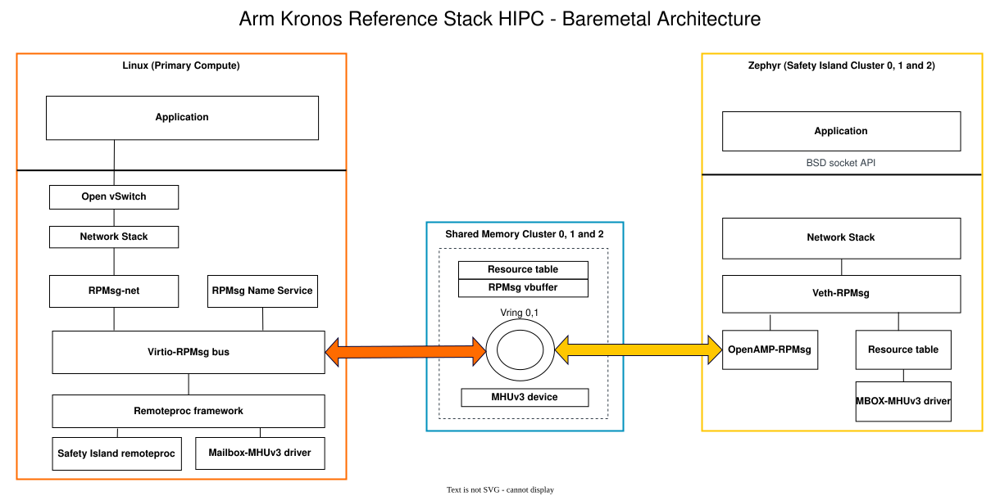
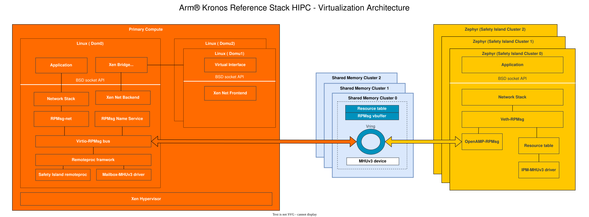
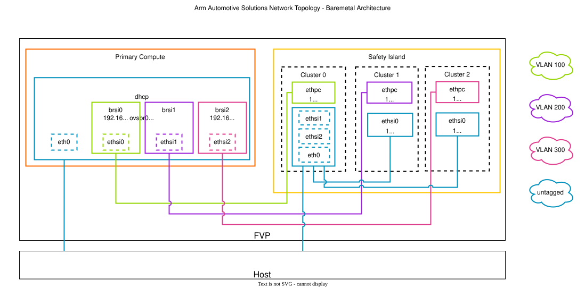
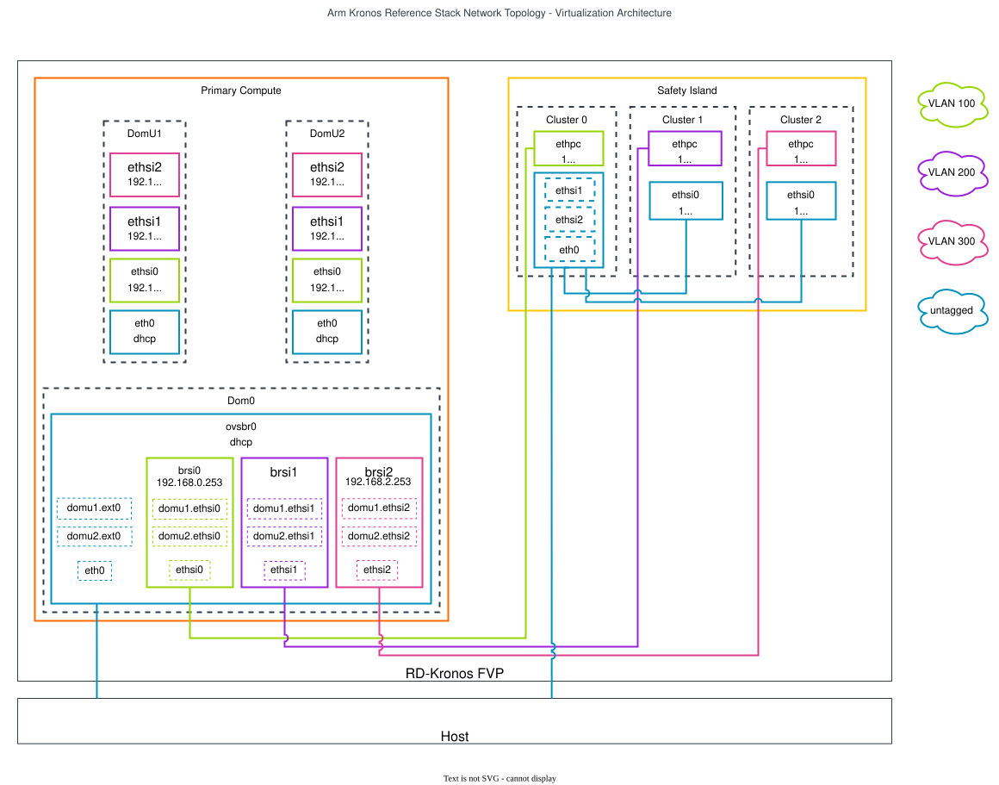

..
 # SPDX-FileCopyrightText: <text>Copyright 2023 Arm Limited and/or its
 # affiliates <open-source-office@arm.com></text>
 #
 # SPDX-License-Identifier: MIT

.. _design_hipc:

##################################################
Heterogeneous Inter-processor Communication (HIPC)
##################################################

************
Introduction
************

The Kronos FVP contains Armv9.0-A (Primary Compute) and Safety Island
heterogeneous processing elements which share data via the Message Handling
Unit (MHUv3) and shared Dynamic Random-Access Memory (DRAM). The MHUv3 is a
mailbox controller used for signal transmission and the shared memory is used
for data exchange.

Safety Island Remoteproc Driver
===============================
The remoteproc framework allows different platforms/architectures to control
(power on/off, load firmware) remote processors while abstracting the hardware
differences, so the entire driver doesn't need to be duplicated. The remoteproc
platform driver is added to the RD-Kronos stack to add support for communication
between PC and SI clusters.

In the Kronos FVP, Linux regards the Safety Island clusters as its remote
processors. The Kronos FVP Safety Island has three clusters. Each cluster will
behave as an independent entity and has its own resources to establish the
connection to the PC.

These clusters cannot be booted by the Armv9-A processor because they need to
monitor the other hardware including the Primary Compute. Therefore, the initial
status of the clusters in the driver is “RPROC_DETACHED”, which means the
cluster has been booted independently from the Armv9-A processor. This driver
will implement the notification handler using an MHUv3-based mailbox, which
notifies other cores when new messages are sent to the virtual queue.

The memory regions of the resource table, vrings and message buffers are
configured in the device tree bindings for each cluster. The driver will parse
the device tree node for each cluster and will add each cluster to the
remoteproc framework. Each cluster has its own resource table, vrings and
message buffers that will be used as a base for communication

RPMsg Protocol
==============

RPMsg (Remote Processor Messaging) is a messaging protocol enabling
heterogeneous communication, which can be used by Linux as well as real-time
OSes.

In Linux, the RPMsg framework is implemented on top of the virtio-rpmsg
bus and remoteproc framework. The virtio-rpmsg implementation is generic and
based on virtio vrings to transmit/receive messages to/from the remote CPU over
shared memory.

On the Safety Island side, Zephyr has imported OpenAMP as an external module.
The OpenAMP library implements the RPMsg backend based on virtio, which is
compatible with the upstream Linux remoteproc and RPMsg components. This library
can be used with the Zephyr kernel or Zephyr applications to behave as an RPMsg
backend service for communication with the Armv9-A cores.

Virtual Network Device over RPMsg
=================================

RPMsg provides a set of user APIs for RPMsg endpoints to transmit/receive
messages to/from the endpoints. These APIs can be used for some basic
inter-processor communication. However, many existing user applications are not
implemented based on RPMsg APIs. More often, they use BSD sockets for IPC. This
is because BSD sockets can shield the difference between inter-processor
communication and intra-processor communication, which makes applications
generic and portable. In order to meet the needs of such applications, an RPMsg
based virtual network device is added to the reference stack.

On the Safety Island side, it creates a network device over an RPMsg endpoint
with a specific service name. The RPMsg endpoint announces its existence by
sending a name service message to the Armv9-A cores. This message is then
handled by the RPMsg bus to create an RPMsg endpoint and a corresponding
network device. After that, the network communication is established based on
this pair of virtual network devices.

On the Primary Compute side, the RPMsg frame needs to be copied to the skb
buffer used by the network stack. When the traffic exceeds the performance
limitation, the skb buffer may be dropped during processing for congestion
control or by the protocol layers. At this time, network statistics will
increase the dropped packet counter.

As shown in the following diagram each Safety Island cluster has its own shared
memory and MHUv3 device to communicate with the Primary Compute. Each shared
memory instance has a resource table, vring and message buffer that are used to
transfer/receive information between the Primary Compute and the Safety Island.
On the Primary Compute, the Safety Island remoteproc driver and RPMsg based
virtual interface driver are added to communicate with the Safety Island.

|

|

Virtualization Architecture
===========================

In the Virtualization Architecture of the Reference Stack, virtual network
interfaces based on Xen bridges will be exposed to the domUs. Xen bridges are
created in backend domain (dom0). The backend virtual network interfaces are
added to these bridges along with an RPmsg virtual interface to communicate
with the Safety Island.

Dom0 has a communication channel with the Safety Island which is the same as
the baremetal architecture.

|

|

There are some issues and limitations of the virtual network device over RPMsg.
Please refer to the changelog :ref:`changelog_knownissues` and
:ref:`changelog_limitations` section.

****************
Network Topology
****************

Baremetal Architecture
======================

This diagram shows the network topology for the baremetal architecture.
ethsi{N} is the RPMsg-based virtual interface that is connected to Safety Island
Cluster{N} where N is the cluster number, for example ethsi0 is connected to
Safety Island cluster 0.

User space applications on the Primary Compute can communicate with Safety
Island cluster N via ethsi{N}. 

|

|

Virtualization Architecture
===========================

As shown in the diagram below the virtual network interfaces for the Xen guests
are based on Xen bridges. domu1.ethsi{N} and domu2.ethsi{N} are backend virtual
network interface that are exposed to domu1 and domu2 guests. ethsi{N} in the
Primary Compute is the RPMsg-based virtual interface that is connected to
Safety Island Cluster{N} to provide communication between Primary Compute and
Safety Island. ethsi{N}(Primary Compute) and domu1.ethsi{N} are added to the
Xen bridge(brsi0) to have a connection between dom0 and domU1.

|

|

***********
Device Tree
***********

In Linux, a remoteproc binding is needed for Safety Island remote clusters.
It includes MHUv3 transmit/receive channels for signaling and several memory
regions for data exchange. Each Safety Island cluster has it own remoteproc
binding that includes MHUv3 and shared memory.

The Linux device tree with the appropriate nodes for HIPC is located at
:meta-arm-repo:`meta-arm-bsp/recipes-bsp/trusted-firmware-a/files/fvp-rd-kronos/rdkronos.dts`.

In Zephyr, there is an overlay device tree for the network over RPMsg application,
which also defines the MHUv3 channels and device memory regions.

The Zephyr overlay device tree for FVP the Kronos board is located at
:kronos-repo:`components/safety_island/zephyr/src/overlays/hipc`.
