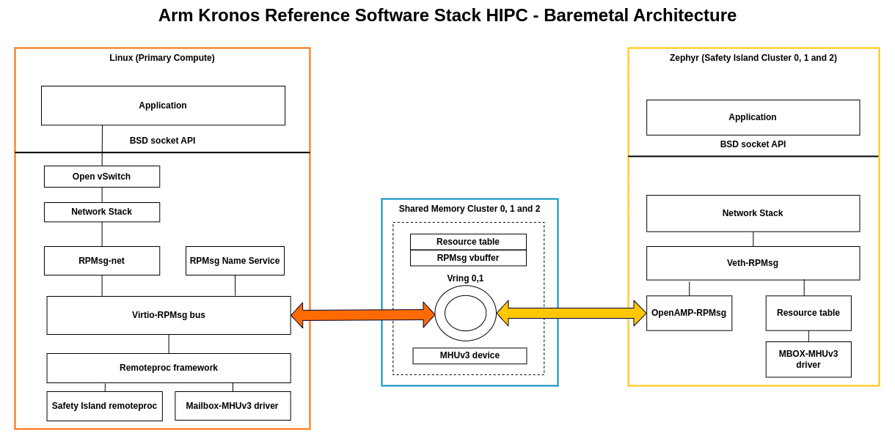
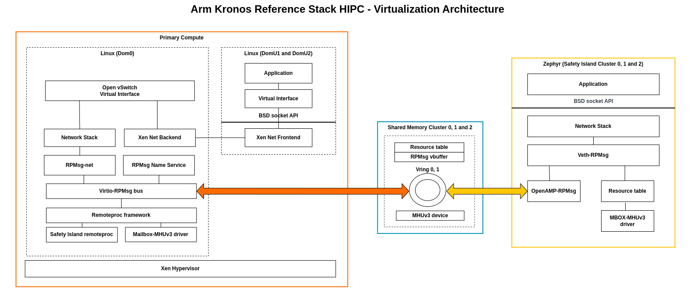
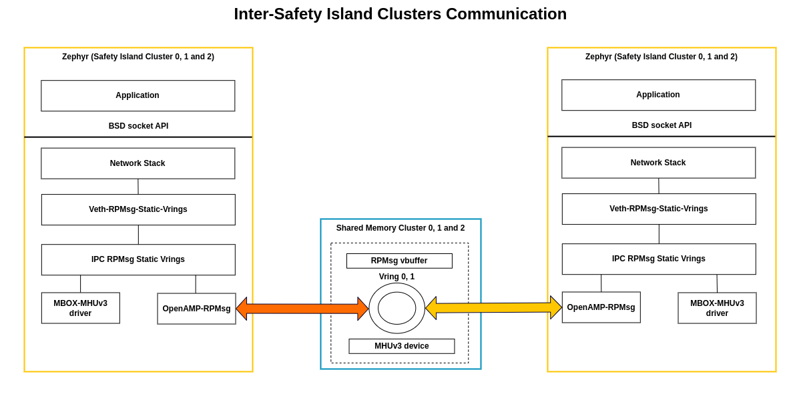
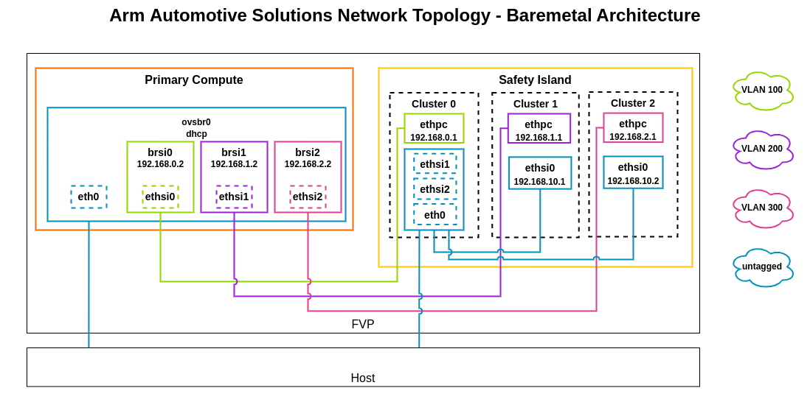
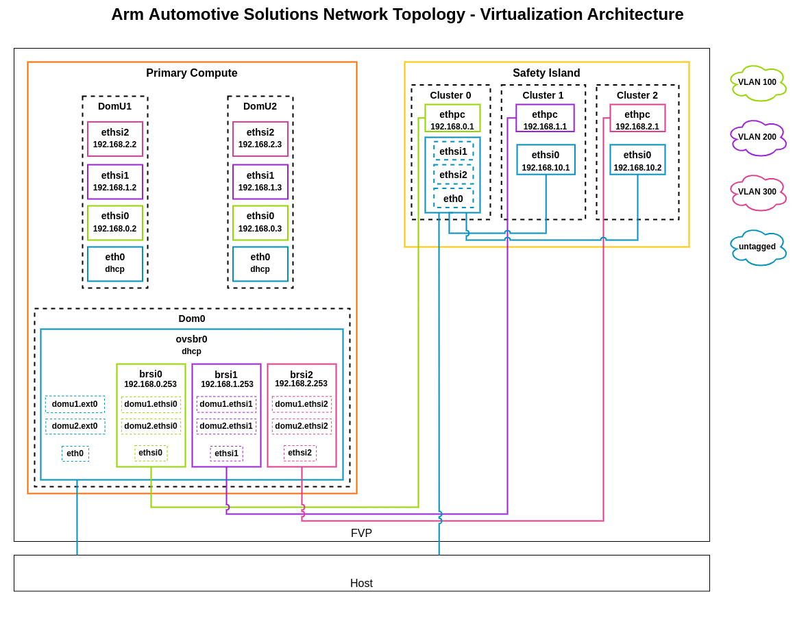

..
 # SPDX-FileCopyrightText: <text>Copyright 2023 Arm Limited and/or its
 # affiliates <open-source-office@arm.com></text>
 #
 # SPDX-License-Identifier: MIT

.. _design_hipc:

##################################################
Heterogeneous Inter-processor Communication (HIPC)
##################################################

************
Introduction
************

The Kronos FVP contains Armv9-A (Primary Compute) and Armv8-R64 (Safety Island)
heterogeneous processing elements which share data via the Message Handling
Unit (MHUv3) and shared Dynamic Random-Access Memory (DRAM). The MHUv3 is a
mailbox controller used for signal transmission and the shared memory is used
for data exchange. Safety Island clusters also share data via the MHUv3 and
shared DRAM.

The HIPC demonstrates the communication between:

  * Primary Compute and the three Safety Island clusters.
  * Safety Island clusters.

**************************************************************************
Communication between Primary Compute and Safety Island clusters
**************************************************************************

|

|

RPMsg Protocol
==============

RPMsg (Remote Processor Messaging) is a messaging protocol enabling
heterogeneous communication, which can be used by Linux as well as real-time
OSes.

In Linux, the RPMsg framework is implemented on top of the virtio-rpmsg
bus and remoteproc framework. The virtio-rpmsg implementation is generic and
based on virtio vrings to transmit/receive messages to/from the remote CPU over
shared memory.

On the Safety Island side, Zephyr has imported OpenAMP as an external module.
The OpenAMP library implements the RPMsg backend based on virtio, which is
compatible with the upstream Linux remoteproc and RPMsg components. This library
can be used with the Zephyr kernel or Zephyr applications to behave as an RPMsg
backend service for communication with the Primary Compute.

Virtual Network Device over RPMsg
=================================

RPMsg provides a set of user APIs for RPMsg endpoints to transmit/receive
messages to/from the endpoints. These APIs can be used for some basic
inter-processor communication. However, many existing user applications are not
implemented based on RPMsg APIs. More often, they use BSD sockets for IPC. This
is because BSD sockets can shield the difference between inter-processor
communication and intra-processor communication, which makes applications
generic and portable. In order to meet the needs of such applications, an RPMsg
based virtual network device is added to the Reference Stack.

On the Safety Island side, it creates a network device over an RPMsg endpoint
with a specific service name. The RPMsg endpoint announces its existence by
sending a name service message to the Primary Compute. This message is then
handled by the RPMsg bus to create an RPMsg endpoint and a corresponding
network device. After that, the network communication is established based on
this pair of virtual network devices.

On the Primary Compute side, the RPMsg frame needs to be copied to the skb
buffer used by the network stack. When the traffic exceeds the performance
limitation, the skb buffer may be dropped during processing for congestion
control or by the protocol layers. At this time, network statistics will
increase the dropped packet counter.

As shown in the above diagram each Safety Island cluster has its own shared
memory and MHUv3 device to communicate with the Primary Compute. Each shared
memory instance has a resource table, vring and message buffer that are used to
transfer/receive information between the Primary Compute and the Safety Island.
On the Primary Compute, the Safety Island remoteproc driver and RPMsg based
virtual interface driver are added to communicate with the Safety Island.

RPMsg-net driver on the Primary Compute and Veth-RPMsg on the Safety Island
clusters implement the virtual ethernet device that is base for communication
between Primary Compute and Safety Island clusters.

Safety Island Remoteproc Driver
===============================
The remoteproc framework allows different platforms/architectures to control
(power on/off, load firmware) remote processors while abstracting the hardware
differences, so the entire driver doesn't need to be duplicated. The remoteproc
platform driver is added to the RD-Kronos stack to provide support for
communication between Primary Compute and Safety Island clusters.

In the Kronos FVP, Linux running in the Primary Compute, regards the Safety
Island clusters as its remote processors. The Kronos FVP Safety Island has
three clusters. Each cluster behaves as an independent entity and has its
own resources to establish the connection to the Primary Compute.

These clusters cannot be booted by the Primary Compute processor because they
need to monitor the other hardware, including the Primary Compute. Therefore,
the initial status of the clusters in the driver is ``RPROC_DETACHED``, which
means the cluster has been booted independently from the Primary Compute
processor. This driver implements the notification handler using an MHUv3-based
mailbox, which notifies other cores when new messages are sent to the virtual
queue.

The memory regions of the resource table, vrings and message buffers are
configured in the device tree bindings for each cluster. The driver parses the
device tree node for each cluster and adds each cluster to the remoteproc
framework. Each cluster has its own resource table, vrings and message buffers
that will be used as a base for communication.

Virtualization Architecture
===========================

In the Virtualization Architecture of the Reference Stack, virtual network
interfaces based on Xen drivers created in the control domain (Dom0) are
exposed to the domUs. These virtual network interfaces are added to an Open
vSwitch virtual switch along with an RPmsg virtual interface to communicate
with the Safety Island.

Dom0 has a communication channel with the Safety Island which is the same as
the Baremetal Architecture.

|

|

There are some limitations of the virtual network device over RPMsg. Please
refer to the changelog :ref:`changelog_limitations` section.

************************************************
Communication between the Safety Island clusters
************************************************

Virtual Network Device over IPC Static Vrings
=============================================

Zephyr `IPC Service`_  based virtual network devices are added to each cluster
to provide communication between clusters via BSD sockets. The backend used for
the IPC service is RPMSg static vrings. The IPC RPMsg Static Vrings backend is
implemented on top of virtio based RPMsg communication.

|

|

.. _hipc_network_topology:

****************
Network Topology
****************

VLAN
====

`Open vSwitch`_ is used to create a virtual switch that connects all the
network interfaces of the Primary Compute.

VLAN is a concept standardized by IEEE 802.1Q. It is used to partition a switch
into multiple logical switches. The VLAN tag has a value from 0 to 4096 stored
in the packet header. Usually 0 means that the packet is untagged, but some
values are reserved.

On a switch, using VLAN tagged traffic makes sure that a packet tagged with a
certain VLAN identifier reaches only ports that are configured to manage the
traffic tagged with that identifier (tag).

The traffic between the Primary Compute and the Safety Island is using the
following VLAN identifiers:

 * VLAN **100**: Traffic from/to **Safety Island Cluster 0**
 * VLAN **200**: Traffic from/to **Safety Island Cluster 1**
 * VLAN **300**: Traffic from/to **Safety Island Cluster 2**

External Connection
===================

The Safety Island has a single network interface leading outside the Kronos
FVP system located on Cluster 0.

A software-based network bridge deployed on Cluster 0 bridges this external
interface with the IPC channels to the other Safety Island clusters so Cluster
1 and 2 can reach outside Kronos FVP.

See :ref:`design_applications_bridge` for more information.

Baremetal Architecture
======================

This diagram shows the network topology for the Baremetal Architecture. ethsi{N}
is the name of the RPMsg-based virtual interfaces that are connected to Safety
Island Cluster{N}, where N is the cluster number. For example, the ethsi0
interfaces are connected to Safety Island Cluster 0. Similarly, ethpc is the
name of the interfaces that are connected to the Primary Compute.

ovsbr0 is the Open vSwitch network switch which carries untagged traffic. The
communication between the Primary Compute and Safety Island is managed through
the brsi{N} VLAN tagged switches that are configured to carry VLAN tagged
traffic from/to the ethsi{N} interface with the Safety Island.

User space applications on the Primary Compute can communicate with Safety
Island cluster N via brsi{N}.

|

|

Virtualization Architecture
===========================

As shown in the diagram below the virtual network interfaces for the Xen guests
are based on Xen drivers. domu1.ethsi{N} and domu2.ethsi{N} are backend virtual
network interfaces that are exposed to DomU1 and DomU2 guests. ethsi{N} in the
Primary Compute is the RPMsg-based virtual interface that is connected to
Safety Island Cluster{N} to provide communication between Primary Compute and
Safety Island. ethsi{N}(Primary Compute) and domu1.ethsi{N} are added to
Open vSwitch (brsi{N}) to have a connection between Dom0, DomU1 and Safety
Island Cluster N.

|

|

***********
Device Tree
***********

In Linux, a remoteproc binding is needed for Safety Island remote clusters.
It includes MHUv3 transmit/receive channels for signaling and several memory
regions for data exchange. Each Safety Island cluster has it own remoteproc
binding that includes MHUv3 and shared memory.

The Linux device tree with the appropriate nodes for HIPC is located at
:meta-arm-repo:`meta-arm-bsp/recipes-bsp/trusted-firmware-a/files/fvp-rd-kronos/rdkronos.dts`.

In Zephyr, there is an overlay device tree for the network over RPMsg application,
which also defines the MHUv3 channels and device memory regions.

The Zephyr overlay device tree for FVP the Kronos board is located at
:kronos-repo:`components/safety_island/zephyr/src/overlays/hipc`.
