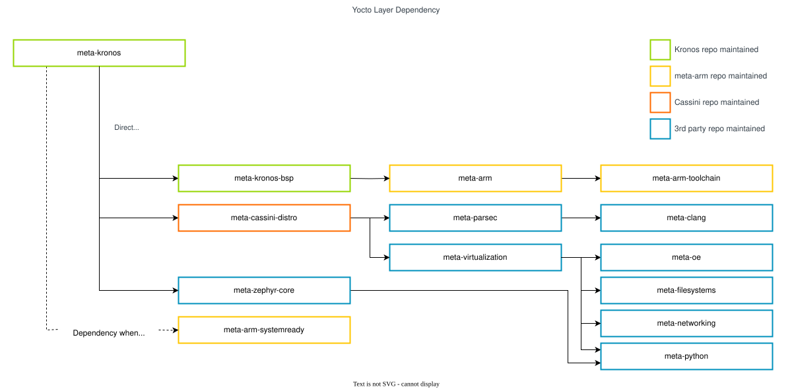

..
 # SPDX-FileCopyrightText: <text>Copyright 2023 Arm Limited and/or its
 # affiliates <open-source-office@arm.com></text>
 #
 # SPDX-License-Identifier: MIT

###########
Integration
###########

The Reference Software Stack uses the Yocto Project build framework to build,
integrate and validate the :ref:`Use-Cases <introduction_use_cases>`.

The Yocto Project version used by the Reference Stack is |yocto version|.

***********************
meta-kronos Yocto Layer
***********************

The ``meta-kronos`` layer primarily depends on the ``meta-arm-bsp`` layer which
implements the ``fvp-rd-kronos`` bitbake ``MACHINE`` definition to enable the
Reference Stack to run on the Arm Kronos Reference Design FVP (FVP_RD_Kronos).
Based on the `Cassini`_ distribution. It also contains a set of bitbake
bbclasses, recipes and libraries to build, integrate, and validate the
:ref:`introduction_use_cases` with either or both the **Baremetal** and
**Virtualization** Reference Stack Architectures as described in
:ref:`Reference Stack Overview
<introduction_reference_software_stack_overview>`.

The layer source code can be found at :kronos-repo:`yocto/meta-kronos`.

Yocto Build Configuration
=========================

A set of ``yaml`` configuration files (found at :kronos-repo:`yocto/kas`) for
the `kas build tool`_ is provided to support bitbake layer fetching, project
configuration and executing the build and validation. The description of the
kas configuration files can be found in the
:ref:`Reproduce <user_guide/reproduce:Reproduce>` section of the User Guide.

Yocto Layers Dependency
=======================

The following diagram illustrates the layers which are integrated as part of
the Reference Stack.

|

|

**Note** that the ``meta-arm-systemready`` layer is only required when building
for the |Arm SystemReadyTM| IR ACS tests.

The layer dependency sources and their revisions for the ``kronos`` repository
(|kronos repository|) |layer dependency statement| are:

  .. code-block:: yaml
    :substitutions:

    URL: |meta-arm repository|
    layers: meta-arm, meta-arm-bsp, meta-arm-systemready, meta-arm-toolchain
    branch: |meta-arm branch|
    revision: |meta-arm revision|

    URL: |meta-cassini repository|
    layers: meta-cassini-distro
    branch: |meta-cassini branch|
    revision: |meta-cassini revision|

    URL: |meta-clang repository|
    layers: meta-clang
    branch: |meta-clang branch|
    revision: |meta-clang revision|

    URL: |meta-openembedded repository|
    layers: meta-filesystems, meta-networking, meta-oe, meta-python
    branch: |meta-openembedded branch|
    revision: |meta-openembedded revision|

    URL: |meta-security repository|
    layers: meta-parsec
    branch: |meta-security branch|
    revision: |meta-security revision|

    URL: |meta-virtualization repository|
    layers: meta-virtualization
    branch: |meta-virtualization branch|
    revision: |meta-virtualization revision|

    URL: |meta-zephyr repository|
    layers: meta-zephyr-core
    branch: |meta-zephyr branch|
    revision: |meta-zephyr revision|

    URL: |poky repository|
    layers: meta, meta-poky
    branch: |poky branch|
    revision: |poky revision|
