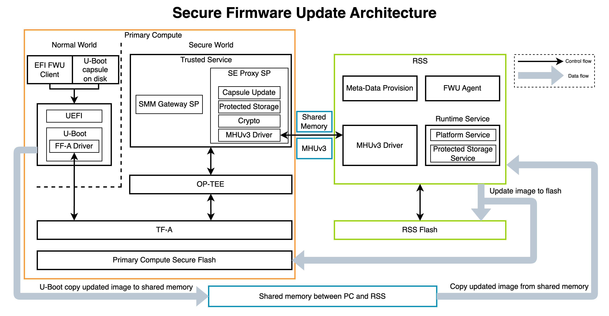

..
 # SPDX-FileCopyrightText: <text>Copyright 2023-2024 Arm Limited and/or its
 # affiliates <open-source-office@arm.com></text>
 #
 # SPDX-License-Identifier: MIT

.. _design_secure_firmware_update:

######################
Secure Firmware Update
######################

************
Introduction
************

The Reference Software Stack implements Secure Firmware Update following
the `Platform Security Firmware Update Specification`_. The following firmware
images are included:

  * RSS BL2 image
  * RSS Runtime image
  * SCP RAM Firmware (SCP RAMFW) image
  * LCP RAM Firmware (LCP RAMFW) image
  * Safety Island Cluster 0 (SI CL0) image
  * Safety Island Cluster 1 (SI CL1) image
  * Safety Island Cluster 2 (SI CL2) image
  * Primary Compute FIP (Firmware Image Package) image

The new images are accepted in the form of a UEFI capsule.

.. _design_secure_firmware_update_architecture:

************
Architecture
************

As standardized into the `Platform Security Firmware Update Specification`_,
each one of the RSS flash and secure flash is divided into two banks, where one
bank has the currently running images and the other bank is used for staging
new images. The flash layouts are shown in the below figures.

..
  /* cspell:disable */

|

  * MBR: Master Boot Record
  * GPT: GUUID Partition Table
  * FWU MetaData: Used for RSS BL1 to select the correct bank to load and
    boot the RSS BL2.
  * FWU Private MetaData: Used for the RSS BL2 to select the correct bank to
    load and boot the SCP, LCP, SI, and the Primary Compute BL2.

..
  /* cspell:enable */

|

  * MetaData: Used for the Primary Compute BL2 to select the correct bank to
    load and boot the Primary Compute BL31, BL32, BL33 etc.

The following diagram illustrates the components and data flow that implement
the Secure Firmware Update.

|

A typical Secure Firmware Update process can be described in the
following steps:

  1. The capsule image is generated by EDK2 tools and stored on the disk of
     the Primary Compute for the UEFI UpdateCapsule runtime service to access.
  2. The firmware upgrade process is initiated from the UEFI UpdateCapsule
     runtime service.
  3. The capsule image is then read and copied from the Primary Compute
     disk to the shared memory between the Primary Compute and RSS.
  4. The Capsule Update service in SE Proxy SP handles the firmware update
     request. It then sends a request to the RSS Platform Runtime Service to
     handle the firmware update request.
  5. Once the RSS Platform service receives the firmware update request, it
     firstly carries out validations of the header of the capsule, the version
     of the images, and the counter of the images, then copies the image from
     the shared memory to the RSS flash, and finally updates the image to the
     Bank-0 or the Bank-1 of the RSS flash and Primary Compute Secure Flash.
  6. The system will reset after a successful firmware update and boot from
     the bank with the new firmware images. If the firmware update fails, when
     the user restarts the system from the UEFI shell the system will boot
     from the bank with the original firmware images.
