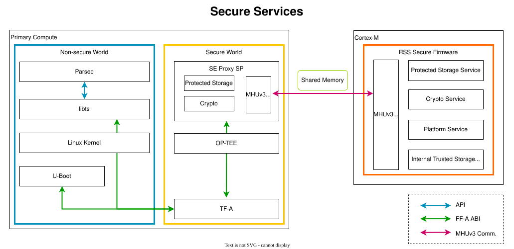

..
 # SPDX-FileCopyrightText: <text>Copyright 2023 Arm Limited and/or its
 # affiliates <open-source-office@arm.com></text>
 #
 # SPDX-License-Identifier: MIT

.. _design_secure_services:

###############
Secure Services
###############

************
Introduction
************

The Reference Software Stack provides the implementation of `Crypto Service`_
and `Secure Storage Service`_ via the SE Proxy secure partition. These services
are aligned to the following specifications:

* `PSA Crypto API`_: The API provides a portable programming interface to
  cryptographic operations, and key storage functionality on a wide range of
  hardware.

* `PSA Secure Storage API`_: The API provides key/value storage
  interfaces for use with device-protected storage. The Secure Storage API
  describes two interfaces for storage:

    * Internal Trusted Storage (ITS) API: An interface for storage provided by
      the Platform Root of Trust (PRoT). For now the ITS API is not supported by
      the Reference Stack.
    * Protected Storage (PS) API: An interface for external protected storage.

The Reference Software Stack also provides the implementation of
`UEFI SMM Services`_ via the SMM Gateway secure partition to support UEFI System
Management Mode (SMM).

These Secure Services are provided by the `Trusted Services`_ project, and
implemented by leveraging the `TrustZone`_ technology in the Primary Compute and
the hardware-isolated secure enclave in the RSS.

.. _design_secure_services_architecture:

************
Architecture
************

The following diagram illustrates the components and data flow that implement
the Secure Services.

|

|

Parsec
======

`Parsec`_, The Platform AbstRaction for SECurity, is an open-source initiative
to provide a common API to hardware security and cryptographic services in a
platform-agnostic way. This abstraction layer keeps workloads decoupled from
physical platform details.

``Parsec`` is configured to use Trusted Services in the Secure world as its
backend. ``Parsec`` service calls the API provided by ``libts`` which further
invokes the RSS for cryptographic services.

libts
=====

In Linux userspace, the Secure Services are provided in the form of `libts`_
API. ``libts`` is a library that is provided by `Trusted Services`_ for handling
service discovery and Remote Procedure Call (RPC) messaging. ``libts`` entirely
decouples client applications from details of where a service provider is
deployed and how to communicate with it.

The client application sends operation requests and receives responses by
calling the ``libts`` API. ``libts`` communicates with the `Secure Partition`_
(SP) running in the Secure world. The communication between ``libts`` and the
Secure world SP is carried by the `Arm Firmware Framework for Arm A-profile`_
(FF-A) call which is supported by Linux kernel and Trusted Firmware-A.

SE Proxy SP
===========

The `SE Proxy SP`_ (Secure Enclave Proxy Secure Partition) is a proxy partition
managed by `OP-TEE`_. It provides access to services hosted by the RSS.

The ``SE Proxy SP`` receives secure service operation requests from the Normal
world, translates the request parameters to IPC calls, and invokes the runtime
services provided by the RSS. The IPC is carried by shared memory and MHUv3
doorbell communication between the Primary Compute and the RSS.

SMM Gateway SP
==============

The `SMM Gateway SP`_ (System Management Mode Gateway Secure Partition) serves
as a gateway for the variable storage required by the implementation of UEFI
Boot and Runtime Services APIs. These UEFI variables are stored in the Protected
Storage Service provided by the RSS.

The data flow to store UEFI variables is presented in the diagram at the
beginning of the :ref:`design_secure_services_architecture` section. The U-Boot
implementation of the UEFI subsystem uses the FF-A driver to communicate with
the `UEFI SMM Services`_ in the `SMM Gateway SP`_. The backend of the SMM
services uses the Protected Storage proxy from the `SE Proxy SP`_. From there
on, the Protected Storage calls are forwarded to the secure enclave as explained
above.

RSS Secure Firmware
===================

The Secure Services are finally served by the ``RSS Secure Firmware``. For more
information about how the Secure Services work in the RSS, please read the
`TF-M Secure Services`_ page.
