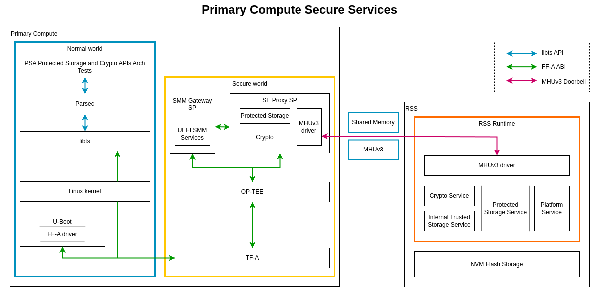
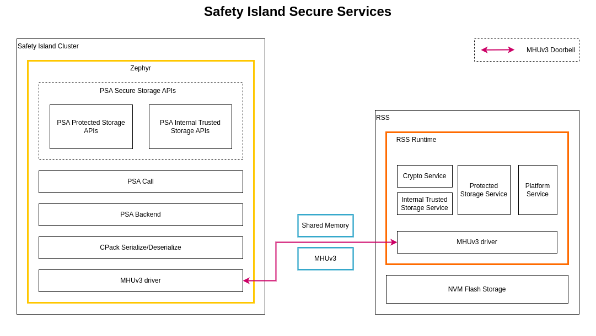

..
 # SPDX-FileCopyrightText: <text>Copyright 2023-2024 Arm Limited and/or its
 # affiliates <open-source-office@arm.com></text>
 #
 # SPDX-License-Identifier: MIT

.. _design_secure_services:

###############
Secure Services
###############

************
Introduction
************

The Reference Software Stack provides the implementation of Secure Services
through both the Primary Compute and Safety Island. These services are aligned
to the following specifications:

* `PSA Crypto API`_: The API provides a portable programming interface to
  cryptographic operations, and key storage functionality on a wide range of
  hardware.

* `PSA Secure Storage API`_: The API provides key/value storage
  interfaces for use with device-protected storage. The Secure Storage API
  describes two interfaces for storage:

    * Internal Trusted Storage (ITS) API: An interface for storage provided by
      the Platform Root of Trust (PRoT). For now the ITS API is not supported by
      the Reference Stack on the Primary Compute.
    * Protected Storage (PS) API: An interface for external protected storage.

***************
Primary Compute
***************

On Primary Compute, the implementation of `Crypto Service`_ and `Secure Storage
Service`_ is based on the SE Proxy secure partition.

The Primary Compute also provides the implementation of
`UEFI SMM Services`_ via the SMM Gateway secure partition to support UEFI System
Management Mode (SMM).

These Secure Services are provided by the `Trusted Services`_ project, and
implemented by leveraging the `TrustZone`_ technology in the Primary Compute and
the hardware-isolated secure enclave in the RSS.

The Reference Software Stack provides the implementation of Secure Services
through both the Primary Compute and the Safety Island.

.. _design_primary_compute_secure_services_architecture:

Architecture
------------

The following diagram illustrates the components and data flow that implement
the Primary Compute Secure Services.

|

|

Parsec
------

`Parsec`_, The Platform AbstRaction for SECurity, is an open-source initiative
to provide a common API to hardware security and cryptographic services in a
platform-agnostic way. This abstraction layer keeps workloads decoupled from
physical platform details.

``Parsec`` is configured to use Trusted Services in the Secure world as its
backend. ``Parsec`` service calls the API provided by ``libts`` which further
invokes the RSS for cryptographic services.

libts
-----

In Linux userspace, the Secure Services are provided in the form of `libts`_
API. ``libts`` is a library that is provided by `Trusted Services`_ for handling
service discovery and Remote Procedure Call (RPC) messaging. ``libts`` entirely
decouples client applications from details of where a service provider is
deployed and how to communicate with it.

The client application sends operation requests and receives responses by
calling the ``libts`` API. ``libts`` communicates with the `Secure Partition`_
(SP) running in the Secure world. The communication between ``libts`` and the
Secure world SP is carried by the `Arm Firmware Framework for Arm A-profile`_
(FF-A) call which is supported by Linux kernel and Trusted Firmware-A.

SE Proxy SP
-----------

The `SE Proxy SP`_ (Secure Enclave Proxy Secure Partition) is a proxy partition
managed by `OP-TEE`_. It provides access to services hosted by the RSS.

The ``SE Proxy SP`` receives secure service operation requests from the Normal
world, translates the request parameters to IPC calls, and invokes the runtime
services provided by the RSS. The IPC is carried by shared memory and MHUv3
doorbell communication between the Primary Compute and the RSS.

SMM Gateway SP
--------------

The `SMM Gateway SP`_ (System Management Mode Gateway Secure Partition) serves
as a gateway for the variable storage required by the implementation of UEFI
Boot and Runtime Services APIs. These UEFI variables are stored in the Protected
Storage Service provided by the RSS.

The data flow to store UEFI variables is presented in the diagram at the
beginning of the :ref:`design_primary_compute_secure_services_architecture`
section. The U-Boot implementation of the UEFI subsystem uses the FF-A driver to
communicate with the `UEFI SMM Services`_ in the `SMM Gateway SP`_.
The backend of the SMM services uses the Protected Storage proxy from the
`SE Proxy SP`_. From there on, the Protected Storage calls are forwarded to the
secure enclave as explained above.

*************
Safety Island
*************

The Safety Island provides the implementation of `Crypto Service`_ and
`Secure Storage Service`_. The data paths of the services are different.

Architecture
------------

The following diagram illustrates the components and data flow that implement
the Safety Island Secure Services.

|

|

.. _design_safety_island_secure_services_psa_crypto_apis:

PSA Crypto APIs
---------------

The `PSA Crypto API`_ is implemented by the ``libmbedcrypto`` library of
`Mbed TLS`_.

Mbed TLS supports drivers for cryptographic accelerators, secure elements and
random generators. An `RSS Communication Driver` is created to communicate with
RSS for calling the crypto service that is provided there. The driver invokes
the ``psa_call()`` interface to communicate with the RSS via MHUv3.

By introducing the driver, different crypto operations can be handled in
different ways:

* Asymmetric crypto operations can be handled in RSS for enhanced security,
  because the private key cannot leave RSS. The following Crypto APIs are
  supported by the driver:

  Key management:
    * ``psa_import_key``
    * ``psa_generate_key``
    * ``psa_copy_key``
    * ``psa_destroy_key``
    * ``psa_export_key``
    * ``psa_export_public_key``

  Asymmetric signature:
    * ``psa_sign_message``
    * ``psa_verify_message``
    * ``psa_sign_hash``
    * ``psa_verify_hash``

  Asymmetric encryption:
    * ``psa_asymmetric_encrypt``
    * ``psa_asymmetric_decrypt``

* Symmetric and other crypto operations are handled in Safety Island locally
  with the Mbed TLS software implementation, where the runtime performance is
  optimized.

PSA Secure Storage APIs
-----------------------

Two use cases are addressed by `PSA Secure Storage API`_:

* Internal Trusted Storage:
  Internal Trusted Storage aims at providing a place for devices to store
  their most intimate secrets, either to ensure data privacy or data integrity.
  For example, a device identity key requires confidentiality, whereas an
  authority public key is public data but requires integrity. Other critical
  values that are part of a Root of Trust Service — for example, secure time
  values, monotonic counter values, or firmware image hashes — will also need
  trusted storage.

  The following PSA Internal Trusted Storage APIs are supported in Kronos
  Reference Stack:

    * ``psa_its_set``
    * ``psa_its_get``
    * ``psa_its_get_info``
    * ``psa_its_remove``

* Protected Storage:
  Protected Storage is meant to protect larger data-sets against physical
  attacks. It aims to provide the ability for a firmware developer to store
  data onto external flash, with a promise of data-at-rest protection,
  including device-bound encryption, integrity, and replay protection.
  It should be possible to select the appropriate protection level — for
  example, encryption only, or integrity only, or both — depending on the
  threat model of the device and the nature of its deployment.

  The following PSA Protected Storage APIs are supported in Kronos
  Reference Stack:

    * ``psa_ps_set``
    * ``psa_ps_get``
    * ``psa_ps_get_info``
    * ``psa_ps_remove``
    * ``psa_ps_get_support``

All the PSA Secure Storage API interfaces use the ``psa_call()`` for
communicating with the RSS.

The PSA APIs are thread safe in case of parallel API invocations from multiple
threads within the same cluster or from different clusters, Where the
``psa_call()`` blocks any new requests using a semaphore until the ongoing
request completes.

RSS communication
-----------------

The RSS communication protocol is designed to be a lightweight serialization of
the ``psa_call()`` API through a combination of in-band MHUv3
(Message Handling Unit) transport and parameter-passing through shared memory.

To call an RSS service, the client must send a message in-band over the MHUv3
sender link to RSS and wait for a reply message on the MHUv3 receiver.
The messages are defined as packed C structures, which are serialized in
byte-order over the MHUv3 links.

*******************
RSS Secure Firmware
*******************

The Secure Services are finally served by the ``RSS Secure Firmware``. For more
information about how the Secure Services work in the RSS, read the
`TF-M Secure Services`_ page.

Trusted Firmware-M has some limitations regarding the Secure Storage Service.
Refer to the changelog :ref:`changelog_limitations` section for more
details.
