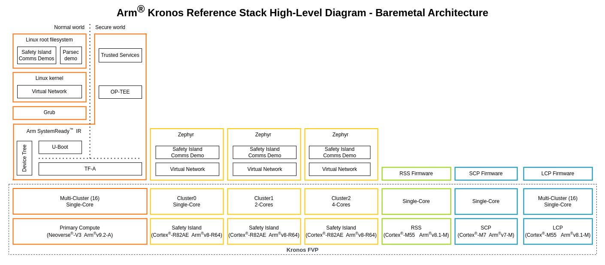
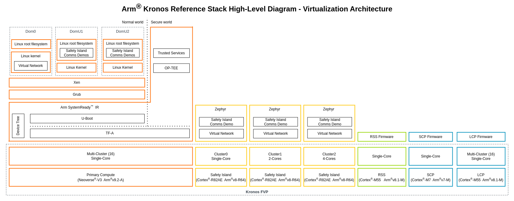

..
 # SPDX-FileCopyrightText: <text>Copyright 2023-2024 Arm Limited and/or its
 # affiliates <open-source-office@arm.com></text>
 #
 # SPDX-License-Identifier: MIT

############
Introduction
############

The |Arm| Kronos Reference Design is a Fixed Virtual Platform (FVP) based
system that introduces the concept of a high-performance |Neoverse| V3
Application Processor (Primary Compute) system augmented with an |Cortex|-R82AE
based Safety Island, for scenarios where additional system safety monitoring is
required. The Reference Design additionally includes a Runtime Security
Subsystem (RSS) used for the secure boot of the system elements and the runtime
Secure Services.

Together, this FVP model and software stack allow for the exploration of
baremetal and XEN hypervisor hosted Linux instances, Primary Compute to/from
Safety Island communication mechanisms (for both baremetal and virtualized
scenarios), and boot flows coordinated via a system root of trust. The Primary
Compute firmware stack of Trusted Firmware-A, U-Boot, OP-TEE and Trusted
Services is also aligned with the technologies and goals of the
|Arm SystemReadyTM| IR program.

Further technical details of the Kronos Reference Design FVP can be found at
`Arm Kronos Reference Design Technical Overview`_, with an
introduction to FVPs available in the `Fast Models FVP Reference Guide`_.

.. _introduction_safety_considerations:

**********************************
Safety and Security Considerations
**********************************

The Kronos Reference Design contains features that users may wish to reference
as part of the design of secure safety-critical systems. This documentation
additionally contains information about these features. Reasonable efforts have
been made to review the information and implementations but:

 * A reference design is not a complete implementation and will inevitably have
   limitations, simplifications, missing features and bugs that would need to
   be addressed to achieve a deployable system design.
 * The information and any limitations documented should be treated as
   non-exhaustive.
 * No formal verification methods have been attempted.
 * Users are fully responsible for validating the design of a system derived
   from any of the work contained within.

.. _introduction_reference_software_stack_overview:

*********************************
Reference Software Stack Overview
*********************************

This Reference Software Stack is made available as part of the Arm Kronos
Reference Design and is composed of multiple Open Source components which
together form the proposed solution, including:

  * The `Runtime Security Subsystem (RSS)`_, running an instance of Trusted
    Firmware-M, which offers boot, cryptography, and secure storage services.

  * The Safety Island subsystem, running three instances of the Zephyr real-time
    operating system (RTOS).

  * The firmware for the Primary Compute, using Trusted Firmware-A, U-Boot,
    OP-TEE and Trusted Services. These are configured to be aligned with `Arm
    SystemReady IR`_.

The remaining software in the Primary Compute subsystem, based on the
`Cassini`_ distribution, is available in two main architectures:

  **Baremetal Architecture**

  The Primary Compute boots a single rich operating system (real-time Linux with
  PREEMPT_RT patches).

|

  **Virtualization Architecture**

    The Primary Compute boots into a type-1 hypervisor (Xen) using Arm’s
    hardware virtualization support. There are three isolated, resource-managed
    virtual machines: Dom0 (privileged domain) and DomU1 and DomU2 (unprivileged
    domains).

|

In both architectures the Primary Compute (Linux) can communicate with the
Safety Island subsystem (Zephyr) via a bi-directional communication channel. The
:ref:`design_applications_actuation` and :ref:`design_applications_cam` are
integrated into the stack to show-case this Heterogeneous Inter-processor
Communication (HIPC) between subsystems.

.. _introduction_use_cases:

*********
Use-Cases
*********

The Reference Software Stack demonstrates the following capabilities of how a
high-performance compute platform can be enhanced to improve functional safety:

  * Critical Applications Monitoring
  * High reliability compute subsystem
  * Safety Island Communication
  * Transport Layer Security (TLS) with hardware cryptography support
  * RSS Secure Services providing PSA Secure Storage and Crypto compliant APIs
  * |Arm SystemReadyTM| IR-aligned software stack
  * Secure firmware update following Arm's Security Firmware Update
    Specification
  * System Fault Handling for increased safety

:ref:`Reproduce <user_guide/reproduce:Reproduce>` section of the User Guide
contains all the instructions necessary to fetch and build the source as well
as to download the required FVP and launch the Use-Cases.

Following are the main Use-Cases implemented by the Reference Software Stack.

Critical Application Monitoring Demo
====================================

Critical Application Monitoring (CAM) is a project that implements a solution
for monitoring critical applications using a service running on a higher safety
level system. This Demo deploys CAM components on the Kronos FVP to demonstrate
the feasibility of the Safety Island monitoring solution.

Please refer to :ref:`design_applications_cam` for more information.

Safety Island Actuation Demo
============================

The Safety Island Actuation Demo consists of the |Arm SystemReadyTM| IR-aligned
firmware along with Linux-based software on the Primary Compute and Zephyr
application on the Safety Island to demonstrate automotive workloads.  Please
refer to :ref:`design_applications_actuation` for more information.

Safety Island Communication Demo
================================

The Safety Island Communication Demo demonstrates via HIPC (Heterogeneous
Inter-processor Communication), the networking between:

  * Primary Compute and the three Safety Island clusters.
  * Safety Island clusters.

Please refer to :ref:`design_hipc` for more information on HIPC.

Parsec-enabled TLS Demo
=======================

The Parsec-enabled TLS demo illustrates a HTTPS session where a Transport
Layer Security (TLS) connection is established, and a simple webpage is
transferred. The TLS session consists of both symmetric and asymmetric
cryptographic operations. The symmetric operations are executed by Mbed TLS
in Linux userspace on the Primary Compute. The asymmetric operations are
carried out by `Parsec`_. While the backend of the Parsec service is based on
RSS cryptographic runtime service. Please refer to
:ref:`design_applications_parsec_enabled_tls` for more information.

Safety Island PSA Secure Storage APIs Architecture Test Suite
=============================================================

The PSA Secure Storage architecture test suite is a set of examples of
the invariant behaviors that are specified in the PSA Secure Storage
APIs specification.

We use this suite to verify whether these behaviors are implemented
correctly in our system. This suite contains self-checking and portable
C-based tests with directed stimulus.

Please refer to :ref:`design_applications_psa_arch_tests_secure_storage` for
more information.

Safety Island PSA Crypto APIs Architecture Test Suite
=====================================================

The PSA Crypto architecture test suite is a set of examples of the invariant
behaviors that are specified in the PSA Crypto APIs specification.

We use this suite to verify whether the PSA Crypto APIs provided on Safety
Island are correctly implemented.

Please refer to :ref:`design_applications_psa_arch_tests_crypto` for more
information.

Fault Management Demo
=====================

The Fault Management subsystem for the Safety Island demonstrates the
injection, reporting and collation of faults from supported hardware to support
the design of safety-critical systems.

Please refer to :ref:`design_applications_fault_mgmt` for more information.

|Arm SystemReadyTM| IR Validation
=================================
|Arm SystemReadyTM| is a compliance certification program based on a set of
hardware and firmware standards that enable interoperability with generic
off-the-shelf operating systems and hypervisors. Please refer to
:ref:`design_systemready_ir` for more information.

Linux Distribution Installation
===============================

Demonstrates the installation of two unmodified generic UEFI distribution
images, Debian and openSUSE, fulfilling |Arm SystemReadyTM| requirements.

Secure Firmware Update
======================

Demonstrates an implementation of Secure Firmware Update initiated from
the Primary Compute and follows the
`Platform Security Firmware Update Specification`_. Please refer to
:ref:`design_secure_firmware_update` for more information.

**********************
Documentation Overview
**********************

The intended target audience of this document are software, hardware, and system
engineers who are planning to evaluate and use the Arm Kronos Reference Stack.

It describes how to build and run images for the Arm Kronos Reference Design
FVP (FVP_RD_Kronos) using the Yocto Project build framework. Basic instructions
about the Yocto Project can be found in the `Yocto Project Quick Start`_.

In addition to having Yocto related knowledge, the target audience also needs
to have a certain understanding of the following technologies:

  * Arm Firmware:

    * `OP-TEE`_

    * `Runtime Security Subsystem (RSS)`_

    * `System Control Processor (SCP) Firmware`_

    * `Local Control Processor (LCP) Firmware`_

    * `Trusted Firmware-A (TF-A)`_

    * `Trusted Services`_

  * `U-boot`_

  * `Xen Hypervisor`_

  * `Zephyr`_

Documentation Structure
=======================

  * :ref:`User Guide <user_guide/index:User Guide>`

    Provides guidance for configuring, building, and deploying the Reference
    Stack on the FVP and running and validating the supported functionalities.

  * :ref:`Solution Design <design/index:Solution Design>`

    Provides more advanced developer-focused details of the Reference Stack,
    its implementation, and dependencies.

  * :ref:`License <license_link:License>`

    Defines the license under which the Reference Stack is provided.

  * :ref:`Changelog & Release Notes <changelog:Changelog & Release Notes>`

    Documents new features, bug fixes, limitations, and any other changes
    provided under each Reference Stack release.

********************
Repository Structure
********************

The ``kronos`` repository (|kronos repository|) is
structured as follows:

  * ``kronos``:

    * ``yocto``

      Directory implementing the ``meta-kronos`` Yocto layer as well as kas
      build configuration files.

    * ``components``

      Directory containing source code for components which can either be used
      directly or as part of the ``meta-kronos`` Yocto layer.

    * ``documentation``

      Directory which contains the documentation sources, defined in
      ReStructuredText (``.rst``) format for building via ``sphinx``.

******************
Repository License
******************

The repository's standard license is the MIT license (more details in
:ref:`license_link:License`), under which most of the repository's content is
provided. Exceptions to this standard license relate to files that represent
modifications to externally licensed works (for example, patch files). These
files may therefore be included in the repository under alternative licenses in
order to be compliant with the licensing requirements of the associated external
works.

*********************************
Contributions and Issue Reporting
*********************************

This project has not put in place a process for contributions currently.

To report issues with the repository such as potential bugs, security concerns,
or feature requests, please submit an Issue via `GitLab Issues`_, following the
project's template.

********************
Feedback and Support
********************

To request support please contact Arm at support@arm.com. Arm licensees may
also contact Arm via their partner managers.
