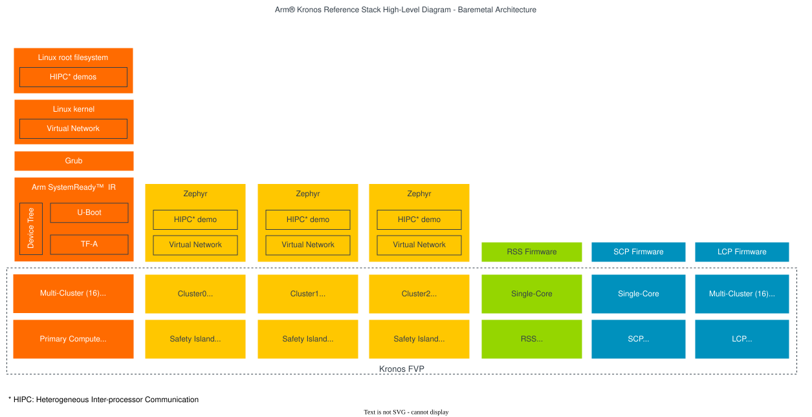
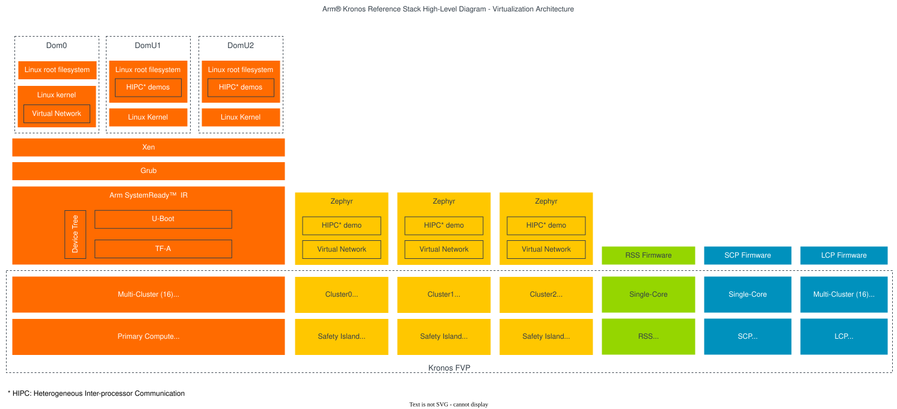

..
 # SPDX-FileCopyrightText: <text>Copyright 2023 Arm Limited and/or its
 # affiliates <open-source-office@arm.com></text>
 #
 # SPDX-License-Identifier: MIT

############
Introduction
############

The |Arm| Kronos Reference Design is a Fixed Virtual Platform (FVP) based
system that introduces the concept of a high-performance Application
Processor (Primary Compute) system augmented with an |Cortex|-R based
Safety Island, for scenarios where additional system safety monitoring is
required. The Reference Design additionally includes a Runtime Security
Subsystem (RSS) used for the secure boot of the system elements.

Together, this FVP model and software stack allow for the exploration of
baremetal and XEN hypervisor hosted Linux instances, Primary Compute to/from
Safety Island communication mechanisms (for both baremetal and virtualized
scenarios), and boot flows coordinated via a system root of trust. The Primary
Compute firmware stack of Trusted Firmware-A and U-Boot is also aligned with
the technologies and goals of the |Arm SystemReadyTM| IR program.

Further technical details of the Kronos Reference Design FVP can be found at
`Arm Kronos Reference Design Technical Overview`_, with an
introduction to FVPs available in the `Fast Models FVP Reference Guide`_.

.. _introduction_use_cases_and_reference_software_stack_overview:

***********************************************
Use-Cases and Reference Software Stack Overview
***********************************************

This Reference Software Stack is made available as part of the Arm Kronos
Reference Design and is composed of multiple Open Source components which
together form the proposed solution, including:

  * The `Runtime Security Subsystem (RSS)`_ runs an instance of Trusted
    Firmware-M which offers boot services.

  * The Safety Island subsystem runs three instances of the Zephyr real-time
    operating system (RTOS).

  * The firmware for the Primary Compute uses Trusted Firmware-A and U-Boot.
    These are configured to be aligned with `Arm SystemReady IR`_.

The remaining software in the Primary Compute subsystem, based on the
`Cassini`_  distribution, is available in two main architectures:

  **Baremetal Architecture**

  The system boots a simple single rich operating system (Linux).

|

  **Virtualization Architecture**

    The system boots into a type-1 hypervisor (Xen) making use of Arm's hardware
    virtualization support. There are three isolated, resource managed virtual
    machines: Dom0 (privileged domain) and DomU1 and DomU2 (unprivileged
    domains).

|

In both architectures the Primary Compute (Linux) can communicate with the
Safety Island subsystem (Zephyr) via a bi-directional communication channel. The
:ref:`design_applications_actuation` is integrated into the stack to show-case
this Heterogeneous Inter-processor Communication (HIPC) between subsystems.

The solution is provided via a set of Yocto layers which contain all the
instructions necessary to fetch and build the source as well as to download
the required FVP and launch the use-case examples.

Instructions for achieving these use-cases are given in the
:ref:`Reproduce <user_guide/reproduce:Reproduce>` section of the User Guide,
subject to relevant assumed technical knowledge as listed later in this
introduction at `Documentation Overview`_.

.. note::
  Users of this software stack must consider safety and security implications
  according to their own usage goals.

**********************
Documentation Overview
**********************

The intended target audience of this document are software, hardware, and system
engineers who are planning to evaluate and use the Arm Kronos Reference Stack.

It describes how to build and run images for the Arm Kronos Reference Design
FVP (FVP_RD_Kronos) using the Yocto Project build framework. Basic instructions
about the Yocto Project can be found in the `Yocto Project Quick Start`_.

In addition to having Yocto related knowledge, the target audience also needs
to have a certain understanding of the following technologies:

  * Arm Firmware:

    * `Runtime Security Subsystem (RSS)`_

    * `System Control Processor (SCP) Firmware`_

    * `Trusted Firmware-A (TF-A)`_

    * `Trusted Firmware-M (TF-M)`_

  * `U-boot`_

  * `Zephyr`_

  * `Xen Hypervisor`_

Documentation Structure
=======================

  * :ref:`User Guide <user_guide/index:User Guide>`

    Provides guidance for configuring, building, and deploying the Reference
    Stack on the FVP and running and validating the supported functionalities.

  * :ref:`Solution Design <design/index:Solution Design>`

    Provides more advanced developer-focused details of the Reference Stack,
    its implementation, and dependencies.

  * :ref:`License <license_link:License>`

    Defines the license under which the Reference Stack is provided.

  * :ref:`Changelog & Release Notes <changelog:Changelog & Release Notes>`

    Documents new features, bug fixes, limitations, and any other changes
    provided under each Reference Stack release.

********************
Repository Structure
********************

The ``kronos`` repository (|kronos repository|) is
structured as follows:

  * ``kronos``:

    * ``yocto``

      Directory implementing the ``meta-kronos`` Yocto layer as well as kas
      build configuration files.

    * ``components``

      Directory containing source code for components which can either be used
      directly or as part of the ``meta-kronos`` Yocto layer.

    * ``documentation``

      Directory which contains the documentation sources, defined in
      ReStructuredText (``.rst``) format for building via ``sphinx``.

******************
Repository License
******************

The repository's standard license is the MIT license (more details in
:ref:`license_link:License`), under which most of the repository's content is
provided. Exceptions to this standard license relate to files that represent
modifications to externally licensed works (for example, patch files). These
files may therefore be included in the repository under alternative licenses in
order to be compliant with the licensing requirements of the associated external
works.

*********************************
Contributions and Issue Reporting
*********************************

This project has not put in place a process for contributions currently.

To report issues with the repository such as potential bugs, security concerns,
or feature requests, please submit an Issue via `GitLab Issues`_, following the
project's template.

********************
Feedback and support
********************

To request support please contact Arm at support@arm.com. Arm licensees may
also contact Arm via their partner managers.
