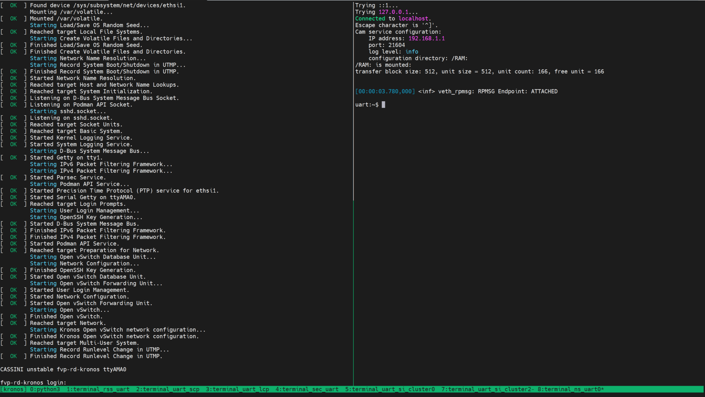
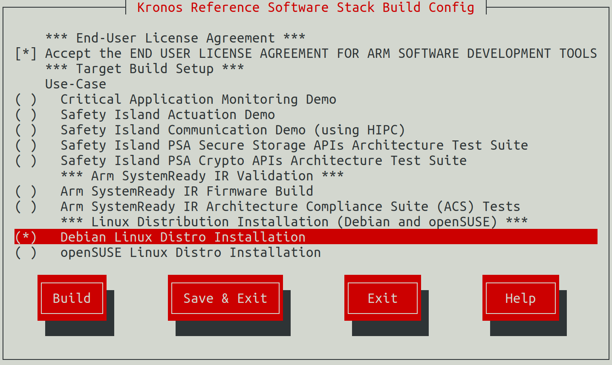
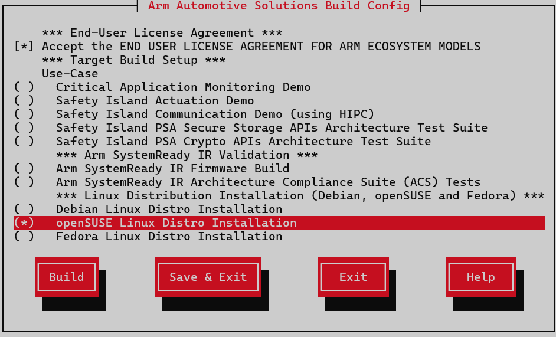

..
 # SPDX-FileCopyrightText: <text>Copyright 2023 Arm Limited and/or its
 # affiliates <open-source-office@arm.com></text>
 #
 # SPDX-License-Identifier: MIT

#########
Reproduce
#########

This section of the User Guide describes how to download, configure, build and
execute this Reference Stack.

************
Introduction
************

This Reference Stack uses the `kas menu tool`_ to configure and customize the
different :ref:`Use-Cases <introduction_use_cases>` via a set of configuration
options provided in the configuration menu.

.. note::
  All command examples on this page can be copied by clicking the copy button.
  Any console prompts at the start of each line, comments, or empty lines will
  be automatically excluded from the copied text.

.. _user_guide_reproduce_environment_setup:

****************************
Build Host Environment Setup
****************************

System Requirements
===================

  * x86_64 or aarch64 host to build and execute the Kronos FVP
  * Ubuntu Desktop or Server 20.04 Linux distribution
  * At least 300GiB of free disk for the download and builds
  * At least 32GiB of RAM memory
  * At least 8GiB of swap memory

Install Dependencies
====================

  * Please follow the Yocto Project documentation on
    `how to install the essential packages`_ required for the build host. The
    packages needed to build the Yocto Project documentation manuals are not
    required.

  * Install the kas tool and its optional dependency (to use the "menu" plugin):

    .. code-block:: console
      :substitutions:

      sudo -H pip3 install --upgrade kas==|kas version| && sudo apt install python3-newt

    For more details on kas installation, see
    `kas Dependencies & installation`_.
  * Install tmux (required for ``runfvp`` tool):

    .. code-block:: console

      sudo apt install tmux

.. _user_guide_reproduce_download:

********
Download
********

Download the ``kronos`` repository using Git and checkout on the kronos branch,
via:

.. code-block:: shell
  :substitutions:

  # Change the tag or branch to be fetched by replacing the value supplied to
  # the --branch parameter option

  mkdir -p ~/kronos
  cd ~/kronos
  tmux new-session -s kronos
  git clone |kronos remote| --branch |kronos version|

.. note::
   Performing the builds and FVP execution in a tmux session is mandatory for
   Kronos because the ``runfvp`` tool that invokes the Kronos FVP expects the
   presence of a tmux session to attach its spawned tmux windows for console
   access to the processing elements. Please refer to
   `Tmux Documentation`_ for more information on the usage of tmux. It is
   recommended to change the default ``history-limit`` by adding
   ``set-option -g history-limit 3000`` to ``~/.tmux.conf`` before starting
   tmux.

*************************
Reproducing the Use-Cases
*************************

General
=======

Kas Build
---------

The Kronos stack has a kas configuration menu that can be used to build the
:ref:`introduction_use_cases`. It can also apply customizable parameters to build
different Reference Stack Architecture types.

To run the configuration menu:

.. code-block:: console

  kas menu kronos/Kconfig

.. note::
  To build and run any image for the Kronos FVP the user has to accept its
  `EULA`_, which can be done by selecting the corresponding configuration
  option in the build setup. The Safety Island Actuation Demo is built as
  part of the default deployment.

.. image:: ../images/kronos_reference_stack_build_config.png
   :align: center
   :width: 60 %

|

FVP
---

The ``runfvp`` tool that invokes the Kronos FVP creates one tmux terminal
window per processing element. The default window displayed will be that of the
Primary Compute terminal titled as ``terminal_ns_uart0``. User may press
``Ctrl-b w`` to see the list of tmux windows and use arrow keys to navigate
through the windows and press ``Enter`` to select any processing element
terminal.

The Reference Stack running on the Primary Compute can be logged into as
``root`` user without password in the Linux terminal.

.. note::
  FVPs, and Fast Models in general, are functionally accurate, meaning that they
  fully execute all instructions correctly, however they are not cycle accurate.
  The main goal of the Reference Stack is to prove functionality only, and
  should not be used for performance analysis.

.. _user_guide_reproduce_actuation_demo:

Safety Island Actuation Demo
============================

The demo can be run on the Baremetal Architecture or Virtualization
Architecture. See :ref:`design_applications_actuation` for further details.

Baremetal Architecture
----------------------

Build
^^^^^

To run the configuration menu:

.. code-block:: console

  kas menu kronos/Kconfig

To build a Baremetal Architecture image:

1. Select ``Safety Island Actuation Demo`` from the ``Use-Case`` menu.
2. Choose ``Baremetal`` from the ``Reference Stack Architecture`` menu.
3. Then choose ``Save & Build``.

Run FVP
^^^^^^^

To start the FVP and connect to the Primary Compute terminal (running Linux):

.. code-block:: console

  kas shell -c "../layers/meta-arm/scripts/runfvp -t tmux --verbose"

The user should wait for the system to boot and for the Linux prompt to appear.
Following image shows a example on how the terminal should look like after the
fvp invocation.

  .. image:: ../images/kronos_reference_stack_fvp_run.png
   :align: center

|

The Safety Island (SI) Cluster 2 terminal running the Actuation Service is
available via the tmux window titled ``terminal_uart_si_cluster2``. For ease of
navigation, we recommend joining the SI Cluster 2 terminal window to Primary
Compute terminal window and to create a tmux pane attached to the build host
machine in order to issue commands on it. User can navigate through the panes
by pressing ``Ctrl-b w`` and arrow keys followed by the ``Enter`` key.

Follow the steps below to achieve the same:

1. Press ``Ctrl-b w`` from the tmux session, navigate to the tmux window titled
   ``terminal_ns_uart0`` followed by pressing ``Enter`` key.
2. Press ``Ctrl-b %`` to add a new tmux window which will be used to issue
   commands on the build host machine.
3. Press ``Ctrl-b :`` and then type ``join-pane -s :terminal_uart_si_cluster2``
   followed by pressing ``Enter`` key to join the SI Cluster 2 terminal window
   to Primary Compute terminal window.

Please refer to the following image of the tmux panes re-arrangement.

  .. image:: ../images/kronos_reference_stack_fvp_rearrange_windows.png
    :align: center

|

The Reference Stack running on the Primary Compute can be logged into as
``root`` user without password in the Linux terminal. Run the below
command to guarantee that all the expected services have been
initialized.

   .. code-block:: shell

      systemctl is-system-running --wait

Wait for it to return expecting ``running`` to be printed in the terminal.

Run the demo
^^^^^^^^^^^^

1. Run the ``ping`` command from the Primary Compute terminal (running Linux)
   to verify that it can communicate with the Safety Island (running Zephyr):

   .. code-block:: shell

      # On the Primary Compute terminal
      ping 192.168.2.1 -c 10

   The output should look like the following line, repeated 10 times:

   .. code-block:: shell

      64 bytes from 192.168.2.1 seq=0 ttl=64 time=0.151 ms

2. From the tmux pane started for the build host machine terminal, start the
   Packet Analyzer:

   .. code-block:: shell

      cd ~/kronos/
      # Start the Packet Analyzer
      kas shell -c "oe-run-native packet-analyzer-native start_analyzer -L debug -a localhost -c ./data"

   The following messages are expected from the host terminal:

   .. code-block:: shell

      INFO : analyzer_client.py/_connect_to: Starting analyze, use Ctrl-C to stop the process.
      INFO : analyzer_client.py/_connect_to: Attempting a connect to (localhost : 49152)
      INFO : analyzer_client.py/_connect_to: Successfully connected to (localhost : 49152)

   A message similar to the following should appear on the SI Cluster 2
   terminal:

   .. code-block:: shell

      Actuation Service initialized.
      Accepted tcp connection from the Packet Analyzer: <11>

   Please refer to the following image for an invocation example of the Packet
   Analyzer.

     .. image:: ../images/kronos_reference_stack_packet_analyzer_baremetal.png
       :align: center

|

3. Start the Player on the Primary Compute terminal which replays a recording
   of a driving scenario:

   .. code-block:: shell

      actuation_player -p /usr/share/actuation_player/

   A message similar to the following should appear on the SI Cluster 2
   terminal:

   .. code-block:: shell

    51572682601: -0.0000 (m/s^2) |  0.0000 (rad)^M
    51597466928: -0.0000 (m/s^2) |  0.0000 (rad)^M
    51622532911: -0.0000 (m/s^2) |  0.0000 (rad)^M
    51647642316: -0.0000 (m/s^2) |  0.0000 (rad)^M
    51672535849: -0.0000 (m/s^2) |  0.0000 (rad)^M
    51697376579: -0.0000 (m/s^2) |  0.0000 (rad)^M
    51722500414: -0.0000 (m/s^2) |  0.0000 (rad)^M
    51747622543: -0.0000 (m/s^2) |  0.0000 (rad)^M
    51772496466: -0.0000 (m/s^2) |  0.0000 (rad)^M
    Thread get_analyzer_handle performing a blocking accept

   A message similar to the following should appear on the host terminal where
   the Packet Analyzer is running:

   .. code-block:: shell

    INFO : analyzer_client.py/_connect_to: Starting analyze, use Ctrl-C to stop the process.
    INFO : analyzer_client.py/_connect_to: Attempting a connect to (localhost : 49152)
    INFO : analyzer_client.py/_connect_to: Successfully connected to (localhost : 49152)
    INFO : analyzer_client.py/run_analyze_on_chain: (1) Analyzer synced with packet chain
    INFO : analyzer_client.py/run_analyze_on_chain: All expected control packets received
    INFO : analyzer_client.py/_log_jitter: Observed Frequency = 21.36147200, Avg Jitter = 0.02624593, Std Deviation:0.06096328
    INFO : analyzer_client.py/run_analyze_on_chain: End of cycle: AnalyzerResult.SUCCESS

    INFO : analyzer_client.py/_tear_conn: Received fin ack from Actuation Service

    Chain ID   Result
    0          AnalyzerResult.SUCCESS

4. To shutdown the FVP and terminate the emulation, follow the below steps:

    * Issue a ``shutdown now`` on the Primary Compute terminal. The below
      messages indicate the shutdown process is complete.

      .. code-block:: shell

         [  OK  ] Finished System Power Off.
         [  OK  ] Reached target System Power Off.

    * Close the Primary Compute terminal tmux window created by the ``runfvp``
      tool by pressing ``Ctrl-]`` and typing ``quit``.
    * Close the tmux pane started for the build host machine by pressing
      ``Ctrl-d``.
    * Select the terminal titled as ``python3`` where the ``runfvp`` was
      launched by pressing ``Ctrl-b 0`` and press ``Ctrl-c`` to stop the FVP
      process.

Automated Validation
^^^^^^^^^^^^^^^^^^^^

To run the configuration menu:

.. code-block:: console

  kas menu kronos/Kconfig

To enable the validation tests:
  1. Select ``Safety Island Actuation Demo`` as ``Use-Case``.
  2. Choose ``Baremetal`` from the ``Reference Stack Architecture`` menu.
  3. Choose ``Run Automated Validation`` from the ``Runtime Validation Setup``
     menu.
  4. Then choose ``Save & Build``.

The complete test suite takes around 16 minutes to complete. See
:ref:`validation_actuation_demo` for more details. A similar output to the
following is printed out.

      .. code-block:: console

        2023-11-26 21:28:21 - INFO     - RESULTS - test_10_fault_mgmt.FaultMgmtSSUTest.test_ssu_ce_not_ok: PASSED (31.07s)
        2023-11-26 21:28:21 - INFO     - RESULTS - test_10_fault_mgmt.FaultMgmtSSUTest.test_ssu_compl_ok: PASSED (28.97s)
        2023-11-26 21:28:21 - INFO     - RESULTS - test_10_fault_mgmt.FaultMgmtSSUTest.test_ssu_nce_ok: PASSED (26.67s)
        2023-11-26 21:28:21 - INFO     - RESULTS - test_10_fault_mgmt.FaultMgmtTest.test_fmu_fault_clear: PASSED (19.21s)
        2023-11-26 21:28:21 - INFO     - RESULTS - test_10_fault_mgmt.FaultMgmtTest.test_fmu_fault_count: PASSED (14.02s)
        2023-11-26 21:28:21 - INFO     - RESULTS - test_10_fault_mgmt.FaultMgmtTest.test_fmu_fault_list: PASSED (18.59s)
        2023-11-26 21:28:21 - INFO     - RESULTS - test_10_fault_mgmt.FaultMgmtTest.test_fmu_fault_summary: PASSED (5.29s)
        2023-11-26 21:28:21 - INFO     - RESULTS - test_10_fault_mgmt.FaultMgmtTest.test_gic_fmu_inject: PASSED (9.28s)
        2023-11-26 21:28:21 - INFO     - RESULTS - test_10_fault_mgmt.FaultMgmtTest.test_system_fmu_internal_inject: PASSED (5.38s)
        2023-11-26 21:28:21 - INFO     - RESULTS - test_10_fault_mgmt.FaultMgmtTest.test_system_fmu_internal_set_enabled: PASSED (10.40s)
        2023-11-26 21:28:21 - INFO     - RESULTS - test_10_fault_mgmt.FaultMgmtTest.test_tree: PASSED (0.16s)
        2023-11-26 21:28:21 - INFO     - RESULTS - test_10_linuxlogin.LinuxLoginTest.test_linux_login: PASSED (14.99s)
        2023-11-26 21:28:21 - INFO     - RESULTS - test_10_safety_island_c2.SafetyIslandC2Test.test_cluster2: PASSED (0.00s)
        2023-11-26 21:28:21 - INFO     - RESULTS - test_30_actuation.ActuationTest.test_analyzer_help: PASSED (0.31s)
        2023-11-26 21:28:21 - INFO     - RESULTS - test_30_actuation.ActuationTest.test_ping: PASSED (16.25s)
        2023-11-26 21:28:21 - INFO     - RESULTS - test_30_actuation.ActuationTest.test_player_to_analyzer: PASSED (102.50s)
        2023-11-26 21:28:21 - INFO     - RESULTS - test_40_parsec.ParsecTest.test_parsec_demo: PASSED (267.34s)
        2023-11-26 21:28:21 - INFO     - RESULTS - test_00_lcp.LcpTest.test_normal_boot: PASSED (0.00s)
        2023-11-26 21:28:21 - INFO     - RESULTS - test_00_rss.RssTest.test_gic_multiple_view: PASSED (0.00s)
        2023-11-26 21:28:21 - INFO     - RESULTS - test_00_rss.RssTest.test_ni710ae: PASSED (0.00s)
        2023-11-26 21:28:21 - INFO     - RESULTS - test_00_rss.RssTest.test_normal_boot: PASSED (0.00s)
        2023-11-26 21:28:21 - INFO     - RESULTS - test_00_scp.ScpTest.test_normal_boot: PASSED (0.00s)
        2023-11-26 21:28:21 - INFO     - RESULTS - test_00_secure_partition.OpteeTest.test_optee_normal: PASSED (0.00s)
        2023-11-26 21:28:21 - INFO     - RESULTS - test_00_trusted_firmware_a.TrustedFirmwareTest.test_normal_boot: PASSED (0.00s)
        2023-11-26 21:28:21 - INFO     - RESULTS - test_10_linuxboot.LinuxBootTest.test_linux_boot: PASSED (219.67s)
        2023-11-26 21:28:21 - INFO     - RESULTS - test_20_bsp.BspTest.test_cpu_hotplug: PASSED (121.75s)
        2023-11-26 21:28:21 - INFO     - RESULTS - test_20_bsp.BspTest.test_networking: PASSED (46.73s)
        2023-11-26 21:28:21 - INFO     - RESULTS - test_20_bsp.BspTest.test_rtc: PASSED (10.78s)
        2023-11-26 21:28:21 - INFO     - RESULTS - test_20_bsp.BspTest.test_virtiorng: PASSED (10.90s)
        2023-11-26 21:28:21 - INFO     - RESULTS - test_20_bsp.BspTest.test_watchdog: PASSED (6.55s)
        2023-11-26 21:28:21 - INFO     - RESULTS - test_40_parsec.ParsecTest.test_parsec: SKIPPED (0.00s)
        2023-11-26 21:28:21 - INFO     - SUMMARY:
        2023-11-26 21:28:21 - INFO     - baremetal-image () - Ran 31 tests in 986.951s

The following messages are expected to validate this Use-Case:

      .. code-block:: console

        2023-11-26 21:28:21 - INFO     - RESULTS - test_30_actuation.ActuationTest.test_analyzer_help: PASSED (0.31s)
        2023-11-26 21:28:21 - INFO     - RESULTS - test_30_actuation.ActuationTest.test_ping: PASSED (16.25s)
        2023-11-26 21:28:21 - INFO     - RESULTS - test_30_actuation.ActuationTest.test_player_to_analyzer: PASSED (102.50s)

Virtualization Architecture
---------------------------

Build
^^^^^

To run the configuration menu:

.. code-block:: console

  kas menu kronos/Kconfig

To build a Virtualization Architecture image:

1. Select ``Safety Island Actuation Demo`` from the ``Use-Case`` menu.
2. Choose ``Virtualization`` from the ``Reference Stack Architecture`` menu.
3. Then choose ``Save & Build``.

Run FVP
^^^^^^^

To start the FVP and connect to the Primary Compute terminal (running Linux):

.. code-block:: console

  kas shell -c "../layers/meta-arm/scripts/runfvp -t tmux --verbose"

The user should wait for the system to boot and for the Linux prompt to appear.
On a Virtualization Architecture image, this will access Dom0 terminal.
Following image shows a example on how the terminal should look like after the
fvp invocation.

  .. image:: ../images/kronos_reference_stack_fvp_run.png
   :align: center

|

The Safety Island (SI) Cluster 2 terminal running the Actuation Service is
available via the tmux window titled ``terminal_uart_si_cluster2``. For ease of
navigation, we recommend joining the SI Cluster 2 terminal window to Primary
Compute terminal window and to create a tmux pane attached to the build host
machine in order to issue commands on it. User can navigate through the panes
by pressing ``Ctrl-b w`` and arrow keys followed by the ``Enter`` key.

Follow the steps below to achieve the same:

1. Press ``Ctrl-b w`` from the tmux session, navigate to the tmux window titled
   ``terminal_ns_uart0`` followed by pressing ``Enter`` key.
2. Press ``Ctrl-b %`` to add a new tmux window which will be used to issue
   commands on the build host machine.
3. Press ``Ctrl-b :`` and then type ``join-pane -s :terminal_uart_si_cluster2``
   followed by pressing ``Enter`` key to join the SI Cluster 2 terminal window
   to Primary Compute terminal window.

Please refer to the following image of the tmux panes re-arrangement.

  .. image:: ../images/kronos_reference_stack_fvp_rearrange_windows.png
    :align: center

|

The Reference Stack running on the Primary Compute can be logged into as
``root`` user without password in the Linux terminal. Run the below
command to guarantee that all the expected services have been
initialized.

   .. code-block:: shell

      systemctl is-system-running --wait

Wait for it to return expecting ``running`` to be printed in the terminal.

Run the Demo
^^^^^^^^^^^^

1. Enter the DomU1 console using the ``xl`` tool:

   .. code-block:: shell

      xl console domu1

DomU1 can be logged into as ``root`` user without password in the Linux
terminal. This command will provide a console on the DomU1. To exit, one can
enter ``Ctrl-]`` (to access the FVP telnet shell), followed by typing
``send esc`` into the telnet shell and pressing ``Enter``. See the
`xl documentation`_ for further details.

2. Run the ``ping`` command from the Primary Compute terminal (running Linux)
   to verify that it can communicate with the Safety Island (running Zephyr):

   .. code-block:: shell

      # On the Primary Compute terminal
      ping 192.168.2.1 -c 10

   The output should look like the following line, repeated 10 times:

   .. code-block:: shell

      64 bytes from 192.168.2.1 seq=0 ttl=64 time=0.151 ms

3. From the tmux pane started for the build host machine terminal, start the
   Packet Analyzer:

   .. code-block:: shell

      cd ~/kronos/
      # Start the Packet Analyzer
      kas shell -c "oe-run-native packet-analyzer-native start_analyzer -L debug -a localhost -c ./data"

   The following messages are expected from the host terminal:

   .. code-block:: shell

      INFO : analyzer_client.py/_connect_to: Starting analyze, use Ctrl-C to stop the process.
      INFO : analyzer_client.py/_connect_to: Attempting a connect to (localhost : 49152)
      INFO : analyzer_client.py/_connect_to: Successfully connected to (localhost : 49152)

   A message similar to the following should appear on the SI Cluster 2
   terminal:

   .. code-block:: shell

      Actuation Service initialized.
      Accepted tcp connection from the Packet Analyzer: <11>

   Please refer to the following image for an invocation example of the Packet
   Analyzer.

     .. image:: ../images/kronos_reference_stack_packet_analyzer_virtualization.png
       :align: center

|

4. Start the Player on the Primary Compute which replays a recording of a
   driving scenario:

   .. code-block:: shell

      actuation_player -p /usr/share/actuation_player/

   A message similar to the following should appear on the SI Cluster 2
   terminal:

   .. code-block:: shell

    51572682601: -0.0000 (m/s^2) |  0.0000 (rad)^M
    51597466928: -0.0000 (m/s^2) |  0.0000 (rad)^M
    51622532911: -0.0000 (m/s^2) |  0.0000 (rad)^M
    51647642316: -0.0000 (m/s^2) |  0.0000 (rad)^M
    51672535849: -0.0000 (m/s^2) |  0.0000 (rad)^M
    51697376579: -0.0000 (m/s^2) |  0.0000 (rad)^M
    51722500414: -0.0000 (m/s^2) |  0.0000 (rad)^M
    51747622543: -0.0000 (m/s^2) |  0.0000 (rad)^M
    51772496466: -0.0000 (m/s^2) |  0.0000 (rad)^M
    Thread get_analyzer_handle performing a blocking accept

   A message similar to the following should appear on the host terminal where
   the Packet Analyzer is running:

   .. code-block:: shell

    INFO : analyzer_client.py/_connect_to: Starting analyze, use Ctrl-C to stop the process.
    INFO : analyzer_client.py/_connect_to: Attempting a connect to (localhost : 49152)
    INFO : analyzer_client.py/_connect_to: Successfully connected to (localhost : 49152)
    INFO : analyzer_client.py/run_analyze_on_chain: (1) Analyzer synced with packet chain
    INFO : analyzer_client.py/run_analyze_on_chain: All expected control packets received
    INFO : analyzer_client.py/_log_jitter: Observed Frequency = 21.36147200, Avg Jitter = 0.02624593, Std Deviation:0.06096328
    INFO : analyzer_client.py/run_analyze_on_chain: End of cycle: AnalyzerResult.SUCCESS

    INFO : analyzer_client.py/_tear_conn: Received fin ack from Actuation Service

    Chain ID   Result
    0          AnalyzerResult.SUCCESS

5. To leave the DomU1 console, type ``Ctrl-]`` and enter ``send esc``.

6. To shutdown the FVP and terminate the emulation, follow the below steps:

    * Issue a ``shutdown now`` on the Primary Compute terminal. The below
      messages indicate the shutdown process is complete.

      .. code-block:: shell

         [  OK  ] Finished System Power Off.
         [  OK  ] Reached target System Power Off.

    * Close the Primary Compute terminal tmux window created by the ``runfvp``
      tool by pressing ``Ctrl-]`` and typing ``quit``.
    * Close the tmux pane started for the build host machine by pressing
      ``Ctrl-d``.
    * Select the terminal titled as ``python3`` where the ``runfvp`` was
      launched by pressing ``Ctrl-b 0`` and press ``Ctrl-c`` to stop the FVP
      process.

Automated Validation
^^^^^^^^^^^^^^^^^^^^

To run the configuration menu:

.. code-block:: console

  kas menu kronos/Kconfig

To enable the validation tests:
  1. Select ``Safety Island Actuation Demo`` as ``Use-Case``.
  2. Choose ``Virtualization`` from the ``Reference Stack Architecture`` menu.
  3. Choose ``Run Automated Validation`` from the ``Runtime Validation Setup``
     menu.
  4. Then choose ``Save & Build``.

The complete test suite takes around 41 minutes to complete. See
:ref:`validation_actuation_demo` for more details. A similar output to the
following is printed out.

  .. code-block:: console

    2023-09-11 20:20:46 - INFO     - Creating terminal default on terminal_ns_uart0
    2023-09-11 20:20:56 - INFO     - Creating terminal tf-a on terminal_sec_uart
    2023-09-11 20:20:56 - INFO     - Creating terminal scp on terminal_uart_scp
    2023-09-11 20:20:56 - INFO     - Creating terminal lcp on terminal_uart_lcp
    2023-09-11 20:20:56 - INFO     - Creating terminal rss on terminal_rss_uart
    2023-09-11 20:20:56 - INFO     - Creating terminal safety_island_c0 on terminal_uart_si_cluster0
    2023-09-11 20:20:56 - INFO     - Creating terminal safety_island_c1 on terminal_uart_si_cluster1
    2023-09-11 20:20:57 - INFO     - Creating terminal safety_island_c2 on terminal_uart_si_cluster2
    2023-09-11 20:20:57 - INFO     - default: Waiting for login prompt
    2023-09-11 20:42:20 - INFO     - Test skipped due to reliance on FFA, not supported in virtualization
    2023-09-11 20:42:36 - INFO     - 'rtc' not tested in DomU
    2023-09-11 20:42:36 - INFO     - 'virtiorng' not tested in DomU
    2023-09-11 20:42:36 - INFO     - 'watchdog' not tested in DomU
    2023-09-11 20:42:53 - INFO     - 'rtc' not tested in DomU
    2023-09-11 20:42:53 - INFO     - 'virtiorng' not tested in DomU
    2023-09-11 20:42:53 - INFO     - 'watchdog' not tested in DomU
    2023-09-11 20:44:53 - INFO     - Test skipped due to reliance on FFA, not supported in virtualization
    2023-09-11 20:46:38 - INFO     - Test skipped due to reliance on FFA, not supported in virtualization
    2023-09-11 21:02:21 - INFO     - RESULTS:
    2023-09-11 21:02:21 - INFO     - RESULTS - test_10_linuxlogin.LinuxLoginTest.test_linux_login: PASSED (617.49s)
    2023-09-11 21:02:21 - INFO     - RESULTS - test_10_safety_island_c1.SafetyIslandC1Test.test_cluster1: PASSED (0.00s)
    2023-09-11 21:02:21 - INFO     - RESULTS - test_10_safety_island_c2.SafetyIslandC2Test.test_cluster2: PASSED (0.00s)
    2023-09-11 21:02:21 - INFO     - RESULTS - test_30_actuation.ActuationTest.test_analyzer_help: PASSED (0.28s)
    2023-09-11 21:02:21 - INFO     - RESULTS - test_30_actuation.ActuationTest.test_ping: PASSED (30.62s)
    2023-09-11 21:02:21 - INFO     - RESULTS - test_30_actuation.ActuationTest.test_player_to_analyzer: PASSED (170.71s)
    2023-09-11 21:02:21 - INFO     - RESULTS - test_40_parsec.ParsecTest.test_parsec: PASSED (120.99s)
    2023-09-11 21:02:21 - INFO     - RESULTS - test_40_virtualization.BspTestDomU1.test_cpu_hotplug: PASSED (7.98s)
    2023-09-11 21:02:21 - INFO     - RESULTS - test_40_virtualization.BspTestDomU1.test_networking: PASSED (2.65s)
    2023-09-11 21:02:21 - INFO     - RESULTS - test_40_virtualization.BspTestDomU2.test_cpu_hotplug: PASSED (2.09s)
    2023-09-11 21:02:21 - INFO     - RESULTS - test_40_virtualization.BspTestDomU2.test_networking: PASSED (2.19s)
    2023-09-11 21:02:21 - INFO     - RESULTS - test_40_virtualization.GICv4DomU1Test.test_gicv4_1: PASSED (0.58s)
    2023-09-11 21:02:21 - INFO     - RESULTS - test_40_virtualization.ParsecDomU1Test.test_parsec: PASSED (92.72s)
    2023-09-11 21:02:21 - INFO     - RESULTS - test_40_virtualization.ParsecDomU2Test.test_parsec: PASSED (91.38s)
    2023-09-11 21:02:21 - INFO     - RESULTS - test_40_virtualization.PtestRunnerDom0Test.test_ptestrunner: PASSED (850.17s)
    2023-09-11 21:02:21 - INFO     - RESULTS - test_00_lcp.LcpTest.test_normal_boot: PASSED (0.00s)
    2023-09-11 21:02:21 - INFO     - RESULTS - test_00_rss.RssTest.test_normal_boot: PASSED (0.00s)
    2023-09-11 21:02:21 - INFO     - RESULTS - test_00_scp.ScpTest.test_normal_boot: PASSED (0.00s)
    2023-09-11 21:02:21 - INFO     - RESULTS - test_00_trusted_firmware_a.TrustedFirmwareTest.test_normal_boot: PASSED (0.00s)
    2023-09-11 21:02:21 - INFO     - RESULTS - test_10_linuxboot.LinuxBootTest.test_linux_boot: PASSED (317.42s)
    2023-09-11 21:02:21 - INFO     - RESULTS - test_20_bsp.BspTest.test_cpu_hotplug: PASSED (20.22s)
    2023-09-11 21:02:21 - INFO     - RESULTS - test_20_bsp.BspTest.test_networking: PASSED (21.98s)
    2023-09-11 21:02:21 - INFO     - RESULTS - test_20_bsp.BspTest.test_rtc: PASSED (9.90s)
    2023-09-11 21:02:21 - INFO     - RESULTS - test_20_bsp.BspTest.test_virtiorng: PASSED (10.04s)
    2023-09-11 21:02:21 - INFO     - RESULTS - test_20_bsp.BspTest.test_watchdog: PASSED (6.59s)
    2023-09-11 21:02:21 - INFO     - RESULTS - test_40_parsec.ParsecTest.test_parsec_demo: SKIPPED (0.00s)
    2023-09-11 21:02:21 - INFO     - RESULTS - test_40_virtualization.BspTestDomU1.test_rtc: SKIPPED (0.00s)
    2023-09-11 21:02:21 - INFO     - RESULTS - test_40_virtualization.BspTestDomU1.test_virtiorng: SKIPPED (0.00s)
    2023-09-11 21:02:21 - INFO     - RESULTS - test_40_virtualization.BspTestDomU1.test_watchdog: SKIPPED (0.00s)
    2023-09-11 21:02:21 - INFO     - RESULTS - test_40_virtualization.BspTestDomU2.test_rtc: SKIPPED (0.00s)
    2023-09-11 21:02:21 - INFO     - RESULTS - test_40_virtualization.BspTestDomU2.test_virtiorng: SKIPPED (0.00s)
    2023-09-11 21:02:21 - INFO     - RESULTS - test_40_virtualization.BspTestDomU2.test_watchdog: SKIPPED (0.00s)
    2023-09-11 21:02:21 - INFO     - RESULTS - test_40_virtualization.ParsecDomU1Test.test_parsec_demo: SKIPPED (0.00s)
    2023-09-11 21:02:21 - INFO     - RESULTS - test_40_virtualization.ParsecDomU2Test.test_parsec_demo: SKIPPED (0.00s)
    2023-09-11 21:02:21 - INFO     - SUMMARY:
    2023-09-11 21:02:21 - INFO     - virtualization-image () - Ran 34 tests in 2469.165s

The following messages are expected to validate this Use-Case:

  .. code-block:: console

    2023-09-11 21:02:21 - INFO     - RESULTS - test_30_actuation.ActuationTest.test_analyzer_help: PASSED (0.28s)
    2023-09-11 21:02:21 - INFO     - RESULTS - test_30_actuation.ActuationTest.test_ping: PASSED (30.62s)
    2023-09-11 21:02:21 - INFO     - RESULTS - test_30_actuation.ActuationTest.test_player_to_analyzer: PASSED (170.71s)

.. _user_guide_reproduce_cam:

Critical Application Monitoring Demo
====================================

The demo can be run on the Baremetal Architecture. See
:ref:`design_applications_cam` for further details.

Baremetal Architecture
----------------------

Build
^^^^^

To run the configuration menu:

.. code-block:: console

  kas menu kronos/Kconfig

To build a Baremetal Architecture image:

1. Select ``Critical Application Monitoring Demo`` from the ``Use-Case`` menu.
2. Choose ``Baremetal`` from the ``Reference Stack Architecture`` menu.
3. Choose ``Save & Build``.

Run FVP
^^^^^^^

To start the FVP and connect to the Primary Compute terminal (running Linux):

.. code-block:: console

  kas shell -c "../layers/meta-arm/scripts/runfvp -t tmux --verbose"

The user should wait for the system to boot and for the Linux prompt to appear.

The Safety Island (SI) Cluster 1 terminal running ``cam-service`` is available
via the tmux window titled ``terminal_uart_si_cluster1``. For ease of
navigation, we recommend joining the ``cam-service`` terminal window to Primary
Compute terminal window in order to issue commands on it. The user can navigate
through the panes by pressing ``Ctrl-b w`` and arrow keys followed by the
``Enter`` key.

Follow the steps below to achieve the same:

1. Press ``Ctrl-b w`` from the tmux session, navigate to the tmux window titled
   ``terminal_ns_uart0`` followed by pressing ``Enter`` key.
2. Press ``Ctrl-b :`` and then type
   ``join-pane -s :terminal_uart_si_cluster1 -h`` followed by pressing ``Enter``
   key to join the ``cam-service`` terminal window to Primary Compute terminal
   window.

Please refer to the following image of the tmux panes re-arrangement.

|

The Reference Stack running on the Primary Compute can be logged into as
``root`` user without password in the Linux terminal. Run the below
command to guarantee that all the expected services have been
initialized.

   .. code-block:: shell

      systemctl is-system-running --wait

Wait for it to return expecting ``running`` to be printed in the terminal.

Run the Demo
^^^^^^^^^^^^

Monitoring
""""""""""

1. Run ``cam-tool deploy`` command from the Primary Compute terminal to transfer
   the stream deployment data (.csd) to ``cam-service``:

   .. code-block:: shell

      cam-tool deploy -i /usr/share/cam-data/84085ddc-bc10-11ed-9a44-7ef9696e0000.csd -a 192.168.1.1

   The output should look like as below:

   .. code-block:: shell

      Connection 4 is created.
      Deploy Message
      Connection 4 is closed.

   After that, the stream data of ``84085ddc-bc10-11ed-9a44-7ef9696e0000`` is
   deployed to the ``cam-service`` file system.

   Running ``cam-tool deploy`` three more times can deploy the data of three
   other streams to ``cam-service``.

   .. code-block:: shell

      cam-tool deploy -i /usr/share/cam-data/84085ddc-bc10-11ed-9a44-7ef9696e0001.csd -a 192.168.1.1
      cam-tool deploy -i /usr/share/cam-data/84085ddc-bc10-11ed-9a44-7ef9696e0002.csd -a 192.168.1.1
      cam-tool deploy -i /usr/share/cam-data/84085ddc-bc10-11ed-9a44-7ef9696e0003.csd -a 192.168.1.1

   List all the files from the ``cam-service`` terminal:

   .. code-block:: shell

      fs ls RAM:/

   The stream deployment data can be shown as below:

   .. code-block:: shell

      84085ddc-bc10-11ed-9a44-7ef9696e0000.csd
      84085ddc-bc10-11ed-9a44-7ef9696e0001.csd
      84085ddc-bc10-11ed-9a44-7ef9696e0002.csd
      84085ddc-bc10-11ed-9a44-7ef9696e0003.csd

2. Start ``cam-app-example`` from the Primary Compute terminal to create an
   application with four streams. Each stream sends an event message 10 times
   with a period of 3000 milliseconds.

   .. code-block:: shell

      cam-app-example -t 3000 -c 10 -s 4 -a 192.168.1.1

   The following configure messages are expected from the Primary Compute
   terminal:

   .. code-block:: shell

      Cam application configuration:
          Service IP address: 192.168.1.1
          Service port: 21604
          UUID base: 84085ddc-bc10-11ed-9a44-7ef9696e
          Stream count: 4
          Processing period (ms): 3000
          Processing count: 10
          Multiple connection support: false
          Calibration mode support: false
          Fault injection support: false
          Event(s) interval time (ms): 0
      Using libcam v0.1
      Starting activity...
      Starting activity...
      Starting activity...
      Starting activity...

   And the log of sending event messages are shown repeatedly:

   .. code-block:: shell

    Stream 0 sends event 0
    Stream 1 sends event 0
    Stream 2 sends event 0
    Stream 3 sends event 0
    Stream 0 sends event 0
    Stream 1 sends event 0
    Stream 2 sends event 0
    Stream 3 sends event 0
    ...

   As observed from the ``cam-service`` terminal, ``cam-service`` is loading
   four stream deployment files for monitoring. In the following log, the stream
   messages are received and processed by it:

   .. code-block:: shell

      Connection 4 is created.
      Init Message
      Stream 84085ddc-bc10-11ed-9a44-7ef9696e0001 configuration is loaded.
      Init Message
      Stream 84085ddc-bc10-11ed-9a44-7ef9696e0000 configuration is loaded.
      Init Message
      Stream 84085ddc-bc10-11ed-9a44-7ef9696e0002 configuration is loaded.
      Init Message
      Stream 84085ddc-bc10-11ed-9a44-7ef9696e0003 configuration is loaded.
      Start Message
      Start Message
      Start Message
      Start Message
      Event Message
      Event Message
      Event Message
      Event Message
      Event Message
      # Repeated event messages
      ...

3. Run ``cam-app-example`` again from the Primary Compute terminal with fault
   injection to event stream 0:

   .. code-block:: shell

      cam-app-example -t 3000 -c 10 -s 4 -f -S 0 -T 1000 -a 192.168.1.1

   The fault happens 100ms after stream initialization. At that time
   ``cam-service`` should detect a stream temporal error with the following
   output from the ``cam-service`` terminal.

   .. code-block:: shell

      #Repeated event messages
      ...
      Stream temporal error:
      stream_name: CAM STREAM 0
      stream_uuid: 84085ddc-bc10-11ed-9a44-7ef9696e0000
      event_id: 0
      time_received: 0
      time_expected: 1701066141314201
      ...

Data calibration
""""""""""""""""

The Critical Application Monitoring project provides a mechanism to improve the
efficiency of creating large amounts of stream data. This section describes the
steps to automatically generate stream configuration data (.csc.yml).

1. Start ``cam-app-example`` calibration mode from the Primary Compute terminal:

   .. code-block:: shell

      cam-app-example -t 3000 -c 10 -s 4 -C

   The stream event log files (.csel) for each stream are generated. The output
   should look like as below:

   .. code-block:: shell

      Cam application configuration:
          Service IP address: 127.0.0.1
          Service port: 21604
          UUID base: 84085ddc-bc10-11ed-9a44-7ef9696e
          Stream count: 4
          Processing period (ms): 3000
          Processing count: 10
          Multiple connection support: false
          Calibration mode support: true
          Calibration directory: ./[uuid].csel
          Fault injection support: false
          Event(s) interval time (ms): 0
      Using libcam v0.1
      Starting activity...
      Starting activity...
      Starting activity...
      Starting activity...
          Stream 0 sends event 0
          Stream 1 sends event 0
          Stream 2 sends event 0
          Stream 3 sends event 0
          ...

   List the files generated:

   .. code-block:: shell

      ls *.csel

   The stream event log files can be shown as below:

   .. code-block:: shell

      84085ddc-bc10-11ed-9a44-7ef9696e0000.csel  84085ddc-bc10-11ed-9a44-7ef9696e0002.csel
      84085ddc-bc10-11ed-9a44-7ef9696e0001.csel  84085ddc-bc10-11ed-9a44-7ef9696e0003.csel

2. Run ``cam-tool`` from the Primary Compute terminal to analyze stream event
log files and convert them to stream configuration files (.csc.yml).

   .. code-block:: shell

      cam-tool analyze -i 84085ddc-bc10-11ed-9a44-7ef9696e0000.csel -o 84085ddc-bc10-11ed-9a44-7ef9696e0000.csc.yml

   The analysis result is reported from the Primary Compute terminal as below:

   .. code-block:: shell

      CAM event log analyze report:
      Input event log file:                   84085ddc-bc10-11ed-9a44-7ef9696e0000.csel
      Output configuration file:              84085ddc-bc10-11ed-9a44-7ef9696e0000.csc.yml
      Stream UUID:                            84085ddc-bc10-11ed-9a44-7ef9696e0000
      Stream name:                            CAM STREAM  0
      Timeout between init and start:         300000
      Timeout between start and event:        450000
      Application running times:              1
      Processing count in each run:           [2]

   The stream configuration files contain human-readable settings used for the
   deployment phase of a critical application. Users can modify this
   configuration to include network jitter for the current platform. Then, use
   the ``cam-tool pack`` command to generate deployment data.

   .. code-block:: shell

      cam-tool pack -i 84085ddc-bc10-11ed-9a44-7ef9696e0000.csc.yml -o 84085ddc-bc10-11ed-9a44-7ef9696e0000.csd

3. Run ``cam-tool deploy`` command from the Primary Compute terminal to transfer
   the new stream deployment data to ``cam-service``:

   .. code-block:: shell

      cam-tool deploy -i 84085ddc-bc10-11ed-9a44-7ef9696e0000.csd -a 192.168.1.1 -o

4. To shutdown the FVP and terminate the emulation, follow the below step:

    * Issue a ``shutdown now`` on the Primary Compute terminal. The below
      messages indicate the shutdown process is complete.

      .. code-block:: shell

         [  OK  ] Finished System Power Off.
         [  OK  ] Reached target System Power Off.

    * Select the terminal titled as ``python3`` where the ``runfvp`` was
      launched by pressing ``Ctrl-b 0`` and press ``Ctrl-c`` to stop the FVP
      process.

Automated Validation
^^^^^^^^^^^^^^^^^^^^

To run the configuration menu:

.. code-block:: console

  kas menu kronos/Kconfig

To enable the validation tests:
  1. Select ``Critical Application Monitoring Demo`` as ``Use-Case``.
  2. Choose ``Run Automated Validation`` from the ``Runtime Validation Setup``
     menu.
  3. Choose ``Save & Build``.

The complete test suite takes around 10 minutes to complete. See
:ref:`validation_cam_tests` for more details. A similar output to the
following is printed out:

.. code-block:: console

   NOTE: Executing Tasks
   Creating terminal default on terminal_ns_uart0
   Creating terminal tf-a on terminal_sec_uart
   Creating terminal scp on terminal_uart_scp
   Creating terminal lcp on terminal_uart_lcp
   Creating terminal rss on terminal_rss_uart
   Creating terminal safety_island_c0 on terminal_uart_si_cluster0
   Creating terminal safety_island_c1 on terminal_uart_si_cluster1
   Creating terminal safety_island_c2 on terminal_uart_si_cluster2
   default: Waiting for login prompt
   RESULTS:
   RESULTS - test_10_linuxlogin.LinuxLoginTest.test_linux_login: PASSED (21.10s)
   RESULTS - test_40_cam.CAMTest.test_cam_app_example_help: PASSED (3.34s)
   RESULTS - test_40_cam.CAMTest.test_cam_app_example_to_service_on_pc: PASSED (48.03s)
   RESULTS - test_40_cam.CAMTest.test_cam_app_example_to_service_on_si: PASSED (41.69s)
   RESULTS - test_40_cam.CAMTest.test_cam_app_example_with_custom_uuid_to_service_on_pc: PASSED (55.20s)
   RESULTS - test_40_cam.CAMTest.test_cam_service_boot_on_si: PASSED (0.00s)
   RESULTS - test_40_cam.CAMTest.test_cam_service_help: PASSED (3.47s)
   RESULTS - test_40_cam.CAMTest.test_cam_tool_deploy_to_si: PASSED (31.30s)
   RESULTS - test_40_cam.CAMTest.test_cam_tool_help: PASSED (13.88s)
   RESULTS - test_40_cam.CAMTest.test_cam_tool_pack: PASSED (18.55s)
   RESULTS - test_40_cam.CAMTest.test_data_calibration_on_pc: PASSED (15.97s)
   RESULTS - test_40_cam.CAMTest.test_logical_check_on_si: PASSED (2.25s)
   RESULTS - test_40_cam.CAMTest.test_temporal_check_on_si: PASSED (31.34s)
   RESULTS - test_00_lcp.LcpTest.test_normal_boot: PASSED (0.00s)
   RESULTS - test_00_rss.RssTest.test_gic_multiple_view: PASSED (0.00s)
   RESULTS - test_00_rss.RssTest.test_ni710ae: PASSED (0.00s)
   RESULTS - test_00_rss.RssTest.test_normal_boot: PASSED (0.00s)
   RESULTS - test_00_scp.ScpTest.test_normal_boot: PASSED (0.00s)
   RESULTS - test_00_secure_partition.OpteeTest.test_optee_normal: PASSED (0.00s)
   RESULTS - test_00_trusted_firmware_a.TrustedFirmwareTest.test_normal_boot: PASSED (0.00s)
   RESULTS - test_10_linuxboot.LinuxBootTest.test_linux_boot: PASSED (258.01s)
   SUMMARY:
   baremetal-image () - Ran 21 tests in 544.133s
   baremetal-image - OK - All required tests passed (successes=21, skipped=0, failures=0, errors=0)
   NOTE: Tasks Summary: Attempted 4178 tasks of which 4126 didn't need to be rerun and all succeeded.

The following messages are expected to validate this Use-Case:

.. code-block:: console

   RESULTS - test_40_cam.CAMTest.test_cam_app_example_help: PASSED (3.34s)
   RESULTS - test_40_cam.CAMTest.test_cam_app_example_to_service_on_pc: PASSED (48.03s)
   RESULTS - test_40_cam.CAMTest.test_cam_app_example_to_service_on_si: PASSED (41.69s)
   RESULTS - test_40_cam.CAMTest.test_cam_app_example_with_custom_uuid_to_service_on_pc: PASSED (55.20s)
   RESULTS - test_40_cam.CAMTest.test_cam_service_boot_on_si: PASSED (0.00s)
   RESULTS - test_40_cam.CAMTest.test_cam_service_help: PASSED (3.47s)
   RESULTS - test_40_cam.CAMTest.test_cam_tool_deploy_to_si: PASSED (31.30s)
   RESULTS - test_40_cam.CAMTest.test_cam_tool_help: PASSED (13.88s)
   RESULTS - test_40_cam.CAMTest.test_cam_tool_pack: PASSED (18.55s)
   RESULTS - test_40_cam.CAMTest.test_data_calibration_on_pc: PASSED (15.97s)
   RESULTS - test_40_cam.CAMTest.test_logical_check_on_si: PASSED (2.25s)
   RESULTS - test_40_cam.CAMTest.test_temporal_check_on_si: PASSED (31.34s)

Safety Island Communication Demo (using HIPC)
=============================================

The Safety Island Communication Demo uses :ref:`HIPC (Heterogeneous
Inter-processor Communication) <design/hipc:Heterogeneous Inter-processor
Communication (HIPC)>` to validate networking between the Primary Compute and
the three Safety Island clusters. ``ping`` and ``iperf`` tools are installed.

Baremetal Architecture
----------------------

Build
^^^^^

To run the configuration menu:

.. code-block:: console

  kas menu kronos/Kconfig

To build a Baremetal Architecture image:

1. Select ``Safety Island Communication Demo (using HIPC)`` from the
   ``Use-Case`` menu.
2. Choose ``Baremetal`` from the ``Reference Stack Architecture`` menu.
3. Then choose ``Save & Build``.

Automated Validation
^^^^^^^^^^^^^^^^^^^^

To run the configuration menu:

.. code-block:: console

  kas menu kronos/Kconfig

To enable the validation tests:

  1. Select ``Safety Island Communication Demo (using HIPC)`` as ``Use-Case``.
  2. Choose ``Baremetal`` from the ``Reference Stack Architecture`` menu.
  3. Choose ``Run Automated Validation`` from the ``Runtime Validation Setup``
     menu.
  4. Then choose ``Save & Build``.

A similar output to the following is printed out. The complete test suite takes
around 17 minutes to complete. See
:ref:`validation_hipc_demo` for more details.

.. code-block:: console

  2023-11-05 21:17:10 - INFO     - Creating terminal default on terminal_ns_uart0
  2023-11-05 21:17:20 - INFO     - Creating terminal tf-a on terminal_sec_uart
  2023-11-05 21:17:20 - INFO     - Creating terminal scp on terminal_uart_scp
  2023-11-05 21:17:20 - INFO     - Creating terminal lcp on terminal_uart_lcp
  2023-11-05 21:17:20 - INFO     - Creating terminal rss on terminal_rss_uart
  2023-11-05 21:17:21 - INFO     - Creating terminal safety_island_c0 on terminal_uart_si_cluster0
  2023-11-05 21:17:21 - INFO     - Creating terminal safety_island_c1 on terminal_uart_si_cluster1
  2023-11-05 21:17:22 - INFO     - Creating terminal safety_island_c2 on terminal_uart_si_cluster2
  2023-11-05 21:17:22 - INFO     - default: Waiting for login prompt
  2023-11-05 21:34:42 - INFO     - RESULTS:
  2023-11-05 21:34:42 - INFO     - RESULTS - test_10_linuxlogin.LinuxLoginTest.test_linux_login: PASSED (20.02s)
  2023-11-05 21:34:42 - INFO     - RESULTS - test_30_hipc.HIPCTestBase.test_hipc_cluster0: PASSED (116.47s)
  2023-11-05 21:34:42 - INFO     - RESULTS - test_30_hipc.HIPCTestBase.test_hipc_cluster1: PASSED (129.01s)
  2023-11-05 21:34:42 - INFO     - RESULTS - test_30_hipc.HIPCTestBase.test_hipc_cluster2: PASSED (146.54s)
  2023-11-05 21:34:42 - INFO     - RESULTS - test_30_hipc.HIPCTestBase.test_hipc_cluster_cl0_cl1: PASSED (27.87s)
  2023-11-05 21:34:42 - INFO     - RESULTS - test_30_hipc.HIPCTestBase.test_hipc_cluster_cl0_cl2: PASSED (32.90s)
  2023-11-05 21:34:42 - INFO     - RESULTS - test_30_hipc.HIPCTestBase.test_hipc_cluster_cl1_cl2: PASSED (54.07s)
  2023-11-05 21:34:42 - INFO     - RESULTS - test_30_hipc.HIPCTestBase.test_ping_cl0_cl1: PASSED (18.51s)
  2023-11-05 21:34:42 - INFO     - RESULTS - test_30_hipc.HIPCTestBase.test_ping_cl0_cl2: PASSED (18.73s)
  2023-11-05 21:34:42 - INFO     - RESULTS - test_30_hipc.HIPCTestBase.test_ping_cl1_cl2: PASSED (18.92s)
  2023-11-05 21:34:42 - INFO     - RESULTS - test_30_hipc.HIPCTestBase.test_ping_cluster0: PASSED (50.29s)
  2023-11-05 21:34:42 - INFO     - RESULTS - test_30_hipc.HIPCTestBase.test_ping_cluster1: PASSED (47.85s)
  2023-11-05 21:34:42 - INFO     - RESULTS - test_30_hipc.HIPCTestBase.test_ping_cluster2: PASSED (46.58s)
  2023-11-05 21:34:42 - INFO     - RESULTS - test_30_ptp.PTPTest.test_ptp_linux_services: PASSED (1.87s)
  2023-11-05 21:34:42 - INFO     - RESULTS - test_30_ptp.PTPTest.test_ptp_si_clients: PASSED (16.93s)
  2023-11-05 21:34:42 - INFO     - RESULTS - test_00_lcp.LcpTest.test_normal_boot: PASSED (0.00s)
  2023-11-05 21:34:42 - INFO     - RESULTS - test_00_rss.RssTest.test_normal_boot: PASSED (0.00s)
  2023-11-05 21:34:42 - INFO     - RESULTS - test_00_scp.ScpTest.test_normal_boot: PASSED (0.00s)
  2023-11-05 21:34:42 - INFO     - RESULTS - test_00_secure_partition.OpteeTest.test_optee_normal: PASSED (0.00s)
  2023-11-05 21:34:42 - INFO     - RESULTS - test_00_trusted_firmware_a.TrustedFirmwareTest.test_normal_boot: PASSED (0.00s)
  2023-11-05 21:34:42 - INFO     - RESULTS - test_10_linuxboot.LinuxBootTest.test_linux_boot: PASSED (283.33s)
  2023-11-05 21:34:42 - INFO     - RESULTS - test_30_ptp.PTPTestDomU1.test_ptp_domu_client: SKIPPED
  2023-11-05 21:34:42 - INFO     - RESULTS - test_30_ptp.PTPTestDomU1.test_ptp_linux_services: SKIPPED
  2023-11-05 21:34:42 - INFO     - RESULTS - test_30_ptp.PTPTestDomU2.test_ptp_domu_client: SKIPPED
  2023-11-05 21:34:42 - INFO     - RESULTS - test_30_ptp.PTPTestDomU2.test_ptp_linux_services: SKIPPED
  2023-11-05 21:34:42 - INFO     - SUMMARY:
  2023-11-05 21:34:42 - INFO     - baremetal-image () - Ran 21 tests in 1030.628s

The following messages are expected to validate this Use-Case:

.. code-block:: console

  2023-11-05 21:34:42 - INFO     - RESULTS - test_30_hipc.HIPCTestBase.test_hipc_cluster0: PASSED (116.47s)
  2023-11-05 21:34:42 - INFO     - RESULTS - test_30_hipc.HIPCTestBase.test_hipc_cluster1: PASSED (129.01s)
  2023-11-05 21:34:42 - INFO     - RESULTS - test_30_hipc.HIPCTestBase.test_hipc_cluster2: PASSED (146.54s)
  2023-11-05 21:34:42 - INFO     - RESULTS - test_30_hipc.HIPCTestBase.test_hipc_cluster_cl0_cl1: PASSED (27.87s)
  2023-11-05 21:34:42 - INFO     - RESULTS - test_30_hipc.HIPCTestBase.test_hipc_cluster_cl0_cl2: PASSED (32.90s)
  2023-11-05 21:34:42 - INFO     - RESULTS - test_30_hipc.HIPCTestBase.test_hipc_cluster_cl1_cl2: PASSED (54.07s)
  2023-11-05 21:34:42 - INFO     - RESULTS - test_30_hipc.HIPCTestBase.test_ping_cl0_cl1: PASSED (18.51s)
  2023-11-05 21:34:42 - INFO     - RESULTS - test_30_hipc.HIPCTestBase.test_ping_cl0_cl2: PASSED (18.73s)
  2023-11-05 21:34:42 - INFO     - RESULTS - test_30_hipc.HIPCTestBase.test_ping_cl1_cl2: PASSED (18.92s)
  2023-11-05 21:34:42 - INFO     - RESULTS - test_30_hipc.HIPCTestBase.test_ping_cluster0: PASSED (50.29s)
  2023-11-05 21:34:42 - INFO     - RESULTS - test_30_hipc.HIPCTestBase.test_ping_cluster1: PASSED (47.85s)
  2023-11-05 21:34:42 - INFO     - RESULTS - test_30_hipc.HIPCTestBase.test_ping_cluster2: PASSED (46.58s)
  2023-11-05 21:34:42 - INFO     - RESULTS - test_30_ptp.PTPTest.test_ptp_linux_services: PASSED (1.87s)
  2023-11-05 21:34:42 - INFO     - RESULTS - test_30_ptp.PTPTest.test_ptp_si_clients: PASSED (16.93s)

Virtualization Architecture
---------------------------

Build
^^^^^

To run the configuration menu:

.. code-block:: console

  kas menu kronos/Kconfig

To build a Virtualization Architecture image:

1. Select ``Safety Island Communication Demo (using HIPC)`` as ``Use-Case``.
2. Choose ``Virtualization`` from the ``Reference Stack Architecture`` menu.
3. Then choose ``Save & Build``.

Automated Validation
^^^^^^^^^^^^^^^^^^^^

To run the configuration menu:

.. code-block:: console

  kas menu kronos/Kconfig

To enable the validation tests:
  1. Select ``Safety Island Communication Demo (using HIPC)`` as ``Use-Case``.
  2. Choose ``Virtualization`` from the ``Reference Stack Architecture`` menu.
  3. Choose ``Run Automated Validation`` from the ``Runtime Validation Setup``
     menu.
  4. Then choose ``Save & Build``.

The complete test suite takes around 41 minutes to complete. See
:ref:`validation_hipc_demo` for more details. A similar output to the
following is printed out.

.. code-block:: console

  2023-11-05 21:17:43 - INFO     - Creating terminal default on terminal_ns_uart0
  2023-11-05 21:17:52 - INFO     - Creating terminal tf-a on terminal_sec_uart
  2023-11-05 21:17:52 - INFO     - Creating terminal scp on terminal_uart_scp
  2023-11-05 21:17:53 - INFO     - Creating terminal lcp on terminal_uart_lcp
  2023-11-05 21:17:53 - INFO     - Creating terminal rss on terminal_rss_uart
  2023-11-05 21:17:53 - INFO     - Creating terminal safety_island_c0 on terminal_uart_si_cluster0
  2023-11-05 21:17:53 - INFO     - Creating terminal safety_island_c1 on terminal_uart_si_cluster1
  2023-11-05 21:17:53 - INFO     - Creating terminal safety_island_c2 on terminal_uart_si_cluster2
  2023-11-05 21:17:53 - INFO     - default: Waiting for login prompt
  2023-11-05 21:49:05 - INFO     - HIPC to Cluster 0 not tested for DomU2
  2023-11-05 21:52:43 - INFO     - HIPC to Cluster 2 not tested for DomU2
  2023-11-05 21:56:46 - INFO     - Ping to Cluster 0 not tested for DomU2
  2023-11-05 21:56:46 - INFO     - Ping to Cluster 2 not tested for DomU2
  2023-11-05 21:59:07 - INFO     - RESULTS:
  2023-11-05 21:59:07 - INFO     - RESULTS - test_10_linuxlogin.LinuxLoginTest.test_linux_login: PASSED (576.25s)
  2023-11-05 21:59:07 - INFO     - RESULTS - test_30_hipc_virtualization.HIPCTestDomU1.test_hipc_cluster0: PASSED (177.82s)
  2023-11-05 21:59:07 - INFO     - RESULTS - test_30_hipc_virtualization.HIPCTestDomU1.test_hipc_cluster1: PASSED (133.61s)
  2023-11-05 21:59:07 - INFO     - RESULTS - test_30_hipc_virtualization.HIPCTestDomU1.test_hipc_cluster2: PASSED (154.19s)
  2023-11-05 21:59:07 - INFO     - RESULTS - test_30_hipc_virtualization.HIPCTestDomU1.test_hipc_cluster_cl0_cl1: PASSED (37.69s)
  2023-11-05 21:59:07 - INFO     - RESULTS - test_30_hipc_virtualization.HIPCTestDomU1.test_hipc_cluster_cl0_cl2: PASSED (34.65s)
  2023-11-05 21:59:07 - INFO     - RESULTS - test_30_hipc_virtualization.HIPCTestDomU1.test_hipc_cluster_cl1_cl2: PASSED (57.19s)
  2023-11-05 21:59:07 - INFO     - RESULTS - test_30_hipc_virtualization.HIPCTestDomU1.test_ping_cl0_cl1: PASSED (35.90s)
  2023-11-05 21:59:07 - INFO     - RESULTS - test_30_hipc_virtualization.HIPCTestDomU1.test_ping_cl0_cl2: PASSED (35.35s)
  2023-11-05 21:59:07 - INFO     - RESULTS - test_30_hipc_virtualization.HIPCTestDomU1.test_ping_cl1_cl2: PASSED (35.49s)
  2023-11-05 21:59:07 - INFO     - RESULTS - test_30_hipc_virtualization.HIPCTestDomU1.test_ping_cluster0: PASSED (91.98s)
  2023-11-05 21:59:07 - INFO     - RESULTS - test_30_hipc_virtualization.HIPCTestDomU1.test_ping_cluster1: PASSED (89.69s)
  2023-11-05 21:59:07 - INFO     - RESULTS - test_30_hipc_virtualization.HIPCTestDomU1.test_ping_cluster2: PASSED (89.12s)
  2023-11-05 21:59:07 - INFO     - RESULTS - test_30_hipc_virtualization.HIPCTestDomU2.test_hipc_cluster1: PASSED (127.11s)
  2023-11-05 21:59:07 - INFO     - RESULTS - test_30_hipc_virtualization.HIPCTestDomU2.test_hipc_cluster_cl0_cl1: PASSED (37.59s)
  2023-11-05 21:59:07 - INFO     - RESULTS - test_30_hipc_virtualization.HIPCTestDomU2.test_hipc_cluster_cl0_cl2: PASSED (41.76s)
  2023-11-05 21:59:07 - INFO     - RESULTS - test_30_hipc_virtualization.HIPCTestDomU2.test_hipc_cluster_cl1_cl2: PASSED (57.34s)
  2023-11-05 21:59:07 - INFO     - RESULTS - test_30_hipc_virtualization.HIPCTestDomU2.test_ping_cl0_cl1: PASSED (35.54s)
  2023-11-05 21:59:07 - INFO     - RESULTS - test_30_hipc_virtualization.HIPCTestDomU2.test_ping_cl0_cl2: PASSED (35.36s)
  2023-11-05 21:59:07 - INFO     - RESULTS - test_30_hipc_virtualization.HIPCTestDomU2.test_ping_cl1_cl2: PASSED (35.85s)
  2023-11-05 21:59:07 - INFO     - RESULTS - test_30_hipc_virtualization.HIPCTestDomU2.test_ping_cluster1: PASSED (90.17s)
  2023-11-05 21:59:07 - INFO     - RESULTS - test_30_ptp.PTPTest.test_ptp_linux_services: PASSED (3.57s)
  2023-11-05 21:59:07 - INFO     - RESULTS - test_30_ptp.PTPTest.test_ptp_si_clients: PASSED (25.89s)
  2023-11-05 21:59:07 - INFO     - RESULTS - test_30_ptp.PTPTestDomU1.test_ptp_domu_client: PASSED (28.75s)
  2023-11-05 21:59:07 - INFO     - RESULTS - test_30_ptp.PTPTestDomU1.test_ptp_linux_services: PASSED (0.67s)
  2023-11-05 21:59:07 - INFO     - RESULTS - test_30_ptp.PTPTestDomU2.test_ptp_domu_client: PASSED (25.30s)
  2023-11-05 21:59:07 - INFO     - RESULTS - test_30_ptp.PTPTestDomU2.test_ptp_linux_services: PASSED (0.69s)
  2023-11-05 21:59:07 - INFO     - RESULTS - test_00_lcp.LcpTest.test_normal_boot: PASSED (0.00s)
  2023-11-05 21:59:07 - INFO     - RESULTS - test_00_rss.RssTest.test_normal_boot: PASSED (0.00s)
  2023-11-05 21:59:07 - INFO     - RESULTS - test_00_scp.ScpTest.test_normal_boot: PASSED (0.00s)
  2023-11-05 21:59:07 - INFO     - RESULTS - test_00_trusted_firmware_a.TrustedFirmwareTest.test_normal_boot: PASSED (0.00s)
  2023-11-05 21:59:07 - INFO     - RESULTS - test_10_linuxboot.LinuxBootTest.test_linux_boot: PASSED (302.13s)
  2023-11-05 21:59:07 - INFO     - RESULTS - test_30_hipc_virtualization.HIPCTestDomU2.test_hipc_cluster0: SKIPPED (0.00s)
  2023-11-05 21:59:07 - INFO     - RESULTS - test_30_hipc_virtualization.HIPCTestDomU2.test_hipc_cluster2: SKIPPED (0.00s)
  2023-11-05 21:59:07 - INFO     - RESULTS - test_30_hipc_virtualization.HIPCTestDomU2.test_ping_cluster0: SKIPPED (0.00s)
  2023-11-05 21:59:07 - INFO     - RESULTS - test_30_hipc_virtualization.HIPCTestDomU2.test_ping_cluster2: SKIPPED (0.00s)
  2023-11-05 21:59:07 - INFO     - SUMMARY:
  2023-11-05 21:59:07 - INFO     - virtualization-image () - Ran 36 tests in 2461.116s

The following messages are expected to validate this Use-Case:

.. code-block:: console

  2023-11-05 21:59:07 - INFO     - RESULTS - test_30_hipc_virtualization.HIPCTestDomU1.test_hipc_cluster0: PASSED (177.82s)
  2023-11-05 21:59:07 - INFO     - RESULTS - test_30_hipc_virtualization.HIPCTestDomU1.test_hipc_cluster1: PASSED (133.61s)
  2023-11-05 21:59:07 - INFO     - RESULTS - test_30_hipc_virtualization.HIPCTestDomU1.test_hipc_cluster2: PASSED (154.19s)
  2023-11-05 21:59:07 - INFO     - RESULTS - test_30_hipc_virtualization.HIPCTestDomU1.test_hipc_cluster_cl0_cl1: PASSED (37.69s)
  2023-11-05 21:59:07 - INFO     - RESULTS - test_30_hipc_virtualization.HIPCTestDomU1.test_hipc_cluster_cl0_cl2: PASSED (34.65s)
  2023-11-05 21:59:07 - INFO     - RESULTS - test_30_hipc_virtualization.HIPCTestDomU1.test_hipc_cluster_cl1_cl2: PASSED (57.19s)
  2023-11-05 21:59:07 - INFO     - RESULTS - test_30_hipc_virtualization.HIPCTestDomU1.test_ping_cl0_cl1: PASSED (35.90s)
  2023-11-05 21:59:07 - INFO     - RESULTS - test_30_hipc_virtualization.HIPCTestDomU1.test_ping_cl0_cl2: PASSED (35.35s)
  2023-11-05 21:59:07 - INFO     - RESULTS - test_30_hipc_virtualization.HIPCTestDomU1.test_ping_cl1_cl2: PASSED (35.49s)
  2023-11-05 21:59:07 - INFO     - RESULTS - test_30_hipc_virtualization.HIPCTestDomU1.test_ping_cluster0: PASSED (91.98s)
  2023-11-05 21:59:07 - INFO     - RESULTS - test_30_hipc_virtualization.HIPCTestDomU1.test_ping_cluster1: PASSED (89.69s)
  2023-11-05 21:59:07 - INFO     - RESULTS - test_30_hipc_virtualization.HIPCTestDomU1.test_ping_cluster2: PASSED (89.12s)
  2023-11-05 21:59:07 - INFO     - RESULTS - test_30_hipc_virtualization.HIPCTestDomU2.test_hipc_cluster1: PASSED (127.11s)
  2023-11-05 21:59:07 - INFO     - RESULTS - test_30_hipc_virtualization.HIPCTestDomU2.test_hipc_cluster_cl0_cl1: PASSED (37.59s)
  2023-11-05 21:59:07 - INFO     - RESULTS - test_30_hipc_virtualization.HIPCTestDomU2.test_hipc_cluster_cl0_cl2: PASSED (41.76s)
  2023-11-05 21:59:07 - INFO     - RESULTS - test_30_hipc_virtualization.HIPCTestDomU2.test_hipc_cluster_cl1_cl2: PASSED (57.34s)
  2023-11-05 21:59:07 - INFO     - RESULTS - test_30_hipc_virtualization.HIPCTestDomU2.test_ping_cl0_cl1: PASSED (35.54s)
  2023-11-05 21:59:07 - INFO     - RESULTS - test_30_hipc_virtualization.HIPCTestDomU2.test_ping_cl0_cl2: PASSED (35.36s)
  2023-11-05 21:59:07 - INFO     - RESULTS - test_30_hipc_virtualization.HIPCTestDomU2.test_ping_cl1_cl2: PASSED (35.85s)
  2023-11-05 21:59:07 - INFO     - RESULTS - test_30_hipc_virtualization.HIPCTestDomU2.test_ping_cluster1: PASSED (90.17s)
  2023-11-05 21:59:07 - INFO     - RESULTS - test_30_ptp.PTPTest.test_ptp_linux_services: PASSED (3.57s)
  2023-11-05 21:59:07 - INFO     - RESULTS - test_30_ptp.PTPTest.test_ptp_si_clients: PASSED (25.89s)
  2023-11-05 21:59:07 - INFO     - RESULTS - test_30_ptp.PTPTestDomU1.test_ptp_domu_client: PASSED (28.75s)
  2023-11-05 21:59:07 - INFO     - RESULTS - test_30_ptp.PTPTestDomU1.test_ptp_linux_services: PASSED (0.67s)
  2023-11-05 21:59:07 - INFO     - RESULTS - test_30_ptp.PTPTestDomU2.test_ptp_domu_client: PASSED (25.30s)
  2023-11-05 21:59:07 - INFO     - RESULTS - test_30_ptp.PTPTestDomU2.test_ptp_linux_services: PASSED (0.69s)

Parsec-enabled TLS Demo
=======================

The demo is always available when the ``Baremetal Architecture`` is selected.
The demo consists of a TLS server and a TLS client. Please refer to
:ref:`design_applications_parsec_enabled_tls` for more information on
this application. This demo is included as part of the
``Safety Island Actuation Demo``.

Baremetal Architecture
----------------------

Build
^^^^^

To run the configuration menu:

.. code-block:: console

  kas menu kronos/Kconfig

To build a Baremetal Architecture image:

1. Select ``Safety Island Actuation Demo`` from the ``Use-Case`` menu.
2. Choose ``Baremetal`` from the ``Reference Stack Architecture`` menu.
3. Then choose ``Save & Build``.

Run FVP
^^^^^^^

To start the FVP and connect to the Primary Compute terminal (running Linux):

.. code-block:: console

  kas shell -c "../layers/meta-arm/scripts/runfvp -t tmux --verbose"

The user should wait for the system to boot and for the Linux prompt to appear.

The Reference Stack running on the Primary Compute can be logged into as
``root`` user without password in the Linux terminal. Run the below
command to guarantee that all the expected services have been
initialized.

   .. code-block:: shell

      systemctl is-system-running --wait

Wait for it to return expecting ``running`` to be printed in the terminal.

Run the demo
^^^^^^^^^^^^

The demo consists of a TLS server and a TLS client. Please refer to
:ref:`design_applications_parsec_enabled_tls` for more information on
this application.

1. Run ``ssl_server`` from the Primary Compute terminal in the background and
   press ``Enter`` key to continue:

   .. code-block:: shell

      ssl_server &

   A message similar to the following should appear:

   .. code-block:: shell

        . Seeding the random number generator... ok
        . Loading the server cert. and key... ok
        . Bind on https://localhost:4433/ ... ok
        . Setting up the SSL data.... ok
        . Waiting for a remote connection ...

   The TLS client can take an optional parameter as the TLS server IP address. The
   default value of the parameter is ``localhost``.

2. Run ``ssl_client1`` from the Primary Compute terminal in a container:

   .. code-block:: shell

      docker run  --rm -v /run/parsec/parsec.sock:/run/parsec/parsec.sock -v /usr/bin/ssl_client1:/usr/bin/ssl_client1 --network host docker.io/library/ubuntu:22.04 ssl_client1

   A message similar to the following should appear:

   .. code-block:: shell

         . Seeding the random number generator... ok
         . Loading the CA root certificate ... ok (0 skipped)
         . Connecting to tcp/localhost/4433... ok
         . Setting up the SSL/TLS structure... ok
         . Performing the SSL/TLS handshake... ok
         . Verifying peer X.509 certificate... ok
         > Write to server: 18 bytes written

       GET / HTTP/1.0

       < Read from server: 156 bytes read

       HTTP/1.0 200 OK
       Content-Type: text/html

       <h2>mbed TLS Test Server</h2>
       
Successful connection using: TLS-ECDHE-RSA-WITH-CHACHA20-POLY1305-SHA256

3. Stop the TLS server and synchronize the container image to the
   persistent storage:

     .. code-block:: shell

        pkill ssl_server
        sync

4. To shutdown the FVP and terminate the emulation, follow the below step:

    * Issue a ``shutdown now`` on the Primary Compute terminal. The below
      messages indicate the shutdown process is complete.

      .. code-block:: shell

         [  OK  ] Finished System Power Off.
         [  OK  ] Reached target System Power Off.

    * Select the terminal titled as ``python3`` where the ``runfvp`` was
      launched by pressing ``Ctrl-b 0`` and press ``Ctrl-c`` to stop the FVP
      process.

Automated Validation
^^^^^^^^^^^^^^^^^^^^

For more details about the validation of Parsec demo, refer to
:ref:`validation_parsec_enabled_tls_demo`.

To run the configuration menu:

.. code-block:: console

  kas menu kronos/Kconfig

To enable the validation tests:
  1. Select ``Safety Island Actuation Demo`` as ``Use-Case``.
  2. Choose ``Baremetal Architecture`` from the ``Reference Stack Architecture``
     menu.
  3. Choose ``Run Automated Validation`` from the ``Runtime Validation Setup``
     menu.
  4. Then choose ``Save & Build``.

The complete test suite takes around 16 minutes to complete. See
:ref:`validation_parsec_enabled_tls_demo` for more details. A similar output to
the following is printed out.

.. code-block:: console

  NOTE: Executing Tasks
  2023-09-11 20:13:00 - INFO     - Creating terminal default on terminal_ns_uart0
  2023-09-11 20:13:09 - INFO     - Creating terminal tf-a on terminal_sec_uart
  2023-09-11 20:13:09 - INFO     - Creating terminal scp on terminal_uart_scp
  2023-09-11 20:13:09 - INFO     - Creating terminal lcp on terminal_uart_lcp
  2023-09-11 20:13:09 - INFO     - Creating terminal rss on terminal_rss_uart
  2023-09-11 20:13:09 - INFO     - Creating terminal safety_island_c0 on terminal_uart_si_cluster0
  2023-09-11 20:13:10 - INFO     - Creating terminal safety_island_c1 on terminal_uart_si_cluster1
  2023-09-11 20:13:10 - INFO     - Creating terminal safety_island_c2 on terminal_uart_si_cluster2
  2023-09-11 20:13:10 - INFO     - default: Waiting for login prompt
  2023-09-11 20:29:25 - INFO     - RESULTS:
  2023-09-11 20:29:25 - INFO     - RESULTS - test_10_linuxlogin.LinuxLoginTest.test_linux_login: PASSED (17.63s)
  2023-09-11 20:29:25 - INFO     - RESULTS - test_10_safety_island_c1.SafetyIslandC1Test.test_cluster1: PASSED (0.00s)
  2023-09-11 20:29:25 - INFO     - RESULTS - test_10_safety_island_c2.SafetyIslandC2Test.test_cluster2: PASSED (0.00s)
  2023-09-11 20:29:25 - INFO     - RESULTS - test_30_actuation.ActuationTest.test_analyzer_help: PASSED (0.28s)
  2023-09-11 20:29:25 - INFO     - RESULTS - test_30_actuation.ActuationTest.test_ping: PASSED (17.19s)
  2023-09-11 20:29:25 - INFO     - RESULTS - test_30_actuation.ActuationTest.test_player_to_analyzer: PASSED (100.88s)
  2023-09-11 20:29:25 - INFO     - RESULTS - test_40_parsec.ParsecTest.test_parsec_demo: PASSED (374.00s)
  2023-09-11 20:29:25 - INFO     - RESULTS - test_00_lcp.LcpTest.test_normal_boot: PASSED (0.00s)
  2023-09-11 20:29:25 - INFO     - RESULTS - test_00_rss.RssTest.test_normal_boot: PASSED (0.00s)
  2023-09-11 20:29:25 - INFO     - RESULTS - test_00_scp.ScpTest.test_normal_boot: PASSED (0.00s)
  2023-09-11 20:29:25 - INFO     - RESULTS - test_00_secure_partition.OpteeTest.test_optee_normal: PASSED (0.00s)
  2023-09-11 20:29:25 - INFO     - RESULTS - test_00_trusted_firmware_a.TrustedFirmwareTest.test_normal_boot: PASSED (0.00s)
  2023-09-11 20:29:25 - INFO     - RESULTS - test_10_linuxboot.LinuxBootTest.test_linux_boot: PASSED (297.81s)
  2023-09-11 20:29:25 - INFO     - RESULTS - test_20_bsp.BspTest.test_cpu_hotplug: PASSED (115.08s)
  2023-09-11 20:29:25 - INFO     - RESULTS - test_20_bsp.BspTest.test_networking: PASSED (16.50s)
  2023-09-11 20:29:25 - INFO     - RESULTS - test_20_bsp.BspTest.test_rtc: PASSED (9.51s)
  2023-09-11 20:29:25 - INFO     - RESULTS - test_20_bsp.BspTest.test_virtiorng: PASSED (10.21s)
  2023-09-11 20:29:25 - INFO     - RESULTS - test_20_bsp.BspTest.test_watchdog: PASSED (6.50s)
  2023-09-11 20:29:25 - INFO     - RESULTS - test_40_parsec.ParsecTest.test_parsec: SKIPPED (0.00s)
  2023-09-11 20:29:25 - INFO     - SUMMARY:
  2023-09-11 20:29:25 - INFO     - baremetal-image () - Ran 19 tests in 965.595s

The following messages are expected to validate this Use-Case:

.. code-block:: console

  2023-09-11 20:29:25 - INFO     - RESULTS - test_40_parsec.ParsecTest.test_parsec_demo: PASSED (374.00s)

Safety Island PSA Secure Storage APIs Architecture Test Suite
=============================================================

The demo is always available when the ``Baremetal Architecture`` is selected.
See :ref:`design_applications_psa_arch_tests` for further details.

Baremetal Architecture
----------------------

Build
^^^^^

To run the configuration menu:

.. code-block:: console

  kas menu kronos/Kconfig

To build a Baremetal Architecture image:

1. Select ``Safety Island PSA Secure Storage APIs Architecture Test Suite``
   from the ``Use-Case`` menu.
2. Then choose ``Save & Build``.

Run FVP
^^^^^^^

To start the FVP:

.. code-block:: console

  kas shell -c "../layers/meta-arm/scripts/runfvp -t tmux --verbose"

The Safety Island (SI) Cluster 2 terminal running the ``PSA Secure Storage APIs
Architecture Test Suite`` is available via the tmux window titled
``terminal_uart_si_cluster2``. User can navigate through the panes by pressing
``Ctrl-b w`` and arrow keys followed by the ``Enter`` key.

Run the tests
^^^^^^^^^^^^^

The tests will automatically run. A log similar to the following should be
visible; it is normal for some tests to be skipped but there should be no
failed tests::

    ***** PSA Architecture Test Suite - Version 1.4 *****
    Running.. Storage Suite
    ******************************************
    TEST: 401 | DESCRIPTION: UID not found check | UT: STORAGE
    [Info] Executing tests from non-secure
    [Info] Executing ITS Tests
    [Check 1] Call get API for UID 6 which is not set
    [Check 2] Call get_info API for UID 6 which is not set
    [Check 3] Call remove API for UID 6 which is not set
    [Check 4] Call get API for UID 6 which is removed
    [Check 5] Call get_info API for UID 6 which is removed
    [Check 6] Call remove API for UID 6 which is removed
    Set storage for UID 6
    [Check 7] Call get API for different UID 5
    [Check 8] Call get_info API for different UID 5
    [Check 9] Call remove API for different UID 5

    [Info] Executing PS Tests
    [Check 1] Call get API for UID 6 which is not set
    [Check 2] Call get_info API for UID 6 which is not set
    [Check 3] Call remove API for UID 6 which is not set
    [Check 4] Call get API for UID 6 which is removed
    [Check 5] Call get_info API for UID 6 which is removed
    [Check 6] Call remove API for UID 6 which is removed
    Set storage for UID 6
    [Check 7] Call get API for different UID 5
    [Check 8] Call get_info API for different UID 5
    [Check 9] Call remove API for different UID 5

    TEST RESULT: PASSED

    ******************************************

    <further tests removed from log for brevity>

    ************ Storage Suite Report **********
    TOTAL TESTS     : 17
    TOTAL PASSED    : 11
    TOTAL SIM ERROR : 0
    TOTAL FAILED    : 0
    TOTAL SKIPPED   : 6
    ******************************************

Automated Validation
^^^^^^^^^^^^^^^^^^^^

To run the configuration menu:

.. code-block:: console

  kas menu kronos/Kconfig

To enable the validation tests:
  1. Select ``Safety Island PSA Secure Storage APIs Architecture Test Suite``
     from the ``Use-Case`` menu.
  2. Choose ``Run Automated Validation`` from the ``Runtime Validation Setup``
     menu.
  3. Then choose ``Save & Build``.

The complete test suite takes around 10 minutes to complete. See
:ref:`validation_psa_arch_tests` for more details. A similar output to the
following is printed out.

.. code-block:: console

  NOTE: Executing Tasks
  2023-11-13 11:43:15 - INFO     - Creating terminal default on terminal_ns_uart0
  2023-11-13 11:43:23 - INFO     - Creating terminal tf-a on terminal_sec_uart
  2023-11-13 11:43:23 - INFO     - Creating terminal scp on terminal_uart_scp
  2023-11-13 11:43:23 - INFO     - Creating terminal lcp on terminal_uart_lcp
  2023-11-13 11:43:23 - INFO     - Creating terminal rss on terminal_rss_uart
  2023-11-13 11:43:24 - INFO     - Creating terminal safety_island_c0 on terminal_uart_si_cluster0
  2023-11-13 11:43:24 - INFO     - Creating terminal safety_island_c1 on terminal_uart_si_cluster1
  2023-11-13 11:43:24 - INFO     - Creating terminal safety_island_c2 on terminal_uart_si_cluster2
  2023-11-13 11:43:24 - INFO     - default: Waiting for login prompt
  2023-11-13 11:53:36 - INFO     - Skip as ZEPHYR_APP_SAFETY_ISLAND_CL0 is not psa-storage-tests
  2023-11-13 11:53:36 - INFO     - Skip as ZEPHYR_APP_SAFETY_ISLAND_CL1 is not psa-storage-tests
  2023-11-13 11:53:48 - INFO     - RESULTS:
  2023-11-13 11:53:48 - INFO     - RESULTS - test_10_linuxlogin.LinuxLoginTest.test_linux_login: PASSED (38.58s)
  2023-11-13 11:53:48 - INFO     - RESULTS - test_10_si_psa_arch_tests.SIPSAArchTests.test_psa_si_cluster2: PASSED (0.00s)
  2023-11-13 11:53:48 - INFO     - RESULTS - test_00_lcp.LcpTest.test_normal_boot: PASSED (0.00s)
  2023-11-13 11:53:48 - INFO     - RESULTS - test_00_rss.RssTest.test_gic_multiple_view: PASSED (0.00s)
  2023-11-13 11:53:48 - INFO     - RESULTS - test_00_rss.RssTest.test_ni710ae: PASSED (0.00s)
  2023-11-13 11:53:48 - INFO     - RESULTS - test_00_rss.RssTest.test_normal_boot: PASSED (0.00s)
  2023-11-13 11:53:48 - INFO     - RESULTS - test_00_scp.ScpTest.test_normal_boot: PASSED (0.00s)
  2023-11-13 11:53:48 - INFO     - RESULTS - test_00_secure_partition.OpteeTest.test_optee_normal: PASSED (0.00s)
  2023-11-13 11:53:48 - INFO     - RESULTS - test_00_trusted_firmware_a.TrustedFirmwareTest.test_normal_boot: PASSED (0.00s)
  2023-11-13 11:53:48 - INFO     - RESULTS - test_10_linuxboot.LinuxBootTest.test_linux_boot: PASSED (573.76s)
  2023-11-13 11:53:48 - INFO     - RESULTS - test_10_si_psa_arch_tests.SIPSAArchTests.test_psa_si_cluster0: SKIPPED (0.00s)
  2023-11-13 11:53:48 - INFO     - RESULTS - test_10_si_psa_arch_tests.SIPSAArchTests.test_psa_si_cluster1: SKIPPED (0.00s)
  2023-11-13 11:53:48 - INFO     - SUMMARY:
  2023-11-13 11:53:48 - INFO     - baremetal-image () - Ran 12 tests in 612.344s

The following message is expected to validate this Use-Case:

.. code-block:: console

  2023-11-13 11:53:48 - INFO     - RESULTS - test_10_si_psa_arch_tests.SIPSAArchTests.test_psa_si_cluster2: PASSED (0.00s)

Terminate the FVP
^^^^^^^^^^^^^^^^^

Select the terminal titled as ``python3`` where the ``runfvp`` was launched
by pressing ``Ctrl-b 0`` and press ``Ctrl-c`` to stop the FVP process.

Safety Island PSA Crypto APIs Architecture Test Suite
=====================================================

The demo is always available when the ``Baremetal Architecture`` is selected.
See :ref:`design_applications_psa_arch_tests` for further details.

Baremetal Architecture
----------------------

Build
^^^^^

To run the configuration menu:

.. code-block:: console

  kas menu kronos/Kconfig

To build a Baremetal Architecture image:

1. Select ``Safety Island PSA Crypto APIs Architecture Test Suite``
   from the ``Use-Case`` menu.
2. Choose ``Save & Build``.

Run FVP
^^^^^^^

To start the FVP:

.. code-block:: console

  kas shell -c "../layers/meta-arm/scripts/runfvp -t tmux --verbose"

The ``PSA Crypto APIs Architecture Test Suite`` is deployed on all the 3 Safety
Island (SI) Clusters. The test result can be seen on the following tmux windows:

  * ``terminal_uart_si_cluster0``
  * ``terminal_uart_si_cluster1``
  * ``terminal_uart_si_cluster2``

The user can navigate through the panes by pressing ``Ctrl-b w`` and arrow keys
followed by the ``Enter`` key.

Run the tests
^^^^^^^^^^^^^

The tests will automatically run after the FVP is started. The complete test
suite takes around 8 minutes to complete. When the tests finish, a log similar
to the following should be visible. Normally no failure should be seen::

  ************ Crypto Suite Report **********
  TOTAL TESTS     : 61
  TOTAL PASSED    : 61
  TOTAL SIM ERROR : 0
  TOTAL FAILED    : 0
  TOTAL SKIPPED   : 0
  ******************************************

Automated Validation
^^^^^^^^^^^^^^^^^^^^

To run the configuration menu:

.. code-block:: console

  kas menu kronos/Kconfig

To enable the validation tests:
  1. Select ``Safety Island PSA Crypto APIs Architecture Test Suite`` from the
     ``Use-Case`` menu.
  2. Choose ``Run Automated Validation`` from the ``Runtime Validation Setup``
     menu.
  3. Choose ``Save & Build``.

The complete test suite takes around 9 minutes to complete. See
:ref:`validation_psa_arch_tests` for more details. A similar output to the
following is printed out:

.. code-block:: console

  2023-11-21 07:08:11 - INFO     - RESULTS:
  2023-11-21 07:08:11 - INFO     - RESULTS - test_10_linuxlogin.LinuxLoginTest.test_linux_login: PASSED (20.98s)
  2023-11-21 07:08:11 - INFO     - RESULTS - test_10_si_psa_arch_tests.SIPSAArchTests.test_psa_si_cluster0: PASSED (233.00s)
  2023-11-21 07:08:11 - INFO     - RESULTS - test_10_si_psa_arch_tests.SIPSAArchTests.test_psa_si_cluster1: PASSED (0.01s)
  2023-11-21 07:08:11 - INFO     - RESULTS - test_10_si_psa_arch_tests.SIPSAArchTests.test_psa_si_cluster2: PASSED (0.01s)
  2023-11-21 07:08:11 - INFO     - RESULTS - test_00_lcp.LcpTest.test_normal_boot: PASSED (0.00s)
  2023-11-21 07:08:11 - INFO     - RESULTS - test_00_rss.RssTest.test_gic_multiple_view: PASSED (0.00s)
  2023-11-21 07:08:11 - INFO     - RESULTS - test_00_rss.RssTest.test_ni710ae: PASSED (0.00s)
  2023-11-21 07:08:11 - INFO     - RESULTS - test_00_rss.RssTest.test_normal_boot: PASSED (0.00s)
  2023-11-21 07:08:11 - INFO     - RESULTS - test_00_scp.ScpTest.test_normal_boot: PASSED (0.00s)
  2023-11-21 07:08:11 - INFO     - RESULTS - test_00_secure_partition.OpteeTest.test_optee_normal: PASSED (0.00s)
  2023-11-21 07:08:11 - INFO     - RESULTS - test_00_trusted_firmware_a.TrustedFirmwareTest.test_normal_boot: PASSED (0.00s)
  2023-11-21 07:08:11 - INFO     - RESULTS - test_10_linuxboot.LinuxBootTest.test_linux_boot: PASSED (284.33s)
  2023-11-21 07:08:11 - INFO     - SUMMARY:
  2023-11-21 07:08:11 - INFO     - baremetal-image () - Ran 12 tests in 538.328s

The following messages are expected to validate this Use-Case:

.. code-block:: console

  2023-11-21 07:08:11 - INFO     - RESULTS - test_10_si_psa_arch_tests.SIPSAArchTests.test_psa_si_cluster0: PASSED (233.00s)
  2023-11-21 07:08:11 - INFO     - RESULTS - test_10_si_psa_arch_tests.SIPSAArchTests.test_psa_si_cluster1: PASSED (0.01s)
  2023-11-21 07:08:11 - INFO     - RESULTS - test_10_si_psa_arch_tests.SIPSAArchTests.test_psa_si_cluster2: PASSED (0.01s)

Fault Management Demo
=====================

The demo uses the Safety Island Cluster 1 console and it can be run on the
Baremetal Architecture of the Safety Island Actuation Demo. Refer to
:ref:`design_applications_fault_mgmt` for further details.

Build
-----

To run the configuration menu:

.. code-block:: console

  kas menu kronos/Kconfig

To build the Baremetal Architecture image:

1. Select ``Safety Island Actuation Demo`` from the ``Use-Case`` menu.
2. Choose ``Baremetal`` from the ``Reference Stack Architecture`` menu.
3. Then choose ``Save & Build``.

Run FVP
-------

To start the FVP:

.. code-block:: console

  kas shell -c "../layers/meta-arm/scripts/runfvp -t tmux --verbose"

The Fault Management subsystem is deployed on Safety Island Cluster 1 so the
instructions below should be executed on its terminal. This can be accessed in
tmux by typing ``Ctrl-b w``, using the arrow keys to select
``terminal_uart_si_cluster1`` then pressing the ``Enter`` key.

Run the demo
------------

The instructions below demonstrate injecting faults into both the System FMU
and GIC-700AE FMU and how this affects the SSU safety state.

 1. Start by enumerating the configured fault device tree:

    .. code-block:: shell

      fault tree

    The output shows the root fault device ``fmu@2a510000`` (the System FMU),
    after which are the attached safety state device ``ssu@2a500000`` and
    fault device ``fmu@2a570000`` (the GIC-700AE FMU):

    .. code-block:: shell

      Root 0: fmu@2a510000
              Safety: ssu@2a500000
              Slot 0: fmu@2a570000

 2. After booting, query the initial state of the SSU:

    .. code-block:: shell

      fault safety_status ssu@2a500000

    The initial state is TEST:

    .. code-block:: shell

      Status: TEST (0x0)

 3. It is expected that a Fault Management deployment would perform a self-test
    after boot then signal its outcome to the SSU. For demonstration purposes,
    simulate a successful self-test completion by issuing the
    ``compl_ok`` signal to the SSU:

    .. code-block:: shell

      fault safety_control ssu@2a500000 compl_ok

    The system is now ``SAFE`` for operation:

    .. code-block:: shell

      Signal: compl_ok (0x0)
      State: SAFE (0x3)

 4. Simulate an internal *Lockstep error* (``0x4``) in the System FMU:

    .. code-block:: shell

      fault inject fmu@2a510000 0x4

    Three events are logged:

     * The subsystem reports that it received the fault and that it was
       non-critical (all System FMU internal faults are non-critical)
     * The safety component reports that this caused the SSU to enter the
       ``ERRN`` state.
     * The storage component reports that the total historical fault count for
       this fault on this device is now ``1``.

    .. code-block:: shell

      Injecting fault 0x4 to device fmu@2a510000
      [00:04:49.110,000] <inf> fault_mgmt: Fault received (non-critical): 0x4 on fmu@2a510000

      [00:04:49.110,000] <inf> fault_mgmt_safety: Safety status: ERRN (0x5) on ssu@2a500000

      [00:04:49.160,000] <inf> fault_mgmt_protected_storage: Fault count for 0x4 on fmu@2a510000: 1

 5. The SSU will remain in the ``ERRN`` state until signaled (unless a critical
    fault occurs). Send a ``compl_ok`` signal again to recover from this fault:

    .. code-block:: shell

      fault safety_control ssu@2a500000 compl_ok

    The SSU is now in the ``SAFE`` state again:

    .. code-block:: shell

      Signal: compl_ok (0x0)
      State: SAFE (0x3)

 6. Next, inject an *SPI collator external error* (``0x20000a00``) into the
    GIC-700AE FMU:

    .. code-block:: shell

      fault inject fmu@2a570000 0x20000a00

    This results in a similar output to above, except that the received fault
    was critical and the safety status is now ``ERRC``. (GIC-700AE FMU faults
    are critical by default, but this can be changed from the shell using the
    ``fault set_critical`` sub-command).

    .. code-block:: shell

      Injecting fault 0x20000a00 to device fmu@2a570000
      [00:09:13.210,000] <inf> fault_mgmt: Fault received (critical): 0x20000a00 on fmu@2a570000

      [00:09:13.210,000] <inf> fault_mgmt_safety: Safety status: ERRC (0x6) on ssu@2a500000

      [00:09:13.270,000] <inf> fault_mgmt_protected_storage: Fault count for 0x20000a00 on fmu@2a570000: 1

 7. The number of occurrences of each fault is tracked per device by the
    storage component. Inject the same fault into the System FMU again:

    .. code-block:: shell

      fault inject fmu@2a510000 0x4

    The fault count is now ``2``. Note that the safety status is still
    ``ERRC``.

    .. code-block:: shell

      Injecting fault 0x4 to device fmu@2a510000
      [00:14:02.800,000] <inf> fault_mgmt: Fault received (non-critical): 0x4 on fmu@2a510000

      [00:14:02.800,000] <inf> fault_mgmt_safety: Safety status:  ERRC (0x6) on ssu@2a500000

      [00:14:02.860,000] <inf> fault_mgmt_protected_storage: Fault count for 0x4 on fmu@2a510000: 2

    The full list of stored faults can also be queried:

    .. code-block:: shell

      fault list

    This shows all the faults injected into both FMUs above:

    .. code-block:: shell

      Fault history:
      Fault received (non-critical): 0x4 on fmu@2a510000 : count 2

      Fault received (critical): 0x20000a00 on fmu@2a570000 : count 1

 8. The ``ERRC`` represents a critical system failure and cannot be recovered
    by the software - confirm this by trying to issue ``compl_ok`` again:

    .. code-block:: shell

      fault safety_control ssu@2a500000 compl_ok

    The SSU status is still ``ERRC``:

    .. code-block:: shell

      Signal: compl_ok (0x0)
      State: ERRC (0x6)

    The state can now only be affected through a full system reset (e.g. by
    stopping and starting the FVP), after which the state will be ``TEST``
    once again.

See the :ref:`design_applications_fault_mgmt_shell_reference` for more details
about these and other Fault Management shell sub-commands.

Terminate the FVP
-----------------

Select the terminal titled as ``python3`` where the ``runfvp`` was launched
by pressing ``Ctrl-b 0`` and press ``Ctrl-c`` to stop the FVP process.

Automated Validation
--------------------

To run the configuration menu:

.. code-block:: console

  kas menu kronos/Kconfig

To enable the validation tests:

  1. Select ``Safety Island Actuation Demo`` as ``Use-Case``.
  2. Choose ``Baremetal`` from the ``Reference Stack Architecture`` menu.
  3. Choose ``Run Automated Validation`` from the ``Runtime Validation Setup``
     menu.
  4. Then choose ``Save & Build``.

The following messages are expected in the output to validate this Use-Case:

.. code-block:: console

  2023-11-26 21:28:21 - INFO     - RESULTS - test_10_fault_mgmt.FaultMgmtSSUTest.test_ssu_ce_not_ok: PASSED (31.07s)
  2023-11-26 21:28:21 - INFO     - RESULTS - test_10_fault_mgmt.FaultMgmtSSUTest.test_ssu_compl_ok: PASSED (28.97s)
  2023-11-26 21:28:21 - INFO     - RESULTS - test_10_fault_mgmt.FaultMgmtSSUTest.test_ssu_nce_ok: PASSED (26.67s)
  2023-11-26 21:28:21 - INFO     - RESULTS - test_10_fault_mgmt.FaultMgmtTest.test_fmu_fault_clear: PASSED (19.21s)
  2023-11-26 21:28:21 - INFO     - RESULTS - test_10_fault_mgmt.FaultMgmtTest.test_fmu_fault_count: PASSED (14.02s)
  2023-11-26 21:28:21 - INFO     - RESULTS - test_10_fault_mgmt.FaultMgmtTest.test_fmu_fault_list: PASSED (18.59s)
  2023-11-26 21:28:21 - INFO     - RESULTS - test_10_fault_mgmt.FaultMgmtTest.test_fmu_fault_summary: PASSED (5.29s)
  2023-11-26 21:28:21 - INFO     - RESULTS - test_10_fault_mgmt.FaultMgmtTest.test_gic_fmu_inject: PASSED (9.28s)
  2023-11-26 21:28:21 - INFO     - RESULTS - test_10_fault_mgmt.FaultMgmtTest.test_system_fmu_internal_inject: PASSED (5.38s)
  2023-11-26 21:28:21 - INFO     - RESULTS - test_10_fault_mgmt.FaultMgmtTest.test_system_fmu_internal_set_enabled: PASSED (10.40s)
  2023-11-26 21:28:21 - INFO     - RESULTS - test_10_fault_mgmt.FaultMgmtTest.test_tree: PASSED (0.16s)

See :ref:`validation_fault_management` for more details.

|Arm SystemReadyTM| IR Validation
=================================

|Arm SystemReadyTM| IR Firmware Build
--------------------------------------

The Arm SystemReady IR Firmware Build option just builds the
|Arm SystemReadyTM| IR-aligned firmware. Refer to :ref:`design_systemready_ir`
for more details.

.. image:: ../images/kronos_reference_stack_build_config_sr_ir.png
   :align: center
   :width: 60 %

|

Build
^^^^^

To run the configuration menu:

.. code-block:: console

  kas menu kronos/Kconfig

To build the |Arm SystemReadyTM| IR-aligned firmware image:

1. Select ``Arm SystemReady IR Firmware Build`` under
   ``Arm SystemReady IR Validation`` from the ``Use-Case`` menu.
2. Then choose ``Save & Build``.

The firmware artifacts can be found in the directory
``build/tmp_systemready-glibc/deploy/images/fvp-rd-kronos/``.

.. _user_guide_reproduce_sr_ir_acs:

|Arm SystemReadyTM| IR Architecture Compliance Suite (ACS) Tests
----------------------------------------------------------------

The ACS for the |Arm SystemReadyTM| IR certification is delivered through a
live OS image, which enables the basic automation to run the tests.

The system will boot with the ACS live OS image and the ACS tests will run
automatically after the system boots. See :ref:`systemready_ir_acs_tests` for
more details.

Build and Automated Validation
^^^^^^^^^^^^^^^^^^^^^^^^^^^^^^

To run the configuration menu:

.. code-block:: console

  kas menu kronos/Kconfig

To build and run the |Arm SystemReadyTM| IR ACS tests:

1. Select ``Arm SystemReady IR Architecture Compliance Suite (ACS) Tests`` under
   ``Arm SystemReady IR Validation`` from the ``Use-Case`` menu.
2. Then choose ``Save & Build``.

A similar output to the following is printed out:

.. code-block:: console

  2023-11-30 00:33:53 - INFO     - NOTE: recipe arm-systemready-ir-acs-2.1.0-r0: task do_testimage: Started
  2023-11-30 00:33:53 - INFO     - Creating terminal default on terminal_ns_uart0
  2023-11-30 00:33:58 - INFO     - Creating terminal tf-a on terminal_sec_uart
  2023-11-30 00:33:59 - INFO     - Creating terminal scp on terminal_uart_scp
  2023-11-30 00:33:59 - INFO     - Creating terminal lcp on terminal_uart_lcp
  2023-11-30 00:33:59 - INFO     - Creating terminal rss on terminal_rss_uart
  2023-11-30 00:33:59 - INFO     - Creating terminal safety_island_c0 on terminal_uart_si_cluster0
  2023-11-30 00:33:59 - INFO     - Creating terminal safety_island_c1 on terminal_uart_si_cluster1
  2023-11-30 00:34:00 - INFO     - Creating terminal safety_island_c2 on terminal_uart_si_cluster2
  2023-11-30 00:40:38 - INFO     - Test Group (PlatformSpecificElements): FAILED
  2023-11-30 00:41:38 - INFO     - Test Group (RequiredElements): FAILED
  2023-11-30 00:42:37 - INFO     - Test Group (CheckEvent_Conf): PASSED
  2023-11-30 00:43:36 - INFO     - Test Group (CheckEvent_Func): PASSED
  2023-11-30 00:44:37 - INFO     - Test Group (CloseEvent_Func): PASSED
  2023-11-30 00:45:40 - INFO     - Test Group (CreateEventEx_Conf): PASSED
  2023-11-30 00:46:39 - INFO     - Test Group (CreateEventEx_Func): PASSED
  2023-11-30 00:47:42 - INFO     - Test Group (CreateEvent_Conf): PASSED
  2023-11-30 00:48:41 - INFO     - Test Group (CreateEvent_Func): PASSED
  2023-11-30 00:49:41 - INFO     - Test Group (RaiseTPL_Func): PASSED
  2023-11-30 00:50:43 - INFO     - Test Group (RestoreTPL_Func): PASSED
  2023-11-30 00:51:42 - INFO     - Test Group (SetTimer_Conf): PASSED
  2023-11-30 00:57:32 - INFO     - Test Group (SetTimer_Func): PASSED
  2023-11-30 00:58:30 - INFO     - Test Group (SignalEvent_Func): PASSED
  2023-11-30 00:59:29 - INFO     - Test Group (WaitForEvent_Conf): PASSED
  2023-11-30 01:00:43 - INFO     - Test Group (WaitForEvent_Func): PASSED
  2023-11-30 01:01:42 - INFO     - Test Group (AllocatePages_Conf): PASSED
  2023-11-30 01:04:06 - INFO     - Test Group (AllocatePages_Func): PASSED
  2023-11-30 01:05:08 - INFO     - Test Group (AllocatePool_Conf): PASSED
  2023-11-30 01:06:10 - INFO     - Test Group (AllocatePool_Func): PASSED
  2023-11-30 01:07:08 - INFO     - Test Group (FreePages_Conf): PASSED
  2023-11-30 01:08:08 - INFO     - Test Group (FreePages_Func): PASSED
  2023-11-30 01:09:06 - INFO     - Test Group (GetMemoryMap_Conf): PASSED
  2023-11-30 01:10:05 - INFO     - Test Group (GetMemoryMap_Func): PASSED
  ...
  ...
  2023-11-30 09:06:14 - INFO     - Test Group (virtio_blk virtio1): vda
  2023-11-30 09:33:50 - INFO     - Test Group (Supported ports):
  2023-11-30 09:34:17 - INFO     - Linux tests complete
  2023-11-30 09:34:25 - INFO     - RESULTS:
  2023-11-30 09:34:25 - INFO     - RESULTS - arm_systemready_ir_acs.SystemReadyACSTest.test_acs: PASSED (32417.37s)
  2023-11-30 09:34:25 - INFO     - SUMMARY:
  2023-11-30 09:34:25 - INFO     - arm-systemready-ir-acs () - Ran 1 test in 32417.375s
  2023-11-30 09:34:25 - INFO     - arm-systemready-ir-acs - OK - All required tests passed (successes=1, skipped=0, failures=0, errors=0)

As seen in the above logs, some Test Groups are expected to fail. The following
messages are expected to validate this Use-Case:

.. code-block:: console

  2023-11-30 09:34:25 - INFO     - RESULTS - arm_systemready_ir_acs.SystemReadyACSTest.test_acs: PASSED (32417.37s)

.. note::

  The ACS tests take hours to complete. The actual time taken will vary
  depending on the performance of the build host. The default timeout setting
  for the tests is 12 hours for an x86_64 host or 24 hours for an aarch64 host.
  If a timeout failure occurs, please increase the timeout setting and re-run
  the tests with the following command on the build host terminal. The example
  command below changes the timeout setting to 16 hours.

  .. code-block:: shell

     TEST_OVERALL_TIMEOUT="\${@16*60*60}" kas shell -c "bitbake arm-systemready-ir-acs -C unpack"

Please refer to :ref:`systemready_ir_acs_tests` for an explanation on how the
ACS tests are set up and how they work in the Reference Stack.

.. _user_guide_reproduce_arm_systemready_ir_linux:

Linux Distribution Installation (Debian and openSUSE)
=====================================================

The |Arm SystemReadyTM| IR-aligned firmware must boot at least two unmodified
generic UEFI distribution images from an ISO image.

This Software Stack currently supports two Linux distributions: `Debian Stable`_
and `openSUSE Leap`_. To install Debian, you can refer to the
`Debian GNU/Linux Installation Guide`_. Similarly, you can refer to the
`openSUSE Installation Guide`_ for the installation of openSUSE.

.. note::

  The installation of a Linux distribution requires some manual interaction, for
  example, some necessary selections or confirmations, entering the user and
  password, etc.

  The whole installation process takes a long time (possibly up to 10 hours, or
  even longer).

  We suggest that when running the Linux distribution installations the FVP is
  the only running process as it will consume large amounts of RAM that can make
  the system unstable.

Please refer to :ref:`systemready_ir_linux_install` for an explanation on how
the Linux distros installation is set up and how they work in the Reference
Stack.

Debian
------

Distro Installation Media Preparation
^^^^^^^^^^^^^^^^^^^^^^^^^^^^^^^^^^^^^

To run the configuration menu:

.. code-block:: console

  kas menu kronos/Kconfig

To build the |Arm SystemReadyTM| IR Linux distros installation tests:

1. Choose ``Debian Linux Distro Installation`` under
   ``Linux Distribution Installation (Debian and openSUSE)`` from the
   ``Use-Case`` menu.
2. Then choose ``Save & Build``.

|

Distro Installation
^^^^^^^^^^^^^^^^^^^

Run the following command to start the installation:

.. code-block:: console

  kas shell -c "../layers/meta-arm/scripts/runfvp -t tmux --verbose"

The whole process of installing Debian will probably take about 5 hours. The
install process begins when you see something like the below picture:

    .. image:: ../images/sr-ir-linux-distro-debian-install-grub-3.png
       :align: center
       :width: 60 %

The following are problems that have been encountered during the Debian
installation process and how to solve them:

* Detect and mount installation media

  1. After the installer starts, it will prompt
     ``No device for installation media was detected.`` in the
     ``Detect and mount installation media`` tab.
     Choose ``No`` to continue.

  .. image:: ../images/sr-ir-linux-distro-debian-install-media-0.png
     :align: center
     :width: 60 %

|

  2. Choose ``Yes`` to Manually select a module and device for installation
     media.

  .. image:: ../images/sr-ir-linux-distro-debian-install-media-1.png
     :align: center
     :width: 60 %

|

  3. Choose ``none`` to continue.

  .. image:: ../images/sr-ir-linux-distro-debian-install-media-2.png
     :align: center
     :width: 60 %

|

  4. Input ``/dev/mmcblk0`` as the device file for accessing the installation
     media.

  .. image:: ../images/sr-ir-linux-distro-debian-install-media-3.png
     :align: center
     :width: 60 %

|

* Install the GRUB boot loader

  When the installation reaches the ``Install the GRUB boot loader`` phase,
  there will be an error ``Unable to install GRUB in dummy``.
  This is because on EBBR platform, ``UEFI SetVariable()`` is not required at
  runtime (however, it is required at boot time), and Kronos happens to not
  support ``UEFI SetVariable()`` yet.

  .. image:: ../images/sr-ir-linux-distro-debian-install-grub-0.png
     :align: center
     :width: 60 %

|

  One workaround we have is to "execute a shell" when the GRUB install phase
  throws the above error. To execute a shell, press ``Ctrl-a n`` to switch the
  debug shell, and run the following commands:

  .. code-block:: console

     # chroot /target
     # update-grub
     # mkdir /boot/efi/EFI/BOOT
     # cp -v /boot/efi/EFI/debian/grubaa64.efi /boot/efi/EFI/BOOT/bootaa64.efi

  A snapshot is as below:

  .. code-block:: console

     [           1- installer   (2*shell)  3 shell  4 log           ][ Jun 06 23:13 ]
     #
     # chroot /target
     # update-grub
     Generating grub configuration file ...
     Found linux image: /boot/vmlinuz-5.10.0-23-arm64
     Found initrd image: /boot/initrd.img-5.10.0-23-arm64
     Found linux image: /boot/vmlinuz-5.10.0-22-arm64
     Found initrd image: /boot/initrd.img-5.10.0-22-arm64
     Warning: os-prober will be executed to detect other bootable partitions.
     Its output will be used to detect bootable binaries on them and create new boot
     done
     # ls /boot/efi/EFI/debian/
     BOOTAA64.CSV  fbaa64.efi  grub.cfg  grubaa64.efi  mmaa64.efi  shimaa64.efi
     # mkdir /boot/efi/EFI/BOOT
     # cp -v /boot/efi/EFI/debian/grubaa64.efi /boot/efi/EFI/BOOT/bootaa64.efi
     '/boot/efi/EFI/debian/grubaa64.efi' -> '/boot/efi/EFI/BOOT/bootaa64.efi'
     #

  After doing the above GRUB workaround, press ``Ctrl-a p`` to go back to the
  installer again, then select ``Continue without boot loader`` in the
  ``Debian installer main menu`` and continue.

  .. image:: ../images/sr-ir-linux-distro-debian-install-grub-1.png
     :align: center
     :width: 60 %

|

* Finishing the installation

  When the installation reaches the final ``Finishing the installation``
  phase, you will need to wait some time to finish the remaining tasks,
  and then it will automatically reboot into the installed OS.

* Terminate the FVP

  Select the terminal titled as ``python3`` where the ``runfvp`` was launched
  by pressing ``Ctrl-b 0`` and press ``Ctrl-c`` to stop the FVP process.

openSUSE
--------

Distro Installation Media Preparation
^^^^^^^^^^^^^^^^^^^^^^^^^^^^^^^^^^^^^

To run the configuration menu:

.. code-block:: console

  kas menu kronos/Kconfig

To build the |Arm SystemReadyTM| IR Linux distros installation tests:

1. Choose ``openSUSE Linux Distro Installation`` under
   ``Linux Distribution Installation (Debian and openSUSE)`` from the
   ``Use-Case`` menu.
2. Then choose ``Save & Build``.

|

Distro Installation
^^^^^^^^^^^^^^^^^^^

Run the following command to start the installation:

.. code-block:: console

  kas shell -c "../layers/meta-arm/scripts/runfvp -t tmux --verbose"

The whole process of installing openSUSE will take about 6 hours. Below are the
main steps and tips for installing openSUSE.

1. After the installer starts, select ``Installation`` to start installation
   process.

   .. image:: ../images/sr-ir-linux-distro-opensuse-install-installation.png
      :align: center
      :width: 60 %

2. It will take about 10 minutes to reach the ``Language, Keyboard and Licence
   Agreement`` tab. Select ``Next`` to continue.

   .. tip::

      Use ``Tab`` to cycle through options, and ``Enter`` to confirm.

3. After ``System Probing`` success, select ``No`` for ``Online Repositories``.

   .. image:: ../images/sr-ir-linux-distro-opensuse-install-online-repositories.png
      :align: center
      :width: 60 %

4. Select ``Server`` for ``System Role``, then select ``Next`` to continue.

   .. image:: ../images/sr-ir-linux-distro-opensuse-install-system-role.png
      :align: center
      :width: 60 %

5. Select ``Next`` to accept the ``Suggested Partitioning`` and continue.

   .. image:: ../images/sr-ir-linux-distro-opensuse-install-suggested-partitioning.png
      :align: center
      :width: 60 %

6. ``Create New User``, then select ``Next`` to continue.

   .. image:: ../images/sr-ir-linux-distro-opensuse-install-create-new-user.png
      :align: center
      :width: 60 %

7. If you're warned with ``The password is too simple``, it's fine to ignore and
   select ``Yes`` to continue.

   .. image:: ../images/sr-ir-linux-distro-opensuse-install-password-too-simple.png
      :align: center
      :width: 60 %

8. After ``Analyzing your system...``, a summary of installation settings will
   be given. Select ``Install`` to accept and continue.

   .. image:: ../images/sr-ir-linux-distro-opensuse-install-installation-settings.png
      :align: center
      :width: 60 %

9. Confirm Installation, select ``Install`` to continue.

   .. image:: ../images/sr-ir-linux-distro-opensuse-install-confirm-installation.png
      :align: center
      :width: 60 %

10. The installation will start after you select ``Install`` to continue, and it
    will take several hours. In the installation process,

    * ``Installing Packages...`` takes about 3 hours.
    * ``Save configuration`` takes about 5 minutes.
    * ``Save installation settings`` takes about 30 minutes.
    * ``Install boot manager`` takes about 20 minutes.
    * ``Prepare system for initial boot`` takes about 5 minutes.
    * Then the system will reboot automatically in 10s, you can select ``OK`` to
      reboot immediately.

    .. image:: ../images/sr-ir-linux-distro-opensuse-install-reboot.png
       :align: center
       :width: 60 %

11. The reboot process takes about 20 minutes. Then you can login the Linux
    shell with the user created in Step 6.

12. Select the terminal titled as ``python3`` where the ``runfvp`` was launched
    by pressing ``Ctrl-b 0`` and press ``Ctrl-c`` to stop the FVP process.

.. _user_guide_reproduce_secure_firmware_update:

Secure Firmware Update
======================

Currently, :ref:`design_secure_firmware_update` is only available in the
Baremetal Architecture.

Baremetal Architecture
----------------------

Build
^^^^^

The to be updated firmware capsule for testing will be generated together with
the image for the software stack when building. The firmware capsule is placed
on a removable storage device (in the case of Kronos, an MMC card). To support
MMC, the user needs to append the
``-C ros.board.mmc.p_mmc_file=/path/to/mmc-image-fvp-rd-kronos.wic`` parameter
when running FVP.

To run the configuration menu:

.. code-block:: console

  kas menu kronos/Kconfig

To build a Baremetal Architecture image:

1. Select ``Safety Island Actuation Demo`` from the ``Use-Case`` menu.
2. Select ``Baremetal`` from the ``Reference Stack Architecture`` menu.
3. Select ``Save & Build``.

Run FVP
^^^^^^^

To start the FVP and connect to the Primary Compute terminal (running Linux):

.. code-block:: console

  kas shell -c \
    "../layers/meta-arm/scripts/runfvp -t tmux --verbose \
       -- -C ros.board.mmc.p_mmc_file=${PWD}/build/tmp_baremetal/deploy/images/fvp-rd-kronos/mmc-image-fvp-rd-kronos.wic"

Note that the main consoles involved in the Secure Firmware Update are the
``terminal_ns_uart0`` and the ``terminal_rss_uart``. For ease of navigation,
we recommend joining these two terminal windows and to create a tmux pane
attached to the build host machine in order to issue commands on it. User can
navigate through the panes by pressing ``Ctrl-b w`` and arrow keys followed by
the ``Enter`` key.

Follow the steps below to achieve the same:

 1. Press ``Ctrl-b w`` from the tmux session, navigate to the tmux window
    titled ``terminal_ns_uart0`` followed by pressing ``Enter`` key.
 2. Press ``Ctrl-b :`` and then type ``join-pane -s :terminal_rss_uart -h``
    followed by pressing ``Enter`` key to join the RSS window to Primary
    Compute terminal window.

Run the Demo
^^^^^^^^^^^^

To start Secure Firmware Update:

1. The user should wait for the system to boot and for the Linux prompt to
   appear.
2. Login Linux with the ``root`` account.

   Note: The Reference Stack running on the Primary Compute can be logged
   into as ``root`` user without password in the Linux terminal. Run the
   below command to guarantee that all the expected services have been
   initialized.

   .. code-block:: shell

      systemctl is-system-running --wait

   Wait for it to return expecting ``running`` to be printed in the terminal.

   Run the following commands to copy the capsules to the EFI UpdateCapsule
   directory as the firmware update preparation:

   .. code-block:: console

      mount /dev/vda1 /boot
      mount /dev/mmcblk0p1 /mnt
      mkdir -p /boot/EFI/UpdateCapsule
      cp -f /mnt/fw.cap /boot/EFI/UpdateCapsule/
      reboot

3. Wait for the system to reboot and for the U-Boot ``Hit any key to stop
   autoboot`` to appear.
4. Press any key before the time limit to enter the U-Boot shell.
5. In the U-Boot shell, run the following commands to start Secure Firmware
   Update:

   .. note::

      Each command should be copied and pasted individually to the U-Boot shell.

   .. code-block:: console

      efidebug boot add -b 1001 cap virtio 0:1 EFI/UpdateCapsule
      efidebug boot next 1001
      setenv -e -nv -bs -rt -v OsIndications =0x0000000000000004
      reset

6. Wait for the system to reboot to U-Boot again. The system will automatically
   start upgrading the firmware capsule that was prepared in step 2.
   **Note: This time there is no need to press any keys.**

   The following logs indicate that the upgrade process has started and is in
   progress.

   In ``terminal_ns_uart0``:

   .. code-block:: console

      FF-A driver 1.0
      FF-A framework 1.0
      FF-A versions are compatible
      EFI: MM partition ID 0x8003
      EFI: FVP: Capsule shared buffer at 0x81000000 , size 8192 pages

   In ``terminal_rss_uart``:

   .. code-block:: console

      uefi_capsule_retrieve_images: enter, capsule ptr = 0x0x65000000
      uefi_capsule_retrieve_images: capsule size = 18284656, image count = 1
      uefi_capsule_retrieve_images: image 0 version = 3
      uefi_capsule_retrieve_images: image 0 at 0x65000070, size=18284560
      uefi_capsule_retrieve_images: exit
      flash_rss_capsule: enter: image = 0x65000070, size = 16187408, version = 3
      erase_bank: enter
      erase_bank: erasing sectors = 4080, from offset = 16748544
      erase_bank: exit
      flash_rss_capsule: writing capsule to the flash at offset = 16748544...
      flash_rss_capsule: images are written to bank offset = 16748544
      metadata_write: enter: flash addr = 20480, size = 822576996
      metadata_write: enter: flash addr = 24576, size = 576
      metadata_write: enter: flash addr = 24576, size = 576
      metadata_write: success: active = 1, previous = 0
      flash_rss_capsule: exit
      flash_fip_capsule: enter: image = 0x65f70070, size = 2097152, version = 3
      erase_bank: enter
      erase_bank: erasing sectors = 4080, from offset = 2125824
      erase_bank: exit
      flash_fip_capsule: writing capsule to the flash at offset = 2125824...

   **Note: This step will take about 20 minutes.**

7. The system will reset after a successful firmware update and boot with the
   updated firmware. This can be confirmed by checking the terminal logs: If
   there are lines in the log like below, then the upgrade was successful and
   the system has successfully rebooted with the updated firmware.

   In ``terminal_ns_uart0``:

   .. code-block:: console

      Applying capsule fw.cap succeeded.
      Reboot after firmware update.

   In ``terminal_rss_uart``:

   .. code-block:: console

      metadata_validate: enter:
      metadata_validate: success
      metadata_read: success: active = 1, previous = 0
      private_metadata_read: enter
      private_metadata_read: success: boot_index = 1
      get_fwu_agent_state: enter, boot_index=1
      get_fwu_agent_state: exit: FWU_AGENT_STATE_REGULAR

8. The system will eventually boot into Linux using the upgraded firmware.

9. Select the terminal titled as ``python3`` where the ``runfvp`` was launched
   by pressing ``Ctrl-b 0`` and press ``Ctrl-c`` to stop the FVP process.

   .. note::

      Due to the limitations of the FVP, the updated firmware is lost when FVP
      is terminated, so it is not expected to boot with the updated firmware
      when re-running FVP again after ``Ctrl-c``.
