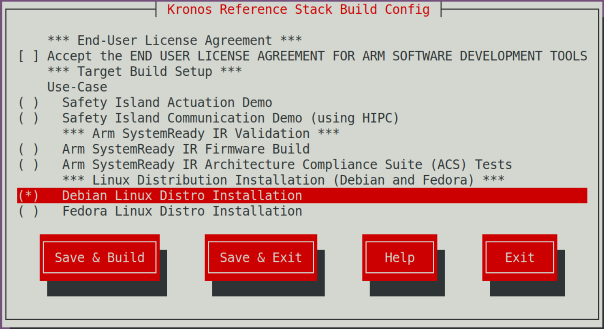

..
 # SPDX-FileCopyrightText: <text>Copyright 2023 Arm Limited and/or its
 # affiliates <open-source-office@arm.com></text>
 #
 # SPDX-License-Identifier: MIT

#########
Reproduce
#########

This section of the User Guide describes how to download, configure, build and
execute this Reference Stack.

************
Introduction
************

This Reference Stack uses the `kas menu tool`_ to configure and customize the
different use cases via a set of configuration options provided in the
configuration menu.

.. note::
  All command examples on this page can be copied by clicking the copy button.
  Any console prompts at the start of each line, comments, or empty lines will
  be automatically excluded from the copied text.

.. _user_guide_reproduce_environment_setup:

****************************
Build Host Environment Setup
****************************

System Requirements
===================

  * x86_64 or aarch64 host to build and execute the Kronos FVP
  * Ubuntu Desktop or Server 20.04 Linux distribution
  * At least 300GiB of free disk for the download and builds
  * At least 32GiB of RAM memory

Install Dependencies
====================

  * Please follow the Yocto Project documentation on
    `how to install the essential packages`_ required for the build host.

  * Install the kas tool and its optional dependency (to use the "menu" plugin):

    .. code-block:: console
      :substitutions:

      sudo -H pip3 install --upgrade kas==|kas version| && sudo apt install python3-newt

    For more details on kas installation, see
    `kas Dependencies & installation`_.
  * Install tmux (required for ``runfvp`` tool):

    .. code-block:: console

      sudo apt install tmux

.. _user_guide_reproduce_download:

********
Download
********

Download the ``kronos`` repository using Git and checkout on the kronos branch,
via:

.. code-block:: shell
  :substitutions:

  # Change the tag or branch to be fetched by replacing the value supplied to
  # the --branch parameter option

  mkdir -p ~/kronos
  cd ~/kronos
  tmux new-session -s kronos
  git clone |kronos remote| --branch |kronos version|

.. note::
   Performing the builds and FVP execution in a tmux session is mandatory for
   Kronos because the ``runfvp`` tool that invokes the Kronos FVP expects the
   presence of a tmux session to attach its spawned tmux windows for console
   access to the processing elements. Please refer to
   `Tmux Documentation`_ for more information on the usage of tmux. It is
   recommended to change the default ``history-limit`` by adding
   ``set-option -g history-limit 3000`` to ``~/.tmux.conf`` before starting
   tmux.

.. _user_guide_reproduce_build:

*****
Build
*****

The Kronos stack comes with a kas configuration menu that can be used to build
:ref:`introduction_use_cases`. The kas configuration menu can also be used to
apply customizable parameters in order to build different Reference Stack types.

To run the configuration menu:

.. code-block:: console

  kas menu kronos/Kconfig

.. note::
  To build and run any image for the Kronos FVP the user has to accept its
  `EULA`_, which can be done by selecting the corresponding configuration
  option in the build setup.

.. image:: ../images/kronos_reference_stack_build_config.png
   :align: center

|

Safety Island Actuation Demo
============================

The demo can be run on the Baremetal Architecture or Virtualization Architecture
that boots Xen with 2 guests.

.. note::
  The Safety Island Actuation Demo is built as part of the default deployment.

Baremetal Architecture
----------------------

To build a baremetal image:

1. Select ``Safety Island Actuation Demo`` from the ``Use-Case`` menu.
2. Choose ``Baremetal`` from the ``Reference Stack Architecture`` menu.
3. Then choose ``Save & Build``.

Validation tests can be run on the baremetal images.
See :ref:`reproduce_run-time_integration_tests` for more details on running
run-time validation tests.

Virtualization Architecture
---------------------------

To build a virtualization image:

1. Select ``Safety Island Actuation Demo`` from the ``Use-Case`` menu.
2. Choose ``Virtualization`` from the ``Reference Stack Architecture`` menu.
3. Then choose ``Save & Build``.

As with the baremetal guidance above, the Reference Stack virtualization
image can also run validation tests.
See :ref:`reproduce_run-time_integration_tests` for more details on running
run-time validation tests.

Safety Island Communication Demo (using HIPC)
=============================================

The demo can be run on the Baremetal Architecture or Virtualization
Architecture.

Baremetal Architecture
----------------------

To build a baremetal image:

1. Select ``Safety Island Communication Demo (using HIPC)`` from the
   ``Use-Case`` menu.
2. Choose ``Baremetal`` from the ``Reference Stack Architecture`` menu.
3. Then choose ``Save & Build``.

Validation tests can be run on the baremetal images.
See :ref:`reproduce_run-time_integration_tests` for more details on running
run-time validation tests.

Virtualization Architecture
---------------------------

To build a virtualization image:

1. Select ``Safety Island Communication Demo (using HIPC)`` from the
   ``Use-Case`` menu.
2. Choose ``Virtualization`` from the ``Reference Stack Architecture`` menu.
3. Then choose ``Save & Build``.

As with the baremetal guidance above, the Reference Stack virtualization
image can also run validation tests.
See :ref:`reproduce_run-time_integration_tests` for more details on running
run-time validation tests.

|Arm SystemReadyTM| IR Validation
=================================

|Arm SystemReadyTM| IR Firmware Build
--------------------------------------

The Arm SystemReady IR Firmware Build option just builds the
|Arm SystemReadyTM| IR-aligned firmware. Optionally, additional artifacts can
be built to validate the firmware.

.. image:: ../images/kronos_reference_stack_build_config_sr_ir.png
   :align: center

|

To build the |Arm SystemReadyTM| firmware image:

1. Select ``Arm SystemReady IR Firmware Build`` under
   ``Arm SystemReady IR Validation`` from the ``Use-Case`` menu.
2. Then choose ``Save & Build``.

.. _user_guide_reproduce_sr_ir_acs:

|Arm SystemReadyTM| IR Architecture Compliance Suite (ACS) Tests
----------------------------------------------------------------

To build and run the |Arm SystemReadyTM| IR ACS tests:

1. Select ``Arm SystemReady IR Architecture Compliance Suite (ACS) Tests`` under
   ``Arm SystemReady IR Validation`` from the ``Use-Case`` menu.
2. Then choose ``Save & Build``.

See :ref:`user_guide_reproduce_arm_systemready_ir_acs` for more details on
running the |Arm SystemReadyTM| IR ACS tests.

.. _user_guide_reproduce_sr_ir_linux_build:

Linux Distribution Installation (Debian and openSUSE)
=====================================================

To build the |Arm SystemReadyTM| IR Linux distros installation tests:

1. Choose ``Debian Linux Distro Installation`` or
   ``openSUSE Linux Distro Installation`` under
   ``Linux Distribution Installation (Debian and openSUSE)`` from the
   ``Use-Case`` menu.
2. Then choose ``Save & Build``.

|

See :ref:`user_guide_reproduce_arm_systemready_ir_linux` for more details on
running the Linux distros installation tests.

.. _reproduce_run:

***
Run
***

This section describes how to run the ``Reference Stack`` and the
``Debian / openSUSE Distro Installation`` images generated during
:ref:`user_guide_reproduce_build` on its FVP and connect to the Primary Compute
to manually execute commands and in this way try out the different Use-Cases
Kronos offers.

The ``runfvp`` tool that invokes the Kronos FVP creates one tmux window per
processing element. The default window displayed will be that of the Primary
Compute titled ``terminal_ns_uart0``. User may press ``Ctrl-b w`` to see the
list of tmux windows and use arrow keys to navigate through the windows and
press then ``Enter`` to select any processing element terminal.

The Reference Stack running on the Primary Compute can be logged into as
``root`` user without password in the Linux terminal.

.. note::
  FVPs, and Fast Models in general, are functionally accurate, meaning that they
  fully execute all instructions correctly, however they are not cycle accurate.
  The main goal of the Reference Stack is to prove functionality only, and
  should not be used for performance analysis.

Baremetal Architecture
======================

To start the FVP and connect to the Primary Compute terminal (running Linux):

.. code-block:: console

  kas shell -c "../layers/meta-arm/scripts/runfvp -t tmux --verbose"

The user should wait for the system to boot and for the Linux prompt to appear.
Following image shows a example on how the terminal should look like after the
fvp invocation.

  .. image:: ../images/kronos_reference_stack_fvp_run.png
   :align: center

|

Virtualization Architecture
===========================

To start the FVP and connect to the Primary Compute terminal (running Linux):

.. code-block:: console

  kas shell -c "../layers/meta-arm/scripts/runfvp -t tmux --verbose"

The user should wait for the system to boot and for the Linux prompt to appear.
On a virtualization image, this will access Dom0. Use the ``xl`` tool to log
in to the DomU1:

.. code-block:: console

  xl console domu1

This command will provide a console on the DomU1. To exit, one can enter
``Ctrl-]`` (to access the FVP telnet shell), followed by typing ``send esc``
into the telnet shell and pressing ``Enter``. See the `xl documentation`_ for
further details.

.. _user_guide_reproduce_sr_ir_linux_run:

Linux Distribution Installation (Debian and openSUSE)
=====================================================

Run the following command to start the installation:

.. code-block:: console

  kas shell -c "../layers/meta-arm/scripts/runfvp -t tmux --verbose"

Reproducing the Use-Cases
=========================

This section contains additional instructions to aid in reproducing the
:ref:`introduction_use_cases` presented in the introduction.

.. _user_guide_reproduce_actuation_demo:

Safety Island Actuation Demo
----------------------------

The instructions can be run on both the Baremetal and Virtualization
architectures and an assumption has been made that the FVP has been launched
as indicated under :ref:`reproduce_run`.

The Safety Island (SI) Cluster 2 terminal running the Actuation Service is
available via the tmux window titled ``terminal_uart_si_cluster2``. For ease of
navigation, we recommend joining the SI Cluster 2 terminal to Primary Compute
terminal and to create a tmux window attached to Primary Compute terminal in
order to issue commands on the host machine. User can navigate through the panes
by pressing ``Ctrl-b`` and arrow keys. Follow the steps below to achieve the
same:

1. Press ``Ctrl-b w`` from the tmux session and navigate to the tmux window
   titled ``terminal_ns_uart0``.
2. Press ``Ctrl-b %`` to add a new tmux window which will be used to issue
   commands on the host machine.
3. Press ``Ctrl-b :`` and then type ``join-pane -s :terminal_uart_si_cluster2``
   followed by pressing ``Enter`` key to join the SI Cluster 2 terminal to
   Primary Compute terminal.

Please refer to the following image for an example re-arrangement of tmux
windows.

  .. image:: ../images/kronos_reference_stack_fvp_rearrange_windows.png
    :align: center

|

Baremetal Architecture
^^^^^^^^^^^^^^^^^^^^^^

1. Run the ``ping`` command from the Primary Compute (running Linux) to verify
   that it can communicate with the Safety Island (running Zephyr):

   .. code-block:: shell

      # On the Primary Compute terminal
      ping 192.168.0.1 -c 10

   The output should look like the following line, repeated 10 times:

   .. code-block:: shell

      64 bytes from 192.168.0.1 seq=0 ttl=64 time=0.151 ms

2. From the tmux window started for the host machine
in :ref:`user_guide_reproduce_actuation_demo`, start the Packet Analyzer:

   .. code-block:: shell

      cd ~/kronos/
      # Start the Packet Analyzer
      kas shell -c "oe-run-native packet-analyzer-native start_analyzer -L debug -a localhost -c ./data"

   A message similar to the following should appear on the SI Cluster 2:

   .. code-block:: shell

      Actuation Service initialized.
      Accepted tcp connection from the Packet Analyzer: <11>

   Please refer to the following image for an example invocation of the Packet
   Analyzer.

     .. image:: ../images/kronos_reference_stack_packet_analyzer.png
       :align: center

|

3. Start the Player on the Primary Compute which replays a recording of a
   driving scenario:

   .. code-block:: shell

      actuation_player -p /usr/share/actuation_player/

   A message similar to the following should appear on the SI Cluster 2:

   .. code-block:: shell

    51572682601: -0.0000 (m/s^2) |  0.0000 (rad)^M
    51597466928: -0.0000 (m/s^2) |  0.0000 (rad)^M
    51622532911: -0.0000 (m/s^2) |  0.0000 (rad)^M
    51647642316: -0.0000 (m/s^2) |  0.0000 (rad)^M
    51672535849: -0.0000 (m/s^2) |  0.0000 (rad)^M
    51697376579: -0.0000 (m/s^2) |  0.0000 (rad)^M
    51722500414: -0.0000 (m/s^2) |  0.0000 (rad)^M
    51747622543: -0.0000 (m/s^2) |  0.0000 (rad)^M
    51772496466: -0.0000 (m/s^2) |  0.0000 (rad)^M
    Thread get_analyzer_handle performing a blocking accept

   A message similar to the following should appear on the host terminal where
   the Packet Analyzer is running:

   .. code-block:: shell

    INFO : analyzer_client.py/_connect_to: Starting analyze, use Ctrl-C to stop the process.
    INFO : analyzer_client.py/_connect_to: Attempting a connect to (localhost : 49152)
    INFO : analyzer_client.py/_connect_to: Successfully connected to (localhost : 49152)
    INFO : analyzer_client.py/run_analyze_on_chain: (1) Analyzer synced with packet chain
    INFO : analyzer_client.py/run_analyze_on_chain: All expected control packets received
    INFO : analyzer_client.py/_log_jitter: Observed Frequency = 21.36147200, Avg Jitter = 0.02624593, Std Deviation:0.06096328
    INFO : analyzer_client.py/run_analyze_on_chain: End of cycle: AnalyzerResult.SUCCESS

    INFO : analyzer_client.py/_tear_conn: Received fin ack from Actuation Service

    Chain ID   Result
    0          AnalyzerResult.SUCCESS

4. In order to shutdown the FVP and terminate the emulation, perform a shutdown
   of the Primary Compute by issuing a ``shutdown now`` on the Primary Compute.
   Once the shutdown process is complete, close the tmux windows created by the
   ``runfvp`` tool by pressing ``Ctrl-]`` and typing ``quit``. Close the tmux
   window started for the host machine in
   :ref:`user_guide_reproduce_actuation_demo` by pressing ``Ctrl-d``. Press
   ``Ctrl-c`` to stop the FVP process.

Virtualization Architecture
^^^^^^^^^^^^^^^^^^^^^^^^^^^

1. Enter the DomU1 console using the ``xl`` tool:

   .. code-block:: shell

      xl console domu1

2. Follow the instructions as for the Baremetal Architecture above.

3. To leave the DomU1 console, type ``Ctrl-]`` and enter ``send esc``.

.. _user_guide_reproduce_si_communication_demo:

Safety Island Communication Demo
--------------------------------

The Safety Island Communication Demo uses HIPC (Heterogeneous Inter-processor
Communication) to validate networking between the Primary Compute and the three
Safety Island clusters. Please refer to :ref:`design_hipc` for more information
on HIPC. ``ping`` and ``iperf`` tools are installed and can be executed
automatically using the automated HIPC test suite (see
:ref:`reproduce_run-time_integration_tests` below and the test descriptions in
:ref:`validation_run-time_integration_tests`).

.. _user_guide_reproduce_parsec_enabled_tls_demo:

Parsec-enabled TLS Demo
-----------------------

The demo is always available when the ``Baremetal Architecture`` is selected.

For the below instructions, an assumption has been made that the FVP has been
launched as indicated under the
:ref:`reproduce_run` section.

The demo consists of a TLS server and a TLS client. Please refer to
:ref:`design_applications_parsec_enabled_tls` for more information on
this application.

Run ``ssl_server`` from the Primary Compute in the background and press *Enter*
key to continue:

   .. code-block:: shell

      ssl_server &

A message similar to the following should appear:

   .. code-block:: shell

        . Seeding the random number generator... ok
        . Loading the server cert. and key... ok
        . Bind on https://localhost:4433/ ... ok
        . Setting up the SSL data.... ok
        . Waiting for a remote connection ...

The TLS client can take an optional parameter as the TLS server IP address. The
default value of the parameter is ``localhost``.

Run ``ssl_client1`` from the Primary Compute in a container:

   .. code-block:: shell

      docker run  --rm -v /run/parsec/parsec.sock:/run/parsec/parsec.sock -v /usr/bin/ssl_client1:/usr/bin/ssl_client1 --network host docker.io/library/ubuntu:22.04 ssl_client1

A message similar to the following should appear:

   .. code-block:: shell

        . Seeding the random number generator... ok
        . Loading the CA root certificate ... ok (0 skipped)
        . Connecting to tcp/localhost/4433... ok
        . Setting up the SSL/TLS structure... ok
        . Performing the SSL/TLS handshake... ok
        . Verifying peer X.509 certificate... ok
        > Write to server: 18 bytes written

      GET / HTTP/1.0

        < Read from server: 156 bytes read

      HTTP/1.0 200 OK
      Content-Type: text/html

      <h2>mbed TLS Test Server</h2>
      
Successful connection using: TLS-ECDHE-RSA-WITH-CHACHA20-POLY1305-SHA256

After the test, stop the TLS server and synchronize the container image to the
persistent storage:

   .. code-block:: shell

      pkill ssl_server
      sync

.. _user_guide_reproduce_IR_validation:

|Arm SystemReadyTM| IR Validation
---------------------------------

|Arm SystemReadyTM| IR Firmware Build
^^^^^^^^^^^^^^^^^^^^^^^^^^^^^^^^^^^^^

This is a build-only option with no supported runtime functionality. The
firmware artifacts can be found in the
directory ``build/tmp/deploy/images/fvp-rd-kronos``.

.. _user_guide_reproduce_arm_systemready_ir_acs:

|Arm SystemReadyTM| IR Architecture Compliance Suite (ACS) Tests
^^^^^^^^^^^^^^^^^^^^^^^^^^^^^^^^^^^^^^^^^^^^^^^^^^^^^^^^^^^^^^^^

The ACS for the |Arm SystemReadyTM| IR certification is delivered through a live
OS image, which enables the basic automation to run the tests.

Follow the steps listed in :ref:`user_guide_reproduce_sr_ir_acs`, the system
will boot with the ACS live OS image and the ACS tests will run automatically
after the system boots.

The previous tests take around 9 hours to complete. A similar output to the
following is printed out:

.. code-block:: console

  2023-09-09 23:10:03 - INFO     - NOTE: recipe arm-systemready-ir-acs-1.0-r0: task do_testimage: Started
  2023-09-09 23:10:05 - INFO     - Creating terminal default on terminal_ns_uart0
  2023-09-09 23:10:16 - INFO     - Creating terminal tf-a on terminal_sec_uart
  2023-09-09 23:10:16 - INFO     - Creating terminal scp on terminal_uart_scp
  2023-09-09 23:10:16 - INFO     - Creating terminal lcp on terminal_uart_lcp
  2023-09-09 23:10:16 - INFO     - Creating terminal rss on terminal_rss_uart
  2023-09-09 23:10:16 - INFO     - Creating terminal safety_island_c0 on terminal_uart_si_cluster0
  2023-09-09 23:10:16 - INFO     - Creating terminal safety_island_c1 on terminal_uart_si_cluster1
  2023-09-09 23:10:17 - INFO     - Creating terminal safety_island_c2 on terminal_uart_si_cluster2
  2023-09-09 23:17:42 - INFO     - Test Group (PlatformSpecificElements): FAILED
  2023-09-09 23:18:47 - INFO     - Test Group (RequiredElements): FAILED
  2023-09-09 23:19:52 - INFO     - Test Group (CheckEvent_Conf): PASSED
  2023-09-09 23:21:03 - INFO     - Test Group (CheckEvent_Func): PASSED
  2023-09-09 23:22:07 - INFO     - Test Group (CloseEvent_Func): PASSED
  2023-09-09 23:23:13 - INFO     - Test Group (CreateEventEx_Conf): PASSED
  2023-09-09 23:24:15 - INFO     - Test Group (CreateEventEx_Func): PASSED
  2023-09-09 23:25:24 - INFO     - Test Group (CreateEvent_Conf): PASSED
  2023-09-09 23:26:26 - INFO     - Test Group (CreateEvent_Func): PASSED
  2023-09-09 23:27:29 - INFO     - Test Group (RaiseTPL_Func): PASSED
  2023-09-09 23:28:31 - INFO     - Test Group (RestoreTPL_Func): PASSED
  2023-09-09 23:29:33 - INFO     - Test Group (SetTimer_Conf): PASSED
  2023-09-09 23:37:17 - INFO     - Test Group (SetTimer_Func): PASSED
  2023-09-09 23:38:14 - INFO     - Test Group (SignalEvent_Func): PASSED
  2023-09-09 23:39:11 - INFO     - Test Group (WaitForEvent_Conf): PASSED
  2023-09-09 23:40:39 - INFO     - Test Group (WaitForEvent_Func): PASSED
  2023-09-09 23:41:36 - INFO     - Test Group (AllocatePages_Conf): PASSED
  2023-09-09 23:43:18 - INFO     - Test Group (AllocatePages_Func): PASSED
  2023-09-09 23:44:15 - INFO     - Test Group (AllocatePool_Conf): PASSED
  2023-09-09 23:45:14 - INFO     - Test Group (AllocatePool_Func): PASSED
  2023-09-09 23:46:11 - INFO     - Test Group (FreePages_Conf): PASSED
  2023-09-09 23:47:11 - INFO     - Test Group (FreePages_Func): PASSED
  2023-09-09 23:48:08 - INFO     - Test Group (GetMemoryMap_Conf): PASSED
  2023-09-09 23:49:06 - INFO     - Test Group (GetMemoryMap_Func): PASSED
  ...
  ...
  2023-09-10 08:13:13 - INFO     - Test Group (virtio_blk virtio1): vda
  2023-09-10 08:13:29 - INFO     - Linux tests complete
  2023-09-10 08:13:39 - INFO     - RESULTS:
  2023-09-10 08:13:39 - INFO     - RESULTS - arm_systemready_ir_acs.SystemReadyACSTest.test_acs: PASSED (32592.00s)
  2023-09-10 08:13:39 - INFO     - SUMMARY:
  2023-09-10 08:13:39 - INFO     - arm-systemready-ir-acs () - Ran 1 test in 32591.997s
  2023-09-10 08:13:39 - INFO     - arm-systemready-ir-acs - OK - All required tests passed (successes=1, skipped=0, failures=0, errors=0)
  2023-09-10 08:13:41 - INFO     - ACS test suite results are consistent with baseline.

Please refer to :ref:`systemready_ir_acs_tests` for an explanation on how the
ACS tests are set up and how they work in the Reference Stack.

.. _user_guide_reproduce_arm_systemready_ir_linux:

Linux Distribution Installation (Debian and openSUSE)
-----------------------------------------------------

The |Arm SystemReadyTM| IR must boot at least two unmodified generic UEFI
distribution images from an ISO image. To test the installation of a Linux
distribution, follow the steps listed in
:ref:`user_guide_reproduce_sr_ir_linux_build` to build and
:ref:`user_guide_reproduce_sr_ir_linux_run` to start the installation.

This Software Stack currently supports two Linux distributions: `Debian Stable`_
and `openSUSE Leap`_. To install Debian, you can refer to the
`Debian GNU/Linux Installation Guide`_. Similarly, you can refer to the
`openSUSE Installation Guide`_ for the installation of openSUSE.

.. note::

  The installation of a Linux distribution requires some manual interaction, for
  example, some necessary selections or confirmations, entering the user and
  password, etc.

  The whole installation process takes a long time (possibly up to 10 hours, or
  even longer).

  We suggest that when running the Linux distribution installations the FVP is
  the only running process as it will consume large amounts of RAM that can make
  the system unstable.

Please refer to :ref:`systemready_ir_linux_install` for an explanation on how
the Linux distros installation is set up and how they work in the Reference
Stack.

Below are some tips and possible problems encountered during the installation
process for reference.

Debian
^^^^^^

The whole process of installing Debian will probably take about 5 hours.

The following are problems that have been encountered during the Debian
installation process and how to solve them:

* Detect and mount installation media

  1. After the installer starts, it will prompt
     ``No device for installation media was detected.`` in the
     ``Detect and mount installation media`` tab.
     Choose ``No`` to continue.

  .. image:: ../images/sr-ir-linux-distro-debian-install-media-0.png
     :align: center
     :width: 60 %

|

  2. Choose ``Yes`` to Manually select a module and device for installation
     media.

  .. image:: ../images/sr-ir-linux-distro-debian-install-media-1.png
     :align: center
     :width: 60 %

|

  3. Choose ``none`` to continue.

  .. image:: ../images/sr-ir-linux-distro-debian-install-media-2.png
     :align: center
     :width: 60 %

|

  4. Input ``/dev/mmcblk0`` as the device file for accessing the installation
     media.

  .. image:: ../images/sr-ir-linux-distro-debian-install-media-3.png
     :align: center
     :width: 60 %

|

* Install the GRUB boot loader

  When the installation reaches the ``Install the GRUB boot loader`` phase,
  there will be an error ``Unable to install GRUB in dummy``.
  This is because on EBBR platform, UEFI SetVariable() is not required at
  runtime (however, it is required at boot time), and Kronos happens to not
  support UEFI SetVariable() yet.

  .. image:: ../images/sr-ir-linux-distro-debian-install-grub-0.png
     :align: center
     :width: 60 %

|

  One workaround we have is to "execute a shell" when the GRUB install phase
  throws the above error. To execute a shell, press ``Ctrl-a n`` to switch the
  debug shell, and run the following commands:

  .. code-block:: console

     # chroot /target
     # update-grub
     # mkdir /boot/efi/EFI/BOOT
     # cp -v /boot/efi/EFI/debian/grubaa64.efi /boot/efi/EFI/BOOT/bootaa64.efi

  A snapshot is as below:

  .. code-block:: console

     [           1- installer   (2*shell)  3 shell  4 log           ][ Jun 06 23:13 ]
     #
     # chroot /target
     # update-grub
     Generating grub configuration file ...
     Found linux image: /boot/vmlinuz-5.10.0-23-arm64
     Found initrd image: /boot/initrd.img-5.10.0-23-arm64
     Found linux image: /boot/vmlinuz-5.10.0-22-arm64
     Found initrd image: /boot/initrd.img-5.10.0-22-arm64
     Warning: os-prober will be executed to detect other bootable partitions.
     Its output will be used to detect bootable binaries on them and create new boot
     done
     # ls /boot/efi/EFI/debian/
     BOOTAA64.CSV  fbaa64.efi  grub.cfg  grubaa64.efi  mmaa64.efi  shimaa64.efi
     # mkdir /boot/efi/EFI/BOOT
     # cp -v /boot/efi/EFI/debian/grubaa64.efi /boot/efi/EFI/BOOT/bootaa64.efi
     '/boot/efi/EFI/debian/grubaa64.efi' -> '/boot/efi/EFI/BOOT/bootaa64.efi'
     #

  After doing the above GRUB workaround, press ``Ctrl-a p`` to go back to the
  installer again, then select ``Continue without boot loader`` in the
  ``Debian installer main menu`` and continue.

  .. image:: ../images/sr-ir-linux-distro-debian-install-grub-1.png
     :align: center
     :width: 60 %

|

* Finishing the installation

  When the installation has reached the final ``Finishing the installation``
  phase, you will need to wait some time to finish the remaining tasks,
  and then it will automatically reboot into the installed OS.

openSUSE
^^^^^^^^

The whole process of installing openSUSE will take about 6 hours. Below are the
main steps and tips for installing openSUSE.

1. After the installer starts, select ``Installation`` to start installation
   process.

   .. image:: ../images/sr-ir-linux-distro-opensuse-install-installation.png
      :align: center
      :width: 60 %

2. It will take about 10 minutes to reach the ``Language, Keyboard and Licence
   Agreement`` tab. Select ``Next`` to continue.

   .. tip::

      Use ``Tab`` to cycle through options, and ``Enter`` to confirm.

3. After ``System Probing`` success, select ``No`` for ``Online Repositories``.

   .. image:: ../images/sr-ir-linux-distro-opensuse-install-online-repositories.png
      :align: center
      :width: 60 %

4. Select ``Server`` for ``System Role``, then select ``Next`` to continue.

   .. image:: ../images/sr-ir-linux-distro-opensuse-install-system-role.png
      :align: center
      :width: 60 %

5. Select ``Next`` to accept the ``Suggested Partitioning`` and continue.

   .. image:: ../images/sr-ir-linux-distro-opensuse-install-suggested-partitioning.png
      :align: center
      :width: 60 %

6. ``Create New User``, then select ``Next`` to continue.

   .. image:: ../images/sr-ir-linux-distro-opensuse-install-create-new-user.png
      :align: center
      :width: 60 %

7. If you're warned with ``The password is too simple``, it's fine to ignore and
   select ``Yes`` to continue.

   .. image:: ../images/sr-ir-linux-distro-opensuse-install-password-too-simple.png
      :align: center
      :width: 60 %

8. After ``Analyzing your system...``, a summary of installation settings will
   be given. Select ``Install`` to accept and continue.

   .. image:: ../images/sr-ir-linux-distro-opensuse-install-installation-settings.png
      :align: center
      :width: 60 %

9. Confirm Installation, select ``Install`` to continue.

   .. image:: ../images/sr-ir-linux-distro-opensuse-install-confirm-installation.png
      :align: center
      :width: 60 %

10. The installation will start after you select ``Install`` to continue, and it
    will take several hours. In the installation process,

    * ``Installing Packages...`` takes about 3 hours.
    * ``Save configuration`` takes about 5 minutes.
    * ``Save installation settings`` takes about 30 minutes.
    * ``Install boot manager`` takes about 20 minutes.
    * ``Prepare system for initial boot`` takes about 5 minutes.
    * Then the system will reboot automatically in 10s, you can select ``OK`` to
      reboot immediately.

    .. image:: ../images/sr-ir-linux-distro-opensuse-install-reboot.png
       :align: center
       :width: 60 %

11. The reboot process takes about 20 minutes. Then you can login the Linux
    shell with the user created in Step 6.

.. _reproduce_run-time_integration_tests:

********************
Automated Validation
********************

To enable the validation tests, choose ``Run Automated Validation``
from the ``Runtime Validation Setup`` menu, then choose ``Save & Build``.

The following validation tests can be performed on the Reference Stack:

  * System Integration Tests:

    * Baremetal Architecture Stack:

      For the ``Safety Island Actuation Demo`` selected as ``Use-Case``, a
      similar output to the following is printed out. The complete test suit
      takes around 16 minutes to complete.

      .. code-block:: console

        NOTE: Executing Tasks
        2023-09-11 20:13:00 - INFO     - Creating terminal default on terminal_ns_uart0
        2023-09-11 20:13:09 - INFO     - Creating terminal tf-a on terminal_sec_uart
        2023-09-11 20:13:09 - INFO     - Creating terminal scp on terminal_uart_scp
        2023-09-11 20:13:09 - INFO     - Creating terminal lcp on terminal_uart_lcp
        2023-09-11 20:13:09 - INFO     - Creating terminal rss on terminal_rss_uart
        2023-09-11 20:13:09 - INFO     - Creating terminal safety_island_c0 on terminal_uart_si_cluster0
        2023-09-11 20:13:10 - INFO     - Creating terminal safety_island_c1 on terminal_uart_si_cluster1
        2023-09-11 20:13:10 - INFO     - Creating terminal safety_island_c2 on terminal_uart_si_cluster2
        2023-09-11 20:13:10 - INFO     - default: Waiting for login prompt
        2023-09-11 20:29:25 - INFO     - RESULTS:
        2023-09-11 20:29:25 - INFO     - RESULTS - test_10_linuxlogin.LinuxLoginTest.test_linux_login: PASSED (17.63s)
        2023-09-11 20:29:25 - INFO     - RESULTS - test_10_safety_island_c1.SafetyIslandC1Test.test_cluster1: PASSED (0.00s)
        2023-09-11 20:29:25 - INFO     - RESULTS - test_10_safety_island_c2.SafetyIslandC2Test.test_cluster2: PASSED (0.00s)
        2023-09-11 20:29:25 - INFO     - RESULTS - test_30_actuation.ActuationTest.test_analyzer_help: PASSED (0.28s)
        2023-09-11 20:29:25 - INFO     - RESULTS - test_30_actuation.ActuationTest.test_ping: PASSED (17.19s)
        2023-09-11 20:29:25 - INFO     - RESULTS - test_30_actuation.ActuationTest.test_player_to_analyzer: PASSED (100.88s)
        2023-09-11 20:29:25 - INFO     - RESULTS - test_40_parsec.ParsecTest.test_parsec_demo: PASSED (374.00s)
        2023-09-11 20:29:25 - INFO     - RESULTS - test_00_lcp.LcpTest.test_normal_boot: PASSED (0.00s)
        2023-09-11 20:29:25 - INFO     - RESULTS - test_00_rss.RssTest.test_normal_boot: PASSED (0.00s)
        2023-09-11 20:29:25 - INFO     - RESULTS - test_00_scp.ScpTest.test_normal_boot: PASSED (0.00s)
        2023-09-11 20:29:25 - INFO     - RESULTS - test_00_secure_partition.OpteeTest.test_optee_normal: PASSED (0.00s)
        2023-09-11 20:29:25 - INFO     - RESULTS - test_00_trusted_firmware_a.TrustedFirmwareTest.test_normal_boot: PASSED (0.00s)
        2023-09-11 20:29:25 - INFO     - RESULTS - test_10_linuxboot.LinuxBootTest.test_linux_boot: PASSED (297.81s)
        2023-09-11 20:29:25 - INFO     - RESULTS - test_20_bsp.BspTest.test_cpu_hotplug: PASSED (115.08s)
        2023-09-11 20:29:25 - INFO     - RESULTS - test_20_bsp.BspTest.test_networking: PASSED (16.50s)
        2023-09-11 20:29:25 - INFO     - RESULTS - test_20_bsp.BspTest.test_rtc: PASSED (9.51s)
        2023-09-11 20:29:25 - INFO     - RESULTS - test_20_bsp.BspTest.test_virtiorng: PASSED (10.21s)
        2023-09-11 20:29:25 - INFO     - RESULTS - test_20_bsp.BspTest.test_watchdog: PASSED (6.50s)
        2023-09-11 20:29:25 - INFO     - RESULTS - test_40_parsec.ParsecTest.test_parsec: SKIPPED (0.00s)
        2023-09-11 20:29:25 - INFO     - SUMMARY:
        2023-09-11 20:29:25 - INFO     - baremetal-image () - Ran 19 tests in 965.595s

      For the ``Safety Island Communication Demo (using HIPC)`` selected as
      ``Use-Case``, a similar output to the following is printed out. The
      complete test suit takes around 14 minutes to complete.

      .. code-block:: console

        NOTE: Executing Tasks
        2023-09-11 20:19:44 - INFO     - Creating terminal default on terminal_ns_uart0
        2023-09-11 20:19:53 - INFO     - Creating terminal tf-a on terminal_sec_uart
        2023-09-11 20:19:54 - INFO     - Creating terminal scp on terminal_uart_scp
        2023-09-11 20:19:54 - INFO     - Creating terminal lcp on terminal_uart_lcp
        2023-09-11 20:19:54 - INFO     - Creating terminal rss on terminal_rss_uart
        2023-09-11 20:19:54 - INFO     - Creating terminal safety_island_c0 on terminal_uart_si_cluster0
        2023-09-11 20:19:54 - INFO     - Creating terminal safety_island_c1 on terminal_uart_si_cluster1
        2023-09-11 20:19:54 - INFO     - Creating terminal safety_island_c2 on terminal_uart_si_cluster2
        2023-09-11 20:19:55 - INFO     - default: Waiting for login prompt
        2023-09-11 20:33:45 - INFO     - RESULTS:
        2023-09-11 20:33:45 - INFO     - RESULTS - test_10_linuxlogin.LinuxLoginTest.test_linux_login: PASSED (16.32s)
        2023-09-11 20:33:45 - INFO     - RESULTS - test_30_hipc.HIPCTestBase.test_hipc_cluster0: PASSED (93.28s)
        2023-09-11 20:33:45 - INFO     - RESULTS - test_30_hipc.HIPCTestBase.test_hipc_cluster1: PASSED (115.26s)
        2023-09-11 20:33:45 - INFO     - RESULTS - test_30_hipc.HIPCTestBase.test_hipc_cluster2: PASSED (89.39s)
        2023-09-11 20:33:45 - INFO     - RESULTS - test_30_hipc.HIPCTestBase.test_hipc_cluster_cl0_cl1: PASSED (28.83s)
        2023-09-11 20:33:45 - INFO     - RESULTS - test_30_hipc.HIPCTestBase.test_hipc_cluster_cl0_cl2: PASSED (39.16s)
        2023-09-11 20:33:45 - INFO     - RESULTS - test_30_hipc.HIPCTestBase.test_hipc_cluster_cl1_cl2: PASSED (49.49s)
        2023-09-11 20:33:45 - INFO     - RESULTS - test_30_hipc.HIPCTestBase.test_ping_cl0_cl1: PASSED (10.91s)
        2023-09-11 20:33:45 - INFO     - RESULTS - test_30_hipc.HIPCTestBase.test_ping_cl0_cl2: PASSED (10.94s)
        2023-09-11 20:33:45 - INFO     - RESULTS - test_30_hipc.HIPCTestBase.test_ping_cl1_cl2: PASSED (10.68s)
        2023-09-11 20:33:45 - INFO     - RESULTS - test_30_hipc.HIPCTestBase.test_ping_cluster0: PASSED (29.04s)
        2023-09-11 20:33:45 - INFO     - RESULTS - test_30_hipc.HIPCTestBase.test_ping_cluster1: PASSED (27.40s)
        2023-09-11 20:33:45 - INFO     - RESULTS - test_30_hipc.HIPCTestBase.test_ping_cluster2: PASSED (26.97s)
        2023-09-11 20:33:45 - INFO     - RESULTS - test_00_lcp.LcpTest.test_normal_boot: PASSED (0.00s)
        2023-09-11 20:33:45 - INFO     - RESULTS - test_00_rss.RssTest.test_normal_boot: PASSED (0.00s)
        2023-09-11 20:33:45 - INFO     - RESULTS - test_00_scp.ScpTest.test_normal_boot: PASSED (0.00s)
        2023-09-11 20:33:45 - INFO     - RESULTS - test_00_secure_partition.OpteeTest.test_optee_normal: PASSED (0.00s)
        2023-09-11 20:33:45 - INFO     - RESULTS - test_00_trusted_firmware_a.TrustedFirmwareTest.test_normal_boot: PASSED (0.00s)
        2023-09-11 20:33:45 - INFO     - RESULTS - test_10_linuxboot.LinuxBootTest.test_linux_boot: PASSED (272.71s)
        2023-09-11 20:33:45 - INFO     - SUMMARY:
        2023-09-11 20:33:45 - INFO     - baremetal-image () - Ran 19 tests in 820.373s

    * Virtualization Architecture Stack:

      For the ``Safety Island Actuation Demo`` selected as ``Use-Case``, a
      similar output to the following is printed out. The complete test suit
      takes around 41 minutes to complete.

      .. code-block:: console

        2023-09-11 20:20:46 - INFO     - Creating terminal default on terminal_ns_uart0
        2023-09-11 20:20:56 - INFO     - Creating terminal tf-a on terminal_sec_uart
        2023-09-11 20:20:56 - INFO     - Creating terminal scp on terminal_uart_scp
        2023-09-11 20:20:56 - INFO     - Creating terminal lcp on terminal_uart_lcp
        2023-09-11 20:20:56 - INFO     - Creating terminal rss on terminal_rss_uart
        2023-09-11 20:20:56 - INFO     - Creating terminal safety_island_c0 on terminal_uart_si_cluster0
        2023-09-11 20:20:56 - INFO     - Creating terminal safety_island_c1 on terminal_uart_si_cluster1
        2023-09-11 20:20:57 - INFO     - Creating terminal safety_island_c2 on terminal_uart_si_cluster2
        2023-09-11 20:20:57 - INFO     - default: Waiting for login prompt
        2023-09-11 20:42:20 - INFO     - Test skipped due to reliance on FFA, not supported in virtualization
        2023-09-11 20:42:36 - INFO     - 'rtc' not tested in DomU
        2023-09-11 20:42:36 - INFO     - 'virtiorng' not tested in DomU
        2023-09-11 20:42:36 - INFO     - 'watchdog' not tested in DomU
        2023-09-11 20:42:53 - INFO     - 'rtc' not tested in DomU
        2023-09-11 20:42:53 - INFO     - 'virtiorng' not tested in DomU
        2023-09-11 20:42:53 - INFO     - 'watchdog' not tested in DomU
        2023-09-11 20:44:53 - INFO     - Test skipped due to reliance on FFA, not supported in virtualization
        2023-09-11 20:46:38 - INFO     - Test skipped due to reliance on FFA, not supported in virtualization
        2023-09-11 21:02:21 - INFO     - RESULTS:
        2023-09-11 21:02:21 - INFO     - RESULTS - test_10_linuxlogin.LinuxLoginTest.test_linux_login: PASSED (617.49s)
        2023-09-11 21:02:21 - INFO     - RESULTS - test_10_safety_island_c1.SafetyIslandC1Test.test_cluster1: PASSED (0.00s)
        2023-09-11 21:02:21 - INFO     - RESULTS - test_10_safety_island_c2.SafetyIslandC2Test.test_cluster2: PASSED (0.00s)
        2023-09-11 21:02:21 - INFO     - RESULTS - test_30_actuation.ActuationTest.test_analyzer_help: PASSED (0.28s)
        2023-09-11 21:02:21 - INFO     - RESULTS - test_30_actuation.ActuationTest.test_ping: PASSED (30.62s)
        2023-09-11 21:02:21 - INFO     - RESULTS - test_30_actuation.ActuationTest.test_player_to_analyzer: PASSED (170.71s)
        2023-09-11 21:02:21 - INFO     - RESULTS - test_40_parsec.ParsecTest.test_parsec: PASSED (120.99s)
        2023-09-11 21:02:21 - INFO     - RESULTS - test_40_virtualization.BspTestDomU1.test_cpu_hotplug: PASSED (7.98s)
        2023-09-11 21:02:21 - INFO     - RESULTS - test_40_virtualization.BspTestDomU1.test_networking: PASSED (2.65s)
        2023-09-11 21:02:21 - INFO     - RESULTS - test_40_virtualization.BspTestDomU2.test_cpu_hotplug: PASSED (2.09s)
        2023-09-11 21:02:21 - INFO     - RESULTS - test_40_virtualization.BspTestDomU2.test_networking: PASSED (2.19s)
        2023-09-11 21:02:21 - INFO     - RESULTS - test_40_virtualization.GICv4DomU1Test.test_gicv4_1: PASSED (0.58s)
        2023-09-11 21:02:21 - INFO     - RESULTS - test_40_virtualization.ParsecDomU1Test.test_parsec: PASSED (92.72s)
        2023-09-11 21:02:21 - INFO     - RESULTS - test_40_virtualization.ParsecDomU2Test.test_parsec: PASSED (91.38s)
        2023-09-11 21:02:21 - INFO     - RESULTS - test_40_virtualization.PtestRunnerDom0Test.test_ptestrunner: PASSED (850.17s)
        2023-09-11 21:02:21 - INFO     - RESULTS - test_00_lcp.LcpTest.test_normal_boot: PASSED (0.00s)
        2023-09-11 21:02:21 - INFO     - RESULTS - test_00_rss.RssTest.test_normal_boot: PASSED (0.00s)
        2023-09-11 21:02:21 - INFO     - RESULTS - test_00_scp.ScpTest.test_normal_boot: PASSED (0.00s)
        2023-09-11 21:02:21 - INFO     - RESULTS - test_00_trusted_firmware_a.TrustedFirmwareTest.test_normal_boot: PASSED (0.00s)
        2023-09-11 21:02:21 - INFO     - RESULTS - test_10_linuxboot.LinuxBootTest.test_linux_boot: PASSED (317.42s)
        2023-09-11 21:02:21 - INFO     - RESULTS - test_20_bsp.BspTest.test_cpu_hotplug: PASSED (20.22s)
        2023-09-11 21:02:21 - INFO     - RESULTS - test_20_bsp.BspTest.test_networking: PASSED (21.98s)
        2023-09-11 21:02:21 - INFO     - RESULTS - test_20_bsp.BspTest.test_rtc: PASSED (9.90s)
        2023-09-11 21:02:21 - INFO     - RESULTS - test_20_bsp.BspTest.test_virtiorng: PASSED (10.04s)
        2023-09-11 21:02:21 - INFO     - RESULTS - test_20_bsp.BspTest.test_watchdog: PASSED (6.59s)
        2023-09-11 21:02:21 - INFO     - RESULTS - test_40_parsec.ParsecTest.test_parsec_demo: SKIPPED (0.00s)
        2023-09-11 21:02:21 - INFO     - RESULTS - test_40_virtualization.BspTestDomU1.test_rtc: SKIPPED (0.00s)
        2023-09-11 21:02:21 - INFO     - RESULTS - test_40_virtualization.BspTestDomU1.test_virtiorng: SKIPPED (0.00s)
        2023-09-11 21:02:21 - INFO     - RESULTS - test_40_virtualization.BspTestDomU1.test_watchdog: SKIPPED (0.00s)
        2023-09-11 21:02:21 - INFO     - RESULTS - test_40_virtualization.BspTestDomU2.test_rtc: SKIPPED (0.00s)
        2023-09-11 21:02:21 - INFO     - RESULTS - test_40_virtualization.BspTestDomU2.test_virtiorng: SKIPPED (0.00s)
        2023-09-11 21:02:21 - INFO     - RESULTS - test_40_virtualization.BspTestDomU2.test_watchdog: SKIPPED (0.00s)
        2023-09-11 21:02:21 - INFO     - RESULTS - test_40_virtualization.ParsecDomU1Test.test_parsec_demo: SKIPPED (0.00s)
        2023-09-11 21:02:21 - INFO     - RESULTS - test_40_virtualization.ParsecDomU2Test.test_parsec_demo: SKIPPED (0.00s)
        2023-09-11 21:02:21 - INFO     - SUMMARY:
        2023-09-11 21:02:21 - INFO     - virtualization-image () - Ran 34 tests in 2469.165s

      For the ``Safety Island Communication Demo (using HIPC)`` selected as
      ``Use-Case``, a similar output to the following is printed out. The
      complete test suit takes around 36 minutes to complete.

      .. code-block:: console

        2023-09-11 20:20:53 - INFO     - Creating terminal default on terminal_ns_uart0
        2023-09-11 20:21:02 - INFO     - Creating terminal tf-a on terminal_sec_uart
        2023-09-11 20:21:02 - INFO     - Creating terminal scp on terminal_uart_scp
        2023-09-11 20:21:02 - INFO     - Creating terminal lcp on terminal_uart_lcp
        2023-09-11 20:21:03 - INFO     - Creating terminal rss on terminal_rss_uart
        2023-09-11 20:21:03 - INFO     - Creating terminal safety_island_c0 on terminal_uart_si_cluster0
        2023-09-11 20:21:03 - INFO     - Creating terminal safety_island_c1 on terminal_uart_si_cluster1
        2023-09-11 20:21:03 - INFO     - Creating terminal safety_island_c2 on terminal_uart_si_cluster2
        2023-09-11 20:21:03 - INFO     - default: Waiting for login prompt
        2023-09-11 20:50:04 - INFO     - HIPC to Cluster 0 not tested for DomU2
        2023-09-11 20:53:36 - INFO     - HIPC to Cluster 2 not tested for DomU2
        2023-09-11 20:57:00 - INFO     - Ping to Cluster 0 not tested for DomU2
        2023-09-11 20:57:00 - INFO     - Ping to Cluster 2 not tested for DomU2
        2023-09-11 20:57:22 - INFO     - RESULTS:
        2023-09-11 20:57:22 - INFO     - RESULTS - test_10_linuxlogin.LinuxLoginTest.test_linux_login: PASSED (596.95s)
        2023-09-11 20:57:22 - INFO     - RESULTS - test_30_hipc_virtualization.HIPCTestDomU1.test_hipc_cluster0: PASSED (159.92s)
        2023-09-11 20:57:22 - INFO     - RESULTS - test_30_hipc_virtualization.HIPCTestDomU1.test_hipc_cluster1: PASSED (146.19s)
        2023-09-11 20:57:22 - INFO     - RESULTS - test_30_hipc_virtualization.HIPCTestDomU1.test_hipc_cluster2: PASSED (125.69s)
        2023-09-11 20:57:22 - INFO     - RESULTS - test_30_hipc_virtualization.HIPCTestDomU1.test_hipc_cluster_cl0_cl1: PASSED (38.76s)
        2023-09-11 20:57:22 - INFO     - RESULTS - test_30_hipc_virtualization.HIPCTestDomU1.test_hipc_cluster_cl0_cl2: PASSED (45.72s)
        2023-09-11 20:57:22 - INFO     - RESULTS - test_30_hipc_virtualization.HIPCTestDomU1.test_hipc_cluster_cl1_cl2: PASSED (61.74s)
        2023-09-11 20:57:22 - INFO     - RESULTS - test_30_hipc_virtualization.HIPCTestDomU1.test_ping_cl0_cl1: PASSED (24.59s)
        2023-09-11 20:57:22 - INFO     - RESULTS - test_30_hipc_virtualization.HIPCTestDomU1.test_ping_cl0_cl2: PASSED (24.34s)
        2023-09-11 20:57:22 - INFO     - RESULTS - test_30_hipc_virtualization.HIPCTestDomU1.test_ping_cl1_cl2: PASSED (24.17s)
        2023-09-11 20:57:22 - INFO     - RESULTS - test_30_hipc_virtualization.HIPCTestDomU1.test_ping_cluster0: PASSED (62.83s)
        2023-09-11 20:57:22 - INFO     - RESULTS - test_30_hipc_virtualization.HIPCTestDomU1.test_ping_cluster1: PASSED (61.03s)
        2023-09-11 20:57:22 - INFO     - RESULTS - test_30_hipc_virtualization.HIPCTestDomU1.test_ping_cluster2: PASSED (60.52s)
        2023-09-11 20:57:22 - INFO     - RESULTS - test_30_hipc_virtualization.HIPCTestDomU2.test_hipc_cluster1: PASSED (150.95s)
        2023-09-11 20:57:22 - INFO     - RESULTS - test_30_hipc_virtualization.HIPCTestDomU2.test_hipc_cluster_cl0_cl1: PASSED (32.77s)
        2023-09-11 20:57:22 - INFO     - RESULTS - test_30_hipc_virtualization.HIPCTestDomU2.test_hipc_cluster_cl0_cl2: PASSED (45.79s)
        2023-09-11 20:57:22 - INFO     - RESULTS - test_30_hipc_virtualization.HIPCTestDomU2.test_hipc_cluster_cl1_cl2: PASSED (52.47s)
        2023-09-11 20:57:22 - INFO     - RESULTS - test_30_hipc_virtualization.HIPCTestDomU2.test_ping_cl0_cl1: PASSED (24.51s)
        2023-09-11 20:57:22 - INFO     - RESULTS - test_30_hipc_virtualization.HIPCTestDomU2.test_ping_cl0_cl2: PASSED (24.41s)
        2023-09-11 20:57:22 - INFO     - RESULTS - test_30_hipc_virtualization.HIPCTestDomU2.test_ping_cl1_cl2: PASSED (24.56s)
        2023-09-11 20:57:22 - INFO     - RESULTS - test_30_hipc_virtualization.HIPCTestDomU2.test_ping_cluster1: PASSED (60.43s)
        2023-09-11 20:57:22 - INFO     - RESULTS - test_00_lcp.LcpTest.test_normal_boot: PASSED (0.00s)
        2023-09-11 20:57:22 - INFO     - RESULTS - test_00_rss.RssTest.test_normal_boot: PASSED (0.00s)
        2023-09-11 20:57:22 - INFO     - RESULTS - test_00_scp.ScpTest.test_normal_boot: PASSED (0.00s)
        2023-09-11 20:57:22 - INFO     - RESULTS - test_00_trusted_firmware_a.TrustedFirmwareTest.test_normal_boot: PASSED (0.00s)
        2023-09-11 20:57:22 - INFO     - RESULTS - test_10_linuxboot.LinuxBootTest.test_linux_boot: PASSED (289.37s)
        2023-09-11 20:57:22 - INFO     - RESULTS - test_30_hipc_virtualization.HIPCTestDomU2.test_hipc_cluster0: SKIPPED (0.00s)
        2023-09-11 20:57:22 - INFO     - RESULTS - test_30_hipc_virtualization.HIPCTestDomU2.test_hipc_cluster2: SKIPPED (0.00s)
        2023-09-11 20:57:22 - INFO     - RESULTS - test_30_hipc_virtualization.HIPCTestDomU2.test_ping_cluster0: SKIPPED (0.00s)
        2023-09-11 20:57:22 - INFO     - RESULTS - test_30_hipc_virtualization.HIPCTestDomU2.test_ping_cluster2: SKIPPED (0.00s)
        2023-09-11 20:57:22 - INFO     - SUMMARY:
        2023-09-11 20:57:22 - INFO     - virtualization-image () - Ran 30 tests in 2165.293s
