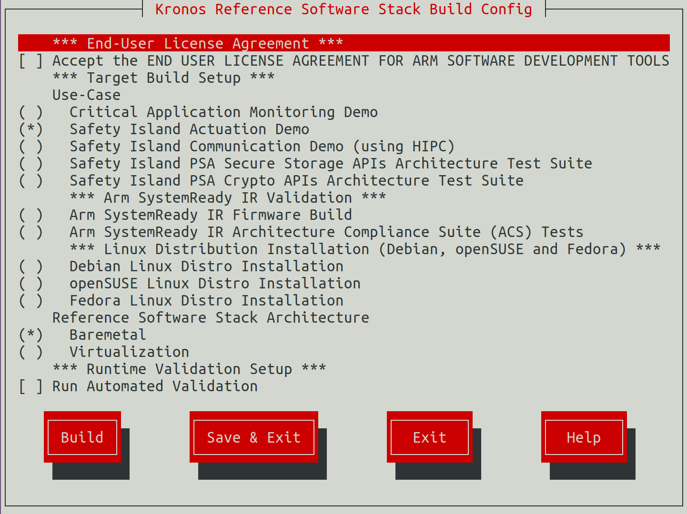

..
 # SPDX-FileCopyrightText: <text>Copyright 2023 Arm Limited and/or its
 # affiliates <open-source-office@arm.com></text>
 #
 # SPDX-License-Identifier: MIT

#########
Reproduce
#########

This section of the User Guide describes how to download, configure, build and
execute this Reference Stack.

************
Introduction
************

This Reference Stack uses the `kas menu tool`_ to configure and customize the
different use cases via a set of configuration options provided in the
configuration menu.

.. note::
  All command examples on this page can be copied by clicking the copy button.
  Any console prompts at the start of each line, comments, or empty lines will
  be automatically excluded from the copied text.

.. _user_guide_reproduce_environment_setup:

****************************
Build Host Environment Setup
****************************

System Requirements
===================

    * x86_64 or aarch64 host to build and execute the Kronos FVP
    * Ubuntu 20.04 Linux distribution
    * At least 200GiB of free disk for the download and builds
    * At least 32GiB of RAM memory

Install Dependencies
====================

Please follow the Yocto Project documentation on
`how to install the essential packages`_ required for the build host.

Install the kas tool and its optional dependency (to use the "menu" plugin):

.. code-block:: console
  :substitutions:

  sudo -H pip3 install --upgrade kas==|kas version| && sudo apt install python3-newt

For more details on kas installation, see `kas Dependencies & installation`_.

.. _user_guide_reproduce_download:

********
Download
********

Download the ``kronos`` repository using Git and checkout on the kronos branch,
via:

.. code-block:: shell
  :substitutions:

  # Change the tag or branch to be fetched by replacing the value supplied to
  # the --branch parameter option

  mkdir -p ~/kronos
  cd ~/kronos
  git clone |kronos remote| --branch |kronos version|

.. _user_guide_reproduce_build:

*****
Build
*****

The provided kas configuration menu can be used to build an image for
different system architectures, and to apply different sets of customizable
parameters. Therefore, the following build guidance is provided as a set of
alternatives to target each of the main supported use cases.

To run the configuration menu:

  .. code-block:: console

    kas menu kronos/Kconfig

|

|

.. note::
  To build and run any image for the Kronos FVP the user has to accept its
  EULA_, which can be done by selecting the corresponding configuration
  option in the build setup.

Baremetal Architecture
======================

To build a baremetal image choose ``Baremetal`` from
the ``Reference Stack Architecture`` menu, then choose ``Save & Build``.

Validation tests can be run on the baremetal images.
See :ref:`reproduce_run-time_integration_tests` for more details on running
run-time validation tests.

.. note::
  The Safety Island Actuation Demo is built as part of the default deployment.

Virtualization Architecture
===========================

To build a virtualization image choose ``Virtualization`` from
the ``Reference Stack Architecture`` menu, then choose ``Save & Build``.

As with the baremetal guidance above, the Reference Stack virtualization
image can also run validation tests.
See :ref:`reproduce_run-time_integration_tests` for more details on running
run-time validation tests.

.. note::
  The Safety Island Actuation Demo is built as part of the default deployment.

|Arm SystemReadyTM| Firmware Architecture
=========================================

To build an |Arm SystemReadyTM| Firmware image choose
``Arm SystemReady Firmware`` from the
``Reference Stack Architecture`` menu, then choose ``Save & Build``.

|Arm SystemReadyTM| IR ACS
==========================

To build an |Arm SystemReadyTM| IR ACS image choose ``Arm SystemReady IR ACS``
from the ``Reference Stack Architecture`` menu, then choose ``Save & Build``.

As with the baremetal guidance above, the Reference Stack |Arm SystemReadyTM| IR
ACS image can also run validation tests.
See :ref:`reproduce_run-time_integration_tests` for more details on running
run-time validation tests.

.. _reproduce_run:

***
Run
***

This section describes how to run the Reference Stack on its FVP and connect to
the Primary Compute to manually execute commands and in this way try out its
different functionalities. This can be done for the Baremetal and
Virtualization Architectures.

.. note::
  FVPs, and Fast Models in general, are functionally accurate, meaning that they
  fully execute all instructions correctly, however they are not cycle accurate.
  The main goal of the Reference Stack is to prove functionality only, and
  should not be used for performance analysis.

The Reference Stack running on the Primary Compute can be logged into as
``root`` user without password in the Linux terminal.

Baremetal Architecture
======================

To start the FVP and connect to the Primary Compute terminal (running Linux):

  .. code-block:: console

    kas shell -c "../layers/meta-arm/scripts/runfvp --verbose --console"

The user should wait for the system to boot and for the Linux prompt to appear.

Virtualization Architecture
===========================

To start the FVP and connect to the Primary Compute terminal (running Linux):

  .. code-block:: console

    kas shell -c "../layers/meta-arm/scripts/runfvp --verbose --console"

The user should wait for the system to boot and for the Linux prompt to appear.
On a virtualization image, this will access Dom0. Use the ``xl`` tool to log
in to the DomU1:

  .. code-block:: console

    xl console domu1

This command will provide a console on the DomU1. To exit, one can enter
``Ctrl+]`` (to access the FVP telnet shell), followed by typing ``send esc``
into the telnet shell and pressing ``Enter``. See the `xl documentation`_ for
further details.

Reproducing the Use-Cases
=========================

Safety Island Actuation Demo
----------------------------

Follow the instructions below to reproduce the ``Actuation Demo`` selected as
``Extra Image Features`` from the :ref:`user_guide_reproduce_build` section.
The Safety Island Actuation Demo is listed
in :ref:`design_applications_actuation`. These instructions can be run on both
Baremetal and Virtualization and an assumption has been made that the FVP has
been launched as indicated under :ref:`reproduce_run`.

.. note::
  When running the ``runfvp`` command, the Safety Island (SI) Cluster 0
  terminal running the Actuation Service is available via the window titled
  **"FVP terminal_uart_si_cluster0"**.

1. Run the ``ping`` command from the Primary Compute (running Linux) to verify
   that it can communicate with the Safety Island (running Zephyr):

   .. code-block:: shell

      # On the Primary Compute terminal
      ping 192.168.0.1 -c 10

   The output should look like the following line, repeated 10 times:

   .. code-block:: shell

      64 bytes from 192.168.0.1 seq=0 ttl=64 time=0.151 ms

2. From a different terminal on the build host, start the Packet Analyzer on
   the host where the FVP is running:

   .. code-block:: shell

      # For x86 host
      cd ~/kronos/build/tmp_baremetal/sysroots-components/x86_64/packet-analyzer-native/usr/bin/actuation_packet_analyzer
      # For arm64 host
      # cd ~/kronos/build/tmp_baremetal/sysroots-components/aarch64/packet-analyzer-native/usr/bin/actuation_packet_analyzer
      # Start the Packet Analyzer
      python3 packet_analyzer/start_analyzer.py -L debug -a localhost -c ./data -L

   A message similar to the following should appear on the SI Cluster 0

   .. code-block:: shell

      Actuation Service initialized.
      Accepted tcp connection from the Packet Analyzer: <11>

3. Start the Player on the Primary Compute which replays a recording of a
   driving scenario:

   .. code-block:: shell

      actuation_player -p /usr/share/actuation_player/

   A message similar to the following should appear on the SI Cluster 0

   .. code-block:: shell

    51572682601: -0.0000 (m/s^2) |  0.0000 (rad)^M
    51597466928: -0.0000 (m/s^2) |  0.0000 (rad)^M
    51622532911: -0.0000 (m/s^2) |  0.0000 (rad)^M
    51647642316: -0.0000 (m/s^2) |  0.0000 (rad)^M
    51672535849: -0.0000 (m/s^2) |  0.0000 (rad)^M
    51697376579: -0.0000 (m/s^2) |  0.0000 (rad)^M
    51722500414: -0.0000 (m/s^2) |  0.0000 (rad)^M
    51747622543: -0.0000 (m/s^2) |  0.0000 (rad)^M
    51772496466: -0.0000 (m/s^2) |  0.0000 (rad)^M
    Thread get_analyzer_handle performing a blocking accept

   A message similar to the following should appear on the host terminal where
   the Packet Analyzer is running

   .. code-block:: shell

    INFO : analyzer_client.py/_connect_to: Starting analyze, use Ctrl-C to stop the process.
    INFO : analyzer_client.py/_connect_to: Attempting a connect to (localhost : 49152)
    INFO : analyzer_client.py/_connect_to: Successfully connected to (localhost : 49152)
    INFO : analyzer_client.py/run_analyze_on_chain: (1) Analyzer synced with packet chain
    INFO : analyzer_client.py/run_analyze_on_chain: All expected control packets received
    INFO : analyzer_client.py/_log_jitter: Observed Frequency = 21.36147200, Avg Jitter = 0.02624593, Std Deviation:0.06096328
    INFO : analyzer_client.py/run_analyze_on_chain: End of cycle: AnalyzerResult.SUCCESS

    INFO : analyzer_client.py/_tear_conn: Received fin ack from Actuation Service

    Chain ID   Result
    0          AnalyzerResult.SUCCESS

.. _reproduce_run-time_integration_tests:

********************
Automated Validation
********************

To enable the validation tests, choose ``Run the tests automatically``
from the ``Runtime Validation Setup`` menu, then choose ``Save & Build``.

The following validation tests can be performed on the Reference Stack:

  * System Integration Tests:

    * Baremetal Architecture Stack:

      For the ``Actuation Demo`` selected as ``Extra Image Features``, a similar
      output is printed out. The complete test suit takes around 8 minutes to
      complete.

      .. code-block:: console

        NOTE: Executing Tasks
        2023-06-06 20:11:44 - INFO     - Creating terminal default on terminal_ns_uart0
        2023-06-06 20:11:53 - INFO     - Creating terminal tf-a on terminal_sec_uart
        2023-06-06 20:11:54 - INFO     - Creating terminal scp on terminal_uart_scp
        2023-06-06 20:11:54 - INFO     - Creating terminal lcp on terminal_uart_lcp
        2023-06-06 20:11:54 - INFO     - Creating terminal rss on terminal_rss_uart
        2023-06-06 20:11:54 - INFO     - Creating terminal safety_island_c0 on terminal_uart_si_cluster0
        2023-06-06 20:11:54 - INFO     - Creating terminal safety_island_c1 on terminal_uart_si_cluster1
        2023-06-06 20:11:54 - INFO     - Creating terminal safety_island_c2 on terminal_uart_si_cluster2
        2023-06-06 20:11:54 - INFO     - default: Waiting for login prompt
        2023-06-06 20:19:57 - INFO     - RESULTS:
        2023-06-06 20:19:57 - INFO     - RESULTS - test_10_linuxlogin.LinuxLoginTest.test_linux_login: PASSED (7.39s)
        2023-06-06 20:19:57 - INFO     - RESULTS - test_10_safety_island_c1.SafetyIslandC1Test.test_cluster1: PASSED (0.00s)
        2023-06-06 20:19:57 - INFO     - RESULTS - test_10_safety_island_c2.SafetyIslandC2Test.test_cluster2: PASSED (0.00s)
        2023-06-06 20:19:57 - INFO     - RESULTS - test_30_actuation.ActuationTest.test_analyzer_help: PASSED (0.24s)
        2023-06-06 20:19:57 - INFO     - RESULTS - test_30_actuation.ActuationTest.test_ping: PASSED (17.43s)
        2023-06-06 20:19:57 - INFO     - RESULTS - test_30_actuation.ActuationTest.test_player_to_analyzer: PASSED (92.06s)
        2023-06-06 20:19:57 - INFO     - RESULTS - test_40_parsec.ParsecTest.test_parsec: PASSED (89.35s)
        2023-06-06 20:19:57 - INFO     - RESULTS - test_00_lcp.LcpTest.test_normal_boot: PASSED (0.00s)
        2023-06-06 20:19:57 - INFO     - RESULTS - test_00_rss.RssTest.test_normal_boot: PASSED (0.00s)
        2023-06-06 20:19:57 - INFO     - RESULTS - test_00_scp.ScpTest.test_normal_boot: PASSED (0.00s)
        2023-06-06 20:19:57 - INFO     - RESULTS - test_00_trusted_firmware_a.TrustedFirmwareTest.test_normal_boot: PASSED (0.00s)
        2023-06-06 20:19:57 - INFO     - RESULTS - test_10_linuxboot.LinuxBootTest.test_linux_boot: PASSED (135.16s)
        2023-06-06 20:19:57 - INFO     - RESULTS - test_20_bsp.BspTest.test_cpu_hotplug: PASSED (93.19s)
        2023-06-06 20:19:57 - INFO     - RESULTS - test_20_bsp.BspTest.test_networking: PASSED (17.70s)
        2023-06-06 20:19:57 - INFO     - RESULTS - test_20_bsp.BspTest.test_rtc: PASSED (8.48s)
        2023-06-06 20:19:57 - INFO     - RESULTS - test_20_bsp.BspTest.test_virtiorng: PASSED (8.22s)
        2023-06-06 20:19:57 - INFO     - RESULTS - test_20_bsp.BspTest.test_watchdog: PASSED (5.50s)
        2023-06-06 20:19:57 - INFO     - SUMMARY:
        2023-06-06 20:19:57 - INFO     - baremetal-image () - Ran 17 tests in 474.728s

      For the ``HIPC Validation`` selected as ``Extra Image Features``, a
      similar output is printed out. The complete test suit takes around 15
      minutes to complete.

      .. code-block:: console

        NOTE: Executing Tasks
        2023-06-07 09:49:02 - INFO     - Creating terminal default on terminal_ns_uart0
        2023-06-07 09:49:11 - INFO     - Creating terminal tf-a on terminal_sec_uart
        2023-06-07 09:49:11 - INFO     - Creating terminal scp on terminal_uart_scp
        2023-06-07 09:49:11 - INFO     - Creating terminal lcp on terminal_uart_lcp
        2023-06-07 09:49:11 - INFO     - Creating terminal rss on terminal_rss_uart
        2023-06-07 09:49:11 - INFO     - Creating terminal safety_island_c0 on terminal_uart_si_cluster0
        2023-06-07 09:49:11 - INFO     - Creating terminal safety_island_c1 on terminal_uart_si_cluster1
        2023-06-07 09:49:11 - INFO     - Creating terminal safety_island_c2 on terminal_uart_si_cluster2
        2023-06-07 09:49:12 - INFO     - default: Waiting for login prompt
        2023-06-07 10:04:24 - INFO     - RESULTS:
        2023-06-07 10:04:24 - INFO     - RESULTS - test_10_linuxlogin.LinuxLoginTest.test_linux_login: PASSED (5.16s)
        2023-06-07 10:04:24 - INFO     - RESULTS - test_30_hipc.HIPCTestBase.test_hipc_cluster0: PASSED (211.84s)
        2023-06-07 10:04:24 - INFO     - RESULTS - test_30_hipc.HIPCTestBase.test_hipc_cluster1: PASSED (211.80s)
        2023-06-07 10:04:24 - INFO     - RESULTS - test_30_hipc.HIPCTestBase.test_hipc_cluster2: PASSED (282.60s)
        2023-06-07 10:04:24 - INFO     - RESULTS - test_30_hipc.HIPCTestBase.test_ping_cluster0: PASSED (21.53s)
        2023-06-07 10:04:24 - INFO     - RESULTS - test_30_hipc.HIPCTestBase.test_ping_cluster1: PASSED (20.99s)
        2023-06-07 10:04:24 - INFO     - RESULTS - test_30_hipc.HIPCTestBase.test_ping_cluster2: PASSED (21.27s)
        2023-06-07 10:04:24 - INFO     - RESULTS - test_00_lcp.LcpTest.test_normal_boot: PASSED (0.00s)
        2023-06-07 10:04:24 - INFO     - RESULTS - test_00_rss.RssTest.test_normal_boot: PASSED (0.00s)
        2023-06-07 10:04:24 - INFO     - RESULTS - test_00_scp.ScpTest.test_normal_boot: PASSED (0.00s)
        2023-06-07 10:04:24 - INFO     - RESULTS - test_00_trusted_firmware_a.TrustedFirmwareTest.test_normal_boot: PASSED (0.00s)
        2023-06-07 10:04:24 - INFO     - RESULTS - test_10_linuxboot.LinuxBootTest.test_linux_boot: PASSED (129.07s)
        2023-06-07 10:04:24 - INFO     - SUMMARY:
        2023-06-07 10:04:24 - INFO     - baremetal-image () - Ran 12 tests in 904.258s

    * Virtualization Architecture Stack:

      For the ``Actuation Demo`` selected as ``Extra Image Features``, a similar
      output is printed out. The complete test suit takes around 22 minutes to
      complete.

      .. code-block:: console

        2023-06-06 20:11:46 - INFO     - Creating terminal default on terminal_ns_uart0
        2023-06-06 20:11:55 - INFO     - Creating terminal tf-a on terminal_sec_uart
        2023-06-06 20:11:55 - INFO     - Creating terminal scp on terminal_uart_scp
        2023-06-06 20:11:55 - INFO     - Creating terminal lcp on terminal_uart_lcp
        2023-06-06 20:11:55 - INFO     - Creating terminal rss on terminal_rss_uart
        2023-06-06 20:11:55 - INFO     - Creating terminal safety_island_c0 on terminal_uart_si_cluster0
        2023-06-06 20:11:55 - INFO     - Creating terminal safety_island_c1 on terminal_uart_si_cluster1
        2023-06-06 20:11:55 - INFO     - Creating terminal safety_island_c2 on terminal_uart_si_cluster2
        2023-06-06 20:11:55 - INFO     - default: Waiting for login prompt
        2023-06-06 20:22:59 - INFO     - 'rtc' not tested in DomU
        2023-06-06 20:22:59 - INFO     - 'virtiorng' not tested in DomU
        2023-06-06 20:22:59 - INFO     - 'watchdog' not tested in DomU
        2023-06-06 20:23:12 - INFO     - 'rtc' not tested in DomU
        2023-06-06 20:23:12 - INFO     - 'virtiorng' not tested in DomU
        2023-06-06 20:23:12 - INFO     - 'watchdog' not tested in DomU
        2023-06-06 20:34:09 - INFO     - RESULTS:
        2023-06-06 20:34:09 - INFO     - RESULTS - test_10_linuxlogin.LinuxLoginTest.test_linux_login: PASSED (0.74s)
        2023-06-06 20:34:09 - INFO     - RESULTS - test_10_safety_island_c1.SafetyIslandC1Test.test_cluster1: PASSED (0.00s)
        2023-06-06 20:34:09 - INFO     - RESULTS - test_10_safety_island_c2.SafetyIslandC2Test.test_cluster2: PASSED (0.00s)
        2023-06-06 20:34:09 - INFO     - RESULTS - test_30_actuation.ActuationTest.test_analyzer_help: PASSED (0.24s)
        2023-06-06 20:34:09 - INFO     - RESULTS - test_30_actuation.ActuationTest.test_ping: PASSED (20.09s)
        2023-06-06 20:34:09 - INFO     - RESULTS - test_30_actuation.ActuationTest.test_player_to_analyzer: PASSED (116.22s)
        2023-06-06 20:34:09 - INFO     - RESULTS - test_40_parsec.ParsecTest.test_parsec: PASSED (93.95s)
        2023-06-06 20:34:09 - INFO     - RESULTS - test_40_virtualization.BspTestDomU1.test_cpu_hotplug: PASSED (6.07s)
        2023-06-06 20:34:09 - INFO     - RESULTS - test_40_virtualization.BspTestDomU1.test_networking: PASSED (2.40s)
        2023-06-06 20:34:09 - INFO     - RESULTS - test_40_virtualization.BspTestDomU2.test_cpu_hotplug: PASSED (1.50s)
        2023-06-06 20:34:09 - INFO     - RESULTS - test_40_virtualization.BspTestDomU2.test_networking: PASSED (2.50s)
        2023-06-06 20:34:09 - INFO     - RESULTS - test_40_virtualization.ParsecDomU1Test.test_parsec: PASSED (71.75s)
        2023-06-06 20:34:09 - INFO     - RESULTS - test_40_virtualization.ParsecDomU2Test.test_parsec: PASSED (79.14s)
        2023-06-06 20:34:09 - INFO     - RESULTS - test_40_virtualization.PtestRunnerDom0Test.test_ptestrunner: PASSED (433.47s)
        2023-06-06 20:34:09 - INFO     - RESULTS - test_00_lcp.LcpTest.test_normal_boot: PASSED (0.00s)
        2023-06-06 20:34:09 - INFO     - RESULTS - test_00_rss.RssTest.test_normal_boot: PASSED (0.00s)
        2023-06-06 20:34:09 - INFO     - RESULTS - test_00_scp.ScpTest.test_normal_boot: PASSED (0.00s)
        2023-06-06 20:34:09 - INFO     - RESULTS - test_00_trusted_firmware_a.TrustedFirmwareTest.test_normal_boot: PASSED (0.00s)
        2023-06-06 20:34:09 - INFO     - RESULTS - test_10_linuxboot.LinuxBootTest.test_linux_boot: PASSED (403.12s)
        2023-06-06 20:34:09 - INFO     - RESULTS - test_20_bsp.BspTest.test_cpu_hotplug: PASSED (12.61s)
        2023-06-06 20:34:09 - INFO     - RESULTS - test_20_bsp.BspTest.test_networking: PASSED (9.84s)
        2023-06-06 20:34:09 - INFO     - RESULTS - test_20_bsp.BspTest.test_rtc: PASSED (6.58s)
        2023-06-06 20:34:09 - INFO     - RESULTS - test_20_bsp.BspTest.test_virtiorng: PASSED (6.69s)
        2023-06-06 20:34:09 - INFO     - RESULTS - test_20_bsp.BspTest.test_watchdog: PASSED (4.35s)
        2023-06-06 20:34:09 - INFO     - RESULTS - test_40_virtualization.BspTestDomU1.test_rtc: SKIPPED (0.00s)
        2023-06-06 20:34:09 - INFO     - RESULTS - test_40_virtualization.BspTestDomU1.test_virtiorng: SKIPPED (0.00s)
        2023-06-06 20:34:09 - INFO     - RESULTS - test_40_virtualization.BspTestDomU1.test_watchdog: SKIPPED (0.00s)
        2023-06-06 20:34:09 - INFO     - RESULTS - test_40_virtualization.BspTestDomU2.test_rtc: SKIPPED (0.00s)
        2023-06-06 20:34:09 - INFO     - RESULTS - test_40_virtualization.BspTestDomU2.test_virtiorng: SKIPPED (0.00s)
        2023-06-06 20:34:09 - INFO     - RESULTS - test_40_virtualization.BspTestDomU2.test_watchdog: SKIPPED (0.00s)
        2023-06-06 20:34:09 - INFO     - SUMMARY:
        2023-06-06 20:34:09 - INFO     - virtualization-image () - Ran 30 tests in 1321.219s

      For the ``HIPC Validation`` selected as ``Extra Image Features``, a
      similar output is printed out. The complete test suit takes around 28
      minutes to complete.

      .. code-block:: console

        2023-06-07 09:48:52 - INFO     - Creating terminal default on terminal_ns_uart0
        2023-06-07 09:49:00 - INFO     - Creating terminal tf-a on terminal_sec_uart
        2023-06-07 09:49:01 - INFO     - Creating terminal scp on terminal_uart_scp
        2023-06-07 09:49:01 - INFO     - Creating terminal lcp on terminal_uart_lcp
        2023-06-07 09:49:01 - INFO     - Creating terminal rss on terminal_rss_uart
        2023-06-07 09:49:01 - INFO     - Creating terminal safety_island_c0 on terminal_uart_si_cluster0
        2023-06-07 09:49:01 - INFO     - Creating terminal safety_island_c1 on terminal_uart_si_cluster1
        2023-06-07 09:49:01 - INFO     - Creating terminal safety_island_c2 on terminal_uart_si_cluster2
        2023-06-07 09:49:01 - INFO     - default: Waiting for login prompt
        2023-06-07 10:11:24 - INFO     - HIPC to Cluster 0 not tested for DomU2
        2023-06-07 10:16:12 - INFO     - HIPC to Cluster 2 not tested for DomU2
        2023-06-07 10:16:12 - INFO     - Ping to Cluster 0 not tested for DomU2
        2023-06-07 10:16:12 - INFO     - Ping to Cluster 2 not tested for DomU2
        2023-06-07 10:16:30 - INFO     - RESULTS:
        2023-06-07 10:16:30 - INFO     - RESULTS - test_10_linuxlogin.LinuxLoginTest.test_linux_login: PASSED (0.79s)
        2023-06-07 10:16:30 - INFO     - RESULTS - test_30_hipc_virtualization.HIPCTestDomU1.test_hipc_cluster0: PASSED (277.58s)
        2023-06-07 10:16:30 - INFO     - RESULTS - test_30_hipc_virtualization.HIPCTestDomU1.test_hipc_cluster1: PASSED (274.31s)
        2023-06-07 10:16:30 - INFO     - RESULTS - test_30_hipc_virtualization.HIPCTestDomU1.test_hipc_cluster2: PASSED (301.45s)
        2023-06-07 10:16:30 - INFO     - RESULTS - test_30_hipc_virtualization.HIPCTestDomU1.test_ping_cluster0: PASSED (28.39s)
        2023-06-07 10:16:30 - INFO     - RESULTS - test_30_hipc_virtualization.HIPCTestDomU1.test_ping_cluster1: PASSED (30.31s)
        2023-06-07 10:16:30 - INFO     - RESULTS - test_30_hipc_virtualization.HIPCTestDomU1.test_ping_cluster2: PASSED (30.89s)
        2023-06-07 10:16:30 - INFO     - RESULTS - test_30_hipc_virtualization.HIPCTestDomU2.test_hipc_cluster1: PASSED (259.74s)
        2023-06-07 10:16:30 - INFO     - RESULTS - test_30_hipc_virtualization.HIPCTestDomU2.test_ping_cluster1: PASSED (28.48s)
        2023-06-07 10:16:30 - INFO     - RESULTS - test_00_lcp.LcpTest.test_normal_boot: PASSED (0.00s)
        2023-06-07 10:16:30 - INFO     - RESULTS - test_00_rss.RssTest.test_normal_boot: PASSED (0.00s)
        2023-06-07 10:16:30 - INFO     - RESULTS - test_00_scp.ScpTest.test_normal_boot: PASSED (0.00s)
        2023-06-07 10:16:30 - INFO     - RESULTS - test_00_trusted_firmware_a.TrustedFirmwareTest.test_normal_boot: PASSED (0.00s)
        2023-06-07 10:16:30 - INFO     - RESULTS - test_10_linuxboot.LinuxBootTest.test_linux_boot: PASSED (384.36s)
        2023-06-07 10:16:30 - INFO     - RESULTS - test_30_hipc_virtualization.HIPCTestDomU2.test_hipc_cluster0: SKIPPED (0.00s)
        2023-06-07 10:16:30 - INFO     - RESULTS - test_30_hipc_virtualization.HIPCTestDomU2.test_hipc_cluster2: SKIPPED (0.00s)
        2023-06-07 10:16:30 - INFO     - RESULTS - test_30_hipc_virtualization.HIPCTestDomU2.test_ping_cluster0: SKIPPED (0.00s)
        2023-06-07 10:16:30 - INFO     - RESULTS - test_30_hipc_virtualization.HIPCTestDomU2.test_ping_cluster2: SKIPPED (0.00s)
        2023-06-07 10:16:30 - INFO     - SUMMARY:
        2023-06-07 10:16:30 - INFO     - virtualization-image () - Ran 18 tests in 1635.156s
        2023-06-07 10:16:30 - INFO     - virtualization-image - OK - All required tests passed (successes=14, skipped=4, failures=0, errors=0)

  * |Arm SystemReadyTM| IR ACS:

    The previous test takes around 8 hours to complete.

    A similar output should be printed out:

    .. code-block:: console

      2023-05-16 03:50:16 - INFO     - NOTE: recipe arm-systemready-ir-acs-1.0-r0: task do_testimage: Started
      2023-05-16 03:50:16 - INFO     - Creating terminal default on terminal_ns_uart0
      2023-05-16 03:50:25 - INFO     - Creating terminal tf-a on terminal_sec_uart
      2023-05-16 03:50:25 - INFO     - Creating terminal scp on terminal_uart_scp
      2023-05-16 03:50:25 - INFO     - Creating terminal lcp on terminal_uart_lcp
      2023-05-16 03:50:26 - INFO     - Creating terminal rss on terminal_rss_uart
      2023-05-16 03:50:26 - INFO     - Creating terminal safety_island_c0 on terminal_uart_si_cluster0
      2023-05-16 03:50:26 - INFO     - Creating terminal safety_island_c1 on terminal_uart_si_cluster1
      2023-05-16 03:50:26 - INFO     - Creating terminal safety_island_c2 on terminal_uart_si_cluster2
      2023-05-16 03:55:48 - INFO     - Test Group (PlatformSpecificElements): FAILED
      2023-05-16 03:56:45 - INFO     - Test Group (RequiredElements): FAILED
      2023-05-16 03:57:41 - INFO     - Test Group (CheckEvent_Conf): PASSED
      2023-05-16 03:58:37 - INFO     - Test Group (CheckEvent_Func): PASSED
      2023-05-16 03:59:34 - INFO     - Test Group (CloseEvent_Func): PASSED
      2023-05-16 04:00:34 - INFO     - Test Group (CreateEventEx_Conf): PASSED
      2023-05-16 04:01:30 - INFO     - Test Group (CreateEventEx_Func): PASSED
      2023-05-16 04:02:29 - INFO     - Test Group (CreateEvent_Conf): PASSED
      2023-05-16 04:03:26 - INFO     - Test Group (CreateEvent_Func): PASSED
      2023-05-16 04:04:23 - INFO     - Test Group (RaiseTPL_Func): PASSED
      2023-05-16 04:05:19 - INFO     - Test Group (RestoreTPL_Func): PASSED
      2023-05-16 04:06:16 - INFO     - Test Group (SetTimer_Conf): PASSED
      2023-05-16 04:11:54 - INFO     - Test Group (SetTimer_Func): PASSED
      2023-05-16 04:12:51 - INFO     - Test Group (SignalEvent_Func): PASSED
      2023-05-16 04:13:48 - INFO     - Test Group (WaitForEvent_Conf): PASSED
      2023-05-16 04:14:59 - INFO     - Test Group (WaitForEvent_Func): PASSED
      2023-05-16 04:15:56 - INFO     - Test Group (AllocatePages_Conf): PASSED
      2023-05-16 04:18:06 - INFO     - Test Group (AllocatePages_Func): PASSED
      2023-05-16 04:19:02 - INFO     - Test Group (AllocatePool_Conf): PASSED
      2023-05-16 04:20:01 - INFO     - Test Group (AllocatePool_Func): PASSED
      2023-05-16 04:20:57 - INFO     - Test Group (FreePages_Conf): PASSED
      2023-05-16 04:21:56 - INFO     - Test Group (FreePages_Func): PASSED
      2023-05-16 04:22:52 - INFO     - Test Group (GetMemoryMap_Conf): PASSED
      2023-05-16 04:23:48 - INFO     - Test Group (GetMemoryMap_Func): PASSED
      ...
      ...
      2023-05-16 11:18:55 - INFO     - Test Group (virtio_blk virtio1): vda
      2023-05-16 11:19:09 - INFO     - Linux tests complete
      2023-05-16 11:19:18 - INFO     - RESULTS:
      2023-05-16 11:19:18 - INFO     - RESULTS - arm_systemready_ir_acs.SystemReadyACSTest.test_acs: PASSED (26923.49s)
      2023-05-16 11:19:18 - INFO     - SUMMARY:
      2023-05-16 11:19:18 - INFO     - arm-systemready-ir-acs () - Ran 1 test in 26923.488s
      2023-05-16 11:19:18 - INFO     - arm-systemready-ir-acs - OK - All required tests passed (successes=1, skipped=0, failures=0, errors=0)
      2023-05-16 11:19:20 - INFO     - ACS test suite results are consistent with baseline.

  Please refer to :ref:`validation` for an explanation on how the validation
  tests are set up and how they work in the Reference Stack.
